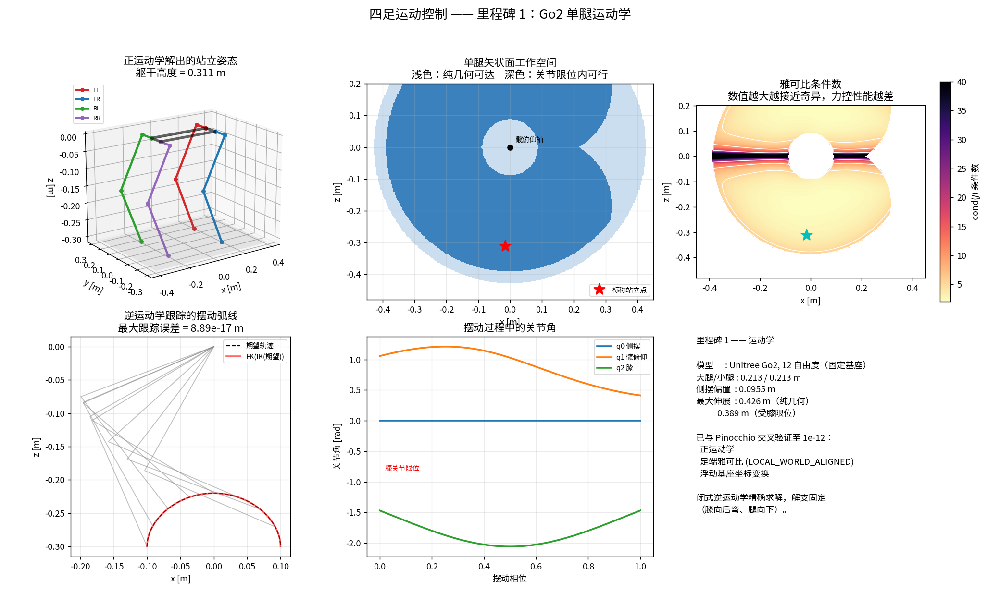

# 里程碑 1 —— 四足单腿运动学

> 模块：`kinematics/` · 机器人：Unitree Go2 · 状态：已完成，24/24 测试通过



---

## 1. 这个模块为什么存在

四足控制器从来不直接命令关节角。它思考的是**足端在哪里**：

- **落脚点规划器**决定*把脚放到地面的什么位置*；
- **摆动腿规划器**决定*脚在空中走什么轨迹*；
- **MPC** 决定*每只脚用多大的力蹬地*；
- **全身控制器（WBC）**把期望的足端加速度和力变成关节力矩。

上面每一个模块说的都是笛卡尔坐标下的足端语言，而电机说的是关节角语言。运动学就是这两种语言之间的字典，它垫在上面全部四个模块的下面。**这里错一个符号，上面每一层都是错的**，而且从上往下几乎不可能调出来。

### 无人机类比

在你熟悉的 PX4 里，有一个等价的层，只是你大概没把它当成"运动学"：**控制分配（mixer）**。控制器算出期望的机体力/力矩 $(F_z, \tau_x, \tau_y, \tau_z)$，mixer 通过一个固定的分配矩阵把它映射成四个电机指令。

四足里同样的思想出现了三次，而**差别恰恰就是腿式控制难的原因**：

|                          | 多旋翼               | 四足                             |
| ------------------------ | -------------------- | -------------------------------- |
| 执行器 → 任务空间的映射 | 常数矩阵$M$        | 依赖构型的雅可比$J(q)$         |
| 是否可逆                 | 总是可逆（几何固定） | 在奇异位形处降秩                 |
| 接触                     | 无，推力永远可用     | 脚必须**踩在地上**才能出力 |
| 分配关系是否随时间变化   | 否                   | 是 —— 每走一步接触集合就变一次 |

就这一行 —— *"常数矩阵"变成 "$J(q)$"* —— 解释了为什么四足需要一个运动学模块，也解释了为什么**真正重要的对象是雅可比，而不是正运动学本身**。

---

## 2. 问题的精确表述

Go2 有 12 个驱动关节，每条腿 3 个。每条腿是一条开链：

```
躯干 ──[侧摆 abduction, 绕 +x]── hip 连杆 ──[髋俯仰 hip pitch, 绕 +y]── 大腿 ──[膝 knee, 绕 +y]── 小腿 ── 足端
```

三个量，三个问题：

| 名称            | 映射                      | 问题                             |
| --------------- | ------------------------- | -------------------------------- |
| 正运动学 FK     | $q \mapsto p$           | 给定关节角，足端在哪？           |
| 逆运动学 IK     | $p \mapsto q$           | 给定期望足端位置，关节角是多少？ |
| 雅可比 Jacobian | $\dot q \mapsto \dot p$ | 足端速度和关节速度是什么关系？   |

雅可比还有第二重含义，对控制来说**更重要**。由虚功原理，若足端对地面施加力 $f$，关节必须提供力矩

$$
\tau = J(q)^\top f
$$

这一个式子就是从 *"MPC 说用 80 N 蹬地"* 到 *"给电机发这个电流"* 的**全部桥梁**。它出现在有史以来每一个四足控制器里 —— 这也是为什么我们要把雅可比测到 $10^{-12}$ 的精度，而不是"看着差不多"。

---

## 3. 坐标系与约定

两套约定，定下来一次，之后处处遵守。

**躯干系（trunk frame）** —— 原点在躯干中心，$x$ 向前，$y$ 向左，$z$ 向上。

**髋系（hip frame）** —— 每条腿一个。原点落在侧摆轴上，坐标轴始终与躯干系平行。在这个系里做代数，可以把腿的安装偏置从公式里消掉，于是**四条腿共用同一组方程，唯一的区别只是 $l_0$ 的符号**。

Go2 的具体数值，直接从 URDF 读出，并由 `test_hardcoded_geometry_matches_urdf` 反复校验：

| 符号    | 含义                        | 数值                                |
| ------- | --------------------------- | ----------------------------------- |
| $l_0$ | 侧摆轴 → 髋俯仰轴，沿$y$ | $\pm 0.0955$ m（左腿 +，右腿 −） |
| $l_1$ | 大腿长度                    | $0.213$ m                         |
| $l_2$ | 小腿长度                    | $0.213$ m                         |
| —      | 躯干系下各髋偏置            | $(\pm 0.1934,\ \pm 0.0465,\ 0)$ m |

关节轴：$q_0$ 绕 $+x$，$q_1$ 绕 $+y$，$q_2$ 绕 $+y$。

注意 $l_1 = l_2$。这是宇树**刻意的设计选择**，不是巧合 —— 等长连杆让工作空间对称，并且让足端恰好能够到髋轴，从而在给定腿部质量下把可用工作空间做到最大。

---

## 4. 正运动学 —— 推导

只要**顺序取对**，推导就很简单：**先解矢状面，再把整个平面绕 $x$ 转过去**。

### 第一步：矢状面内的 2R 链

先不管侧摆。在 $x$–$z$ 平面内，一条从 $-z$ 方向出发、关节为 $q_1, q_2$ 的两连杆链：

$$
x = -l_1 \sin q_1 - l_2 \sin(q_1 + q_2)
$$

$$
L = l_1 \cos q_1 + l_2 \cos(q_1 + q_2)
$$

这里的 $L$ 是**面内伸展量**：足端在髋俯仰轴*下方*多远。用 $q = 0$ 自检：$x = 0$，$L = l_1 + l_2 = 0.426$ m，腿完全伸直垂下。✓

### 第二步：加上侧摆

侧摆关节绕 $+x$ 转过 $q_0$，同时髋俯仰轴沿 $y$ 有 $l_0$ 的偏置。旋转前的点 $(x,\ l_0,\ -L)$ 经 $R_x(q_0)$ 之后：

$$
\boxed{
\begin{aligned}
p_x &= -l_1 s_1 - l_2 s_{12} \\
p_y &= l_0 \cos q_0 + L \sin q_0 \\
p_z &= l_0 \sin q_0 - L \cos q_0
\end{aligned}}
$$

其中 $s_1 = \sin q_1$，$s_{12} = \sin(q_1+q_2)$，其余同理。

有两个结构性事实值得刻进脑子里，因为后面全靠它们：

1. **$q_0$ 不出现在 $p_x$ 里。** 侧摆绕 $x$ 轴转，不可能把脚往前或往后挪。这就是为什么矢状面的步态设计（trot、$x$ 方向的落脚点）和侧向平衡几乎是解耦的。
2. **$p_y^2 + p_z^2 = l_0^2 + L^2$，与 $q_0$ 无关。** 足端到侧摆*轴*的距离在侧摆下不变。**正是这个不变量让逆运动学有闭式解。**

→ 实现见 [`kinematics/leg_kinematics.py`](../kinematics/leg_kinematics.py) 的 `forward_kinematics`。

---

## 5. 逆运动学 —— 推导

三步，每步都是闭式，不迭代。

### 第一步：先求 $L$，再求 $q_0$

由上面的不变量 (2)：

$$
L = \sqrt{p_y^2 + p_z^2 - l_0^2}
$$

再求 $q_0$。记 $A = \sqrt{l_0^2 + L^2}$，$\beta = \operatorname{atan2}(L, l_0)$，则 $y$、$z$ 两式变成

$$
p_y = A\cos(q_0 - \beta), \qquad p_z = A\sin(q_0 - \beta)
$$

于是一个 `atan2` 就反解出来：

$$
\boxed{q_0 = \operatorname{atan2}(p_z,\ p_y) + \operatorname{atan2}(L,\ l_0)}
$$

### 第二步：余弦定理求膝关节角

在矢状面内，足端相对髋俯仰轴位于 $(p_x, -L)$，距离 $d = \sqrt{p_x^2 + L^2}$。对 2R 链用余弦定理：

$$
d^2 = l_1^2 + l_2^2 + 2 l_1 l_2 \cos q_2
\quad\Longrightarrow\quad
\boxed{q_2 = -\arccos\!\left(\frac{d^2 - l_1^2 - l_2^2}{2 l_1 l_2}\right)}
$$

前面的负号选中**膝向后弯**这一解支。对 Go2 而言这不是偏好问题 —— URDF 里膝关节限位是 $[-2.72, -0.838]$ rad，严格为负，**另一支在机械上根本够不到**。

### 第三步：折叠连杆求髋俯仰角

把两根连杆折叠成一根等效连杆，分量为 $a = l_1 + l_2\cos q_2$，$b = l_2 \sin q_2$。则 $-p_x = a s_1 + b c_1$，$L = a c_1 - b s_1$，这就是一个绕 $q_1$ 的旋转叠加上固定相位 $\operatorname{atan2}(b,a)$：

$$
\boxed{q_1 = \operatorname{atan2}(-p_x,\ L) - \operatorname{atan2}(b,\ a)}
$$

### 解支（branch）—— 所有人都会踩的那个坑

一条 3 自由度腿最多有**四**个 IK 解：

| 解支                                  | 由什么选定            | Go2 的情况           |
| ------------------------------------- | --------------------- | -------------------- |
| 膝向前 / 膝向后                       | `arccos` 前面的符号 | 只有向后（关节限位） |
| 腿向下 / 腿折上去（$L \gtrless 0$） | 开方的符号            | 只有向下（可用站姿） |

`inverse_kinematics` **永远**返回*膝向后、腿向下*那一支。这意味着 `IK(FK(q)) == q` 这个往返恒等式，**只在 `q` 本身就在这些解支上时才成立**。喂给它一个折叠向上的构型，它会返回镜像解 —— 而那个解的正运动学**仍然精确落在你要求的点上**。

这不是 bug，也不是瑕疵；这就是"解支选择"本身的含义。两个事实都被测试钉死了：`test_ik_round_trip` 和 `test_ik_returns_mirror_branch_for_folded_configurations`。

**可达性。** 两种失效模式，各自抛出不同的错误：

- $\sqrt{p_y^2+p_z^2} < |l_0|$ —— 目标落在侧摆圆柱内部，$L$ 无实数解；
- $d \notin [|l_1-l_2|,\ l_1+l_2]$ —— 目标在圆环之外，$|\cos q_2| > 1$。

`clamp=True` 选项会把目标投影到边界上，而不是抛异常。**控制回路里要用这个**：落脚点规划器偶尔请求一个够不到的目标时，应该让足端位置退化，而不是在 1 kHz 的线程里抛异常。

---

## 6. 雅可比 —— 推导

对正运动学求导。第 0 列值得用"看"的而不是用"算"的。

**第 0 列（侧摆）。** $q_0$ 产生的是绕过髋原点的 $+x$ 轴的**纯旋转**，所以足端速度就是 $\hat{x} \times p$：

$$
\frac{\partial p}{\partial q_0} = \hat{x} \times p = \begin{bmatrix} 0 \\ -p_z \\ p_y \end{bmatrix}
$$

**第 1、2 列。** 注意 $\partial L/\partial q_1 = p_x$ —— 面内伸展量和前向偏移互为对方的导数。代进去得到：

$$
J(q) =
\begin{bmatrix}
0 & -L & -l_2 c_{12} \\
-p_z & s_0\, p_x & -s_0\, l_2 s_{12} \\
p_y & -c_0\, p_x & c_0\, l_2 s_{12}
\end{bmatrix}
$$

### 奇异位形

当膝完全伸直（$q_2 = 0$）时 $\det J = 0$：足端落在髋与膝的连线上，**任何关节速度都无法让足端沿这条线运动**，秩从 3 降到 2。

图中的条件数面板把这件事画了出来。实际工程里，**接近奇异比正好奇异更危险**：$J^{-1}$ 存在，但极大 —— 一个很小的笛卡尔误差指令会产生巨大的关节速度，腿会猛地弹一下。

这正是 Go2 的膝限位取 $-0.838$ rad 而不是 $0$ 的原因：**机构从物理上就禁止你到达奇异点**。这个限位把可用腿长封顶在

$$
\sqrt{l_1^2 + l_2^2 + 2 l_1 l_2 \cos(-0.838)} = 0.389\ \text{m}
$$

而纯几何最大值是 $0.426$ m。**加上关节限位后，只有 73% 的几何工作空间真正可用**（由 `scripts/viz_kinematics.py` 实测）。你的落脚点规划器必须按小的那个数来。

> **无人机类比。** 腿的奇异位形，和四旋翼推力饱和时失去偏航权限，是同一种现象 —— 分配矩阵在某个方向上降秩，控制器悄无声息地失去了对那个轴的指令能力。区别在于：无人机的分配矩阵是常数，你可以**离线检查一次**；而腿的 $J$ 依赖 $q$，所以这个检查**每个控制周期都得做**。

---

## 7. 软件架构

同一套数学，**故意写两遍**。

```
                    robot_description/go2/go2.urdf
                                 │
              ┌──────────────────┴──────────────────┐
              │                                     │
     kinematics/go2.py                     kinematics/robot_model.py
     （从 URDF 读出的常数）                 （Pinocchio，通用，任意机器人）
              │                                     │
     kinematics/leg_kinematics.py                   │
     （闭式解，纯 NumPy）                            │
              │                                     │
              └──────────────┬──────────────────────┘
                             │
                   tests/test_kinematics.py
                   交叉验证，容差 1e-12
```

为什么要两份？因为**单一实现是没法测试的**。如果闭式解是你手上唯一的代码，那么推导里的符号错误和你脑子里的预期错误会完美地互相印证。两份从**不同来源**写出来的实现 —— 一份手推，一份从 URDF 解析 —— 不可能以同样的方式出错。这是整个仓库的核心策略，里程碑 2 的动力学（手推 vs. RNEA）会继续复用它。

**各层职责：**

| 文件                  | 角色                               | 依赖      |
| --------------------- | ---------------------------------- | --------- |
| `leg_kinematics.py` | 纯几何，单腿，闭式                 | 仅 NumPy  |
| `robot_model.py`    | URDF、坐标系、整机雅可比、浮动基座 | Pinocchio |
| `go2.py`            | Go2 常数，把两者粘起来             | 两者都要  |

`leg_kinematics.py` **刻意只 import NumPy**。它就是将来要移植到 C++、跑在 1 kHz 线程里的那段代码。

---

## 8. 性能 —— 一个和"江湖传闻"相反的实测结果

来自 `scripts/benchmark_kinematics.py`（RTX 5080 工作站，Python 3.11）：

| 操作                      |               耗时 | 占 1 kHz 周期 |
| ------------------------- | -----------------: | ------------: |
| 闭式 FK（NumPy）          |           2.37 µs |        0.24 % |
| 闭式 FK（纯 float 标量）  | **0.16 µs** |        0.02 % |
| 闭式雅可比                |           2.70 µs |        0.27 % |
| 闭式 IK                   |           3.19 µs |        0.32 % |
| Pinocchio FK              | **1.23 µs** |        0.12 % |
| Pinocchio 帧雅可比        |           1.63 µs |        0.16 % |
| Pinocchio 阻尼最小二乘 IK | **71.9 µs** |        7.19 % |

**这张表要仔细读，因为其中两行和常见说法完全相反。**

**1. 在 Python 里，闭式 FK 并不比 Pinocchio 快，反而更慢（0.52×）。** Pinocchio 的算术跑在 C++ 里；闭式解每次调用都要付 NumPy 的数组分配开销。纯 float 那一行精确地隔离出了这个开销：**同样的算术不用 NumPy 快 15 倍**。也就是说，那 2.37 µs 里大约 0.16 µs 是数学，2.2 µs 是 `np.array()`。

这不是 Python 的奇技淫巧，而是一条真正有用的教训：**对 3 维向量而言，数组库的开销完全压倒了算术本身**。这也正是 Isaac Lab 要把成千上万个机器人打包进一个张量运算的原因 —— 摊掉的就是这个开销，这是 GPU 仿真能快起来的唯一途径。

**2. 跨语言都成立的优势是 IK：快 22 倍。** 而且速度还只是次要的那一半。阻尼最小二乘是**迭代**的，它的耗时取决于初值，**没有硬上界**。一个耗时无上界的操作，在硬实时回路里是不可接受的，跟它平均多快无关。

**那到底为什么还要手推腿部运动学？** 不是为了 Python 里的裸速度。而是为了：**精确且耗时有界的 IK**；一个**显式的符号雅可比**，可以再求一次导给 MPC 做灵敏度；以及**实时线程里不依赖任何机器人库**。MIT Cheetah 和宇树在 C++ 里做的就是这件事。

---

## 9. 两个会悄悄搞垮机器人的约定

### 关节顺序

| 约定                                      | 顺序                                              |
| ----------------------------------------- | ------------------------------------------------- |
| **Pinocchio**（URDF 声明顺序）      | FL(hip,thigh,calf), FR(...), RL(...), RR(...)     |
| **Isaac Lab**（对运动树做广度优先） | 先四条腿的 hip，再四条腿的 thigh，再四条腿的 calf |

它们是**同样 12 个数的不同排列**。搞混了，机器人看上去几乎是对的，然后摔倒 —— 这是把策略从 Isaac Lab 搬到基于 Pinocchio 的控制器时**最常见的一个 bug**。在每个边界上都用 `isaac_to_pinocchio` / `pinocchio_to_isaac`，绝不要手动对。

### 雅可比的参考坐标系

Pinocchio 提供三种，它们**不能互换**：

| 参考系                  | 含义                                     | 用在哪                |
| ----------------------- | ---------------------------------------- | --------------------- |
| `LOCAL`               | 表达在足端自身的旋转坐标系里             | 腿控制里很少用        |
| `LOCAL_WORLD_ALIGNED` | 原点在足端，**坐标轴与世界系平行** | ✅ 控制器要的就是这个 |
| `WORLD`               | 空间/旋量约定，原点在世界原点            | 李群理论推导          |

`WORLD` 是那个陷阱：它是**空间雅可比**，其线性部分**不是** $\dot p$。悄悄用错的后果是：控制器在原点附近能用，离原点越远越糟。本模块默认 `LOCAL_WORLD_ALIGNED`。

---

## 10. API

```python
from kinematics import (
    load_go2, LEG_GEOMETRY, HIP_OFFSETS, STANDING_JOINT_ANGLES,
    forward_kinematics, inverse_kinematics, leg_jacobian,
    isaac_to_pinocchio, pinocchio_to_isaac,
)

geom = LEG_GEOMETRY["FL"]

p = forward_kinematics(np.array([0.0, 0.8, -1.5]), geom)   # 髋系, (3,)
q = inverse_kinematics(p, geom)                             # (3,), 精确解
q = inverse_kinematics(p, geom, clamp=True)                 # 永不抛异常
J = leg_jacobian(q, geom)                                   # (3, 3)
tau = J.T @ f                                               # 足端力 -> 关节力矩

model = load_go2(floating_base=True)
q_full = model.make_configuration(q_joints, base_position=[0, 0, 0.31])
model.foot_positions(q_full)             # dict: 腿 -> 世界系位置
model.foot_position_in_base(q_full, "FL")
model.full_foot_jacobian(q_full, "FL")   # (3, 18) —— 基座那 6 列对 WBC 至关重要
```

完整 docstring 见 [`kinematics/leg_kinematics.py`](../kinematics/leg_kinematics.py) 与 [`kinematics/robot_model.py`](../kinematics/robot_model.py)。

---

## 11. 本模块如何被验证

`pytest tests/test_kinematics.py -v` → **24 passed**。

| 分组        | 钉死了什么                                                        |
| ----------- | ----------------------------------------------------------------- |
| URDF 一致性 | 硬编码常数仍与它们所来自的 URDF 一致                              |
| FK          | 闭式 == Pinocchio，四条腿，300 组随机构型，`atol=1e-12`         |
| FK          | $q=0$ 处手算可核对的数值；侧摆不改变 $x$ 与 $y$–$z$ 半径 |
| 雅可比      | == 正运动学的中心差分                                             |
| 雅可比      | == Pinocchio`LOCAL_WORLD_ALIGNED`，`atol=1e-12`               |
| 雅可比      | 完全伸直时奇异；条件数随伸直单调恶化                              |
| IK          | 在解支内往返一致；解支外返回镜像解但仍精确命中目标                |
| IK          | 站姿工作空间内的解都在 URDF 关节限位之内                          |
| IK          | 两种失效模式各自抛出正确异常；`clamp=True` 永不抛异常           |
| IK          | 阻尼最小二乘与闭式解一致到$10^{-6}$                             |
| 浮动基座    | 世界系/躯干系变换自洽；3×18 雅可比的腿部分块正确                 |
| 顺序映射    | Isaac ↔ Pinocchio 互为逆映射，且用关节**名字**验证过       |

### 调试清单

运动学看着不对时，按这个顺序查：

1. **把它画出来。** 跑 `scripts/viz_kinematics.py`。一张火柴人图几秒钟就能抓到符号错误，而纯代数你查几个小时也未必看得出来。
2. **手算 $q = 0$。** 腿必须完全伸直垂下，长度 $l_1 + l_2$。
3. **对雅可比做差分。** 中心差分，$\varepsilon = 10^{-6}$。如果对不上，是雅可比错了；如果对得上但机器人行为异常，那是**坐标系**错了。
4. **先确认解支再断定 IK 有 bug。** 往返不一致不一定是错误。
5. **打印躯干系下的足端位置**，和 0.31 m 左右的站立高度比一下。**差 0.0465 m** 就说明你把髋系和躯干系搞混了。
6. **只要机器人"看起来合理但就是不对"，先怀疑关节顺序。** 对角腿表现得像互为镜像，就是这个 bug 的典型特征。

---

## 12. 面试问题

### 概念题

1. 机器人腿的雅可比是什么？它的**两重**物理含义分别是什么？
2. 为什么 $\tau = J^\top f$ 成立？请从虚功原理推导。
3. 一条 3 自由度腿有几个 IK 解？你怎么选？如果相邻两个控制周期选得不一致会发生什么？
4. 什么是运动学奇异？四足腿的奇异位形在哪里？真实机器人怎么避开它？
5. 为什么检测"接近奇异"时，$J$ 的**条件数**比行列式更有用？
6. 解析 IK vs. 数值 IK —— 什么情况下你会在真机上接受数值 IK？
7. Pinocchio 为什么要区分 `LOCAL`、`LOCAL_WORLD_ALIGNED` 和 `WORLD` 三种雅可比？
8. 浮动基座下足端雅可比是 3×18。前 6 列的物理含义是什么？

### 一定会被追问的

- "你的 IK 返回了合法解，但腿抖了一下，为什么？"（*两个周期之间解支跳变*）
- "足端 $y$ 方向差了 5 cm，但 $x$ 和 $z$ 都对。"（*髋系和躯干系搞混；或 $l_0$ 符号错*）
- "你会在 1 kHz 回路里用 `arccos` 吗？"（*会 —— 但必须先 clamp 参数；浮点误差可能把它推到 1+ε，产生 NaN，然后 NaN 一路传进电机指令*）
- "怎么把这套东西推广到 6 自由度的人形腿？"（*一般不再有解析解；要么满足 Pieper 条件——三轴交于一点，要么上数值 IK*）

### 编程题

- 白板上实现平面 2R 逆运动学。要处理两个解支和不可达情况。
- 给定一个 URDF，不用任何机器人库算出足端雅可比。
- 写出那个能抓到 $l_0$ 符号错误的测试。

### 系统设计题

- 设计落脚点规划器与腿控制器之间的接口。双方各自保证什么？谁来校验可达性？
- 运动学跑在哪个线程 —— 和 MPC 同线程，还是 1 kHz 线程？为什么？
- 真机上你无法直接测量足端位置，那你怎么验证运动学？

---

## 13. 它和后面的模块怎么衔接

| 下游模块         | 需要本模块提供什么                                                    |
| ---------------- | --------------------------------------------------------------------- |
| 动力学（M2）     | 各坐标系的位姿；浮动基座模型                                          |
| 状态估计（M3）   | 腿部里程计：由支撑腿 FK +$J\dot q$ 反推 $p_{\text{base}}$         |
| 摆动腿规划（M5） | 用 IK 把笛卡尔足端轨迹变成关节目标                                    |
| 凸 MPC（M7）     | 足端相对质心的位置，决定力矩臂$r_i \times f_i$                      |
| WBC（M8）        | 接触约束$J_c \dot v + \dot J_c v = 0$；力矩映射 $\tau = J^\top f$ |
| 强化学习（M9）   | 足端位置作为观测；运动学相关的奖励项                                  |

**雅可比是整个技术栈里被复用最多的一个对象。** 上面所有东西都建立在它是正确的这个前提上。

---

## 14. 参考文献

- Featherstone, *Rigid Body Dynamics Algorithms*, Springer 2008 —— 第 2–3 章讲坐标系与空间记号。
- Lynch & Park, *Modern Robotics*, CUP 2017 —— 第 4–5 章，正运动学与雅可比讲得最清楚。
- Carpentier et al., *The Pinocchio C++ library*, SII 2019.
- Di Carlo et al., *Dynamic Locomotion in the MIT Cheetah 3 via Convex MPC*, IROS 2018.
- Bledt et al., *MIT Cheetah 3: Design and Control of a Robust, Dynamic Quadruped Robot*, IROS 2018.
- 宇树 `unitree_ros` —— 本项目使用的 Go2 URDF 来源。

---

**下一步：** 里程碑 2 —— 机器人动力学（用 CRBA 求质量矩阵，用 RNEA 求逆动力学，质心动量，以及浮动基座为什么改变了一切）。
