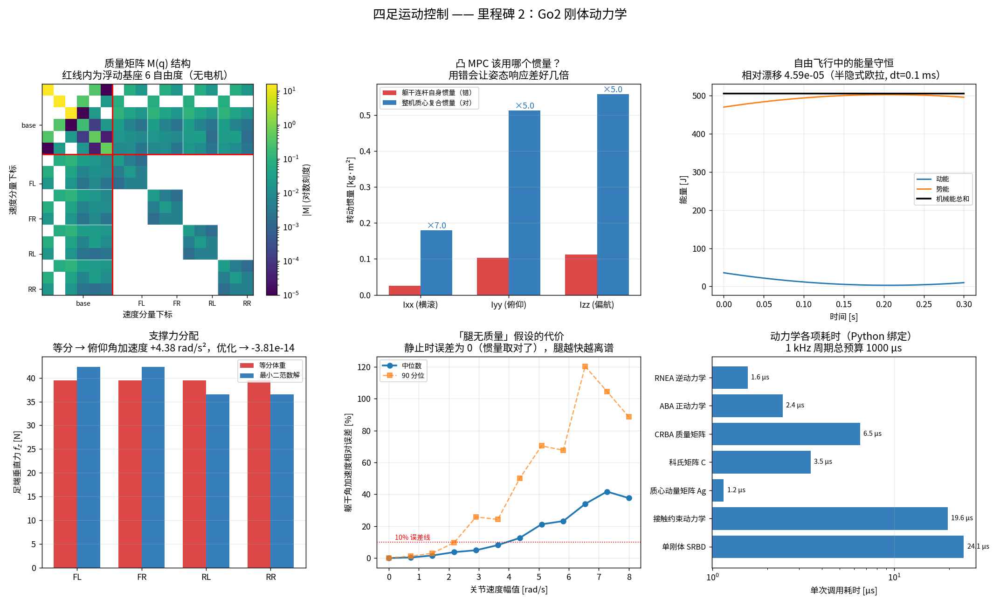

# 里程碑 2 —— 刚体动力学

> 模块：`dynamics/` · 机器人：Unitree Go2 · 状态：已完成，45/45 测试通过



---

## 1. 这个模块为什么存在

里程碑 1 回答的是"脚在哪"。但**运动学不知道机器人会不会摔倒**。要让机器人真的走起来，必须回答：给定电机力矩和地面反力，机器人会怎么动？

整个后续技术栈都建立在一个方程上：

$$\boxed{M(q)\,a + C(q,v)\,v + g(q) = S^\top \tau + \sum_i J_i(q)^\top f_i}$$

| 符号 | 含义 | 维度（Go2 浮动基座） |
|---|---|---|
| $M(q)$ | 质量矩阵 | 18×18 |
| $C(q,v)v$ | 科氏力与离心力 | 18 |
| $g(q)$ | 重力项 | 18 |
| $S$ | 选择矩阵，电机力矩 → 广义力 | 12×18 |
| $\tau$ | 电机力矩 | 12 |
| $J_i$ | 第 $i$ 只脚的接触雅可比 | 3×18 |
| $f_i$ | 第 $i$ 只脚的地面反力 | 3 |

### 与你 NMPC 背景的对应

这件事你其实已经做过一遍。你在 NMPC 里写的是

$$\dot x = f(x, u)$$

现在只是把 $f$ 换成了上面这个方程。**建模的思维完全一样，难点全在那个 $S$ 上。**

| | 多旋翼 | 四足 |
|---|---|---|
| 状态维度 | 12 | 36（18 位置 + 18 速度） |
| 执行器 → 广义力 | 常数矩阵，**满秩** | $S$，前 6 列**全为零** |
| 能否直接控制机体 6 自由度 | 能，螺旋桨直接对机体出力 | **不能**，必须借地面 |
| 模型是否分段切换 | 否 | 是，接触集合每步都变 |

**你的四个螺旋桨直接对机体出力；四足的"执行器"是地面。** 这一句话就是本里程碑的全部。

---

## 2. 欠驱动：整个 WBC 与 MPC 存在的理由

浮动基座的广义坐标是 $q = [\,p_{\text{base}},\ \text{quat},\ q_{\text{joints}}\,]$，共 19 维（速度 18 维）。其中：

- 前 6 个自由度（躯干平动 + 转动）**没有任何电机**；
- 后 12 个自由度是驱动关节。

所以选择矩阵长这样：

$$S^\top = \begin{bmatrix} 0_{6\times 12} \\ I_{12} \end{bmatrix}$$

把动力学方程按行拆开：

$$
\underbrace{\begin{bmatrix} M_{bb} & M_{bj} \\ M_{jb} & M_{jj}\end{bmatrix}}_{M}
\begin{bmatrix} a_b \\ a_j \end{bmatrix}
+ \begin{bmatrix} h_b \\ h_j \end{bmatrix}
= \begin{bmatrix} \mathbf{0} \\ \tau \end{bmatrix}
+ \begin{bmatrix} J_b^\top \\ J_j^\top \end{bmatrix} f
$$

**上面那 6 行右端没有 $\tau$。** 它们是一组必须被满足的约束，而不是可以随便驱动的方程：

$$M_{bb} a_b + M_{bj} a_j + h_b = J_b^\top f$$

也就是说，**躯干想怎么动，完全由脚上的力 $f$ 决定**。电机唯一能做的事是调整腿的构型，从而改变 $J$ 和力臂。

这条约束直接推出三个结论，构成了后面所有里程碑的动机：

1. **MPC 必须直接优化接触力 $f$**，而不是优化关节力矩 —— 因为躯干只听 $f$ 的。
2. **WBC 必须把这 6 行当作等式约束**放进 QP，否则算出来的力矩物理上不可实现。
3. **腾空时无论电机怎么转，质心加速度只能是 $-g$。** 这在测试 `test_robot_cannot_accelerate_its_com_without_contact` 里被严格验证：随便给 12 个关节力矩，质心线加速度恒为 $[0,0,-9.81]$，误差 $10^{-8}$。

> 猫在空中翻身不违反这一条 —— 它改变的是**姿态**，不是质心轨迹。角动量守恒（测试 `test_angular_momentum_is_conserved_in_free_flight`），但姿态可以通过内部运动改变。这是无人机没有的自由度。

---

## 3. 三大算法：RNEA、CRBA、ABA

Featherstone 体系里的三个基础算法，Pinocchio 全部实现。

| 算法 | 全称 | 解决什么 | 复杂度 |
|---|---|---|---|
| **RNEA** | Recursive Newton-Euler Algorithm | 逆动力学：$(q,v,a) \to \tau$ | $O(n)$ |
| **CRBA** | Composite Rigid Body Algorithm | 质量矩阵：$q \to M(q)$ | $O(n^2)$ |
| **ABA** | Articulated Body Algorithm | 正动力学：$(q,v,\tau) \to a$ | $O(n)$ |

### RNEA 的直觉

两趟递推，完全不需要显式构造 $M$：

1. **外向递推**（根 → 叶）：沿运动树往外传播速度和加速度。已知躯干怎么动，就知道大腿怎么动，再知道小腿怎么动。
2. **内向递推**（叶 → 根）：沿运动树往回传播力。已知小腿的加速度，由牛顿-欧拉得到作用在它上面的力；这个力反作用到大腿，逐级累加。

这就是**为什么 RNEA 是 $O(n)$ 而不是 $O(n^3)$** —— 它从不组装、更不求逆任何矩阵。

**面试高频**：既然有了 $M$、$C$、$g$ 就能算 $\tau = Ma + Cv + g$，为什么还要 RNEA？答：因为构造 $M$ 是 $O(n^2)$、构造 $C$ 更贵，而 RNEA 一趟 $O(n)$ 直接给出结果。WBC 里每个控制周期都要算逆动力学，这个差别是实打实的。

### CRBA 的一个坑

Pinocchio 的 `crba` **只填充上三角**。直接拿返回值做矩阵乘法会得到错误结果，而且不会报错。本模块的 `mass_matrix()` 强制补全对称：

```python
M = pin.crba(model, data, q)
return np.triu(M) + np.triu(M, 1).T     # 这一行必须有
```

由 `test_mass_matrix_is_symmetric_positive_definite` 钉死。

---

## 4. 交叉验证策略

延续里程碑 1 的思路，但这次"第二份实现"的形式更丰富：**每一项都用一条与它无关的物理定义去校验**。

| 被验证的量 | 校验路径 | 实测精度 |
|---|---|---|
| $M$ | 动能二次型 $KE = \tfrac12 v^\top M v$ | $10^{-12}$ |
| $g$ | 势能在李群上的梯度 $\partial U/\partial q$ | $10^{-6}$（数值微分限制） |
| RNEA | $Ma + Cv + g$ | $10^{-10}$ |
| ABA | RNEA 的逆 | $10^{-10}$ |
| $C$ | $\dot M - 2C$ 反对称 | $10^{-6}$ |
| 质心动量 | $h_{\text{lin}} = m\,v_{\text{com}}$ | $10^{-12}$ |
| 质心速度 | $p_{\text{com}}$ 的数值微分 | $10^{-8}$ |
| SRBD | 关节锁死的整机模型 | 精确（腿静止时） |

重力项那一条要特别注意：**浮动基座活在李群 $SE(3)$ 上，不能直接对 $q$ 做加减扰动**。必须用 `pin.integrate(model, q, dv)` 沿切空间扰动，否则四元数会失去单位模长，结果全错。

```python
u_plus  = potential_energy(pin.integrate(model, q,  eps * e_i))
u_minus = potential_energy(pin.integrate(model, q, -eps * e_i))
g_num[i] = (u_plus - u_minus) / (2 * eps)
```

### $\dot M - 2C$ 反对称

这条性质是**无源性（passivity）**的数学表达，也是几乎所有机器人 Lyapunov 稳定性证明的基石。物理含义：科氏力与离心力**不做功** —— 它们只在自由度之间搬运动能，不产生也不消耗能量。

必考。也要知道：**$C$ 本身不唯一**，只有乘积 $Cv$ 唯一。Pinocchio 选的是让这条反对称性成立的那个分解。

---

## 5. 接触：把脚焊在地上

支撑脚不动，意味着足端加速度为零：

$$J_c a + \dot J_c v = 0$$

配合动力学方程得到一个 KKT 系统：

$$
\begin{bmatrix} M & -J_c^\top \\ J_c & 0 \end{bmatrix}
\begin{bmatrix} a \\ f \end{bmatrix}
=
\begin{bmatrix} S^\top\tau - Cv - g \\ -\dot J_c v\end{bmatrix}
$$

### 一个把我坑了的符号

Pinocchio 的 `forwardDynamics(model, data, q, v, tau, J, gamma)` 内部解的是

$$J a + \gamma = 0$$

所以 **`gamma` 要直接传 $\dot J v$，不能取负号**。我第一版写反了，测试立刻抓到：约束残差 $0.167$。

这个 bug 的可怕之处在于**它不会让机器人崩掉**。残差 $O(0.1)$ 意味着机器人看起来站得好好的，但支撑脚会以每秒几厘米的速度缓慢滑移。在仿真里表现为"走着走着位置就飘了"，从现象几乎不可能反推到根因。由 `test_constrained_dynamics_keeps_stance_feet_still` 永久钉死。

### 这个模型的局限

这里把接触当作**双边刚性约束** —— 脚既不会滑，也不会离地。真实地面只能推不能拉：

$$f_z \ge 0, \qquad \|f_{xy}\| \le \mu f_z$$

这些**不等式**没法用线性方程组表达，必须上 QP。那是里程碑 7（MPC）和 8（WBC）的内容。本里程碑给出的是"如果脚焊在地上会怎样"，它是仿真和验证的基准。

---

## 6. 单刚体模型（SRBD）：凸 MPC 到底在解什么

### 为什么不能直接用完整模型做 MPC

18 自由度的非线性动力学，放进 10 步预测时域，就是一个 180 维的非凸优化问题。1 kHz 下解不动，而且没有全局最优保证。

### 那个大胆的近似

**把整台机器人当成一个刚体，腿视为无质量，唯一作用是把地面反力施加到这个刚体上。**

于是只剩牛顿-欧拉两式：

$$m\,\ddot p = \sum_i f_i + m g$$
$$\frac{d}{dt}(I_w \omega) = \sum_i (r_i - p) \times f_i$$

**关键在于：足端位置 $r_i$ 已知时，这两式对 $f_i$ 是线性的。** 于是最优化问题变成凸 QP —— 这就是 MIT Cheetah 3 那篇凸 MPC 的全部诀窍。

### 两条额外近似（MPC 版本）

为了在预测时域内保持线性，还要再丢掉两样东西：

1. **丢掉陀螺项** $\omega \times (I_w\omega)$ —— 它对 $\omega$ 是二次的。
2. **姿态只保留偏航** $I_w \approx R_z(\psi) I_b R_z(\psi)^\top$ —— 假设横滚俯仰接近零。

这两条的代价都在 `tests/test_dynamics.py` 里被定量测量，而不是"感觉还行"。

### 参数怎么取 —— 最容易埋的雷

| 量 | 错误取法 | 正确取法 | 差距 |
|---|---|---|---|
| 质量 | 躯干连杆 7.279 kg | **整机 16.087 kg** | 2.2× |
| 惯量 | 躯干连杆惯量 | **整机质心复合惯量** | **5–7×** |

Go2 的实测数字：

```
躯干连杆惯量对角 : [0.0257, 0.1031, 0.1128]  kg·m²
整机复合惯量对角 : [0.1804, 0.5130, 0.5591]  kg·m²
                    ×7.0    ×5.0    ×5.0
```

**为什么差这么多？** 因为 Go2 的**四条腿占了 54.8% 的总质量**（8.808 kg vs 躯干 7.279 kg），而且它们张开在躯干外侧，力臂大，对转动惯量的贡献远超躯干本身。

用错惯量，MPC 会以为躯干比实际"灵活" 5 倍，姿态控制直接发散。这是四足 MPC 最经典的一个坑。

### 「腿无质量」到底有多贵

正确的对照组是**关节锁死**（$a_{\text{joints}} = 0$）的整机模型 —— 它代表"腿被 WBC 牢牢伺服住"的理想情形，与 SRBD 的差别只剩腿运动带来的科氏效应。

> 我第一版用质心动量去比，得到误差恒等于零。那是**循环论证**：角动量变化率恒等于外力矩，再除以同一个复合惯量，两边必然相同。图里那条平线暴露了这个问题，这也是"每个结论都必须画出来"的价值。

修正后的实测：

| 关节速度 | 躯干角加速度相对误差（中位数） |
|---:|---:|
| 0 rad/s | **0.00%**（精确 —— 证明复合惯量取对了） |
| 2 rad/s | 3.7% |
| 5 rad/s | 16.8% |
| 8 rad/s | **43.4%** |

**结论：站着不动时 SRBD 是精确的；腿一快起来就严重失真。** 这正是凸 MPC 之上必须再叠一层 WBC 的原因 —— MPC 用简化模型规划接触力，WBC 用完整模型把它落实成力矩，并补上 SRBD 丢掉的那部分。

---

## 7. 一个反直觉的结论：体重不能平均分给四条腿

看起来天经地义：静止站立，每条腿承担 $mg/4 = 39.45$ N。

**错。** Go2 的标称站姿相对质心并不前后对称：

```
质心 x = -0.0014 m
前脚 x = +0.1778 m   ->  到质心 0.1792 m
后脚 x = -0.2090 m   ->  到质心 0.2076 m
```

前后力臂差了 1.6 cm。等分垂直力留下约 2.2 N·m 的俯仰力矩，折合 **4.38 rad/s² 的俯仰角加速度** —— 机器人会一头栽下去。

最小二范数解给出的分配是前腿 42.3 N、后腿 36.6 N，残余角加速度 $10^{-14}$。

**这就是为什么支撑力分配必须真的解一个优化问题。** 而四足支撑时有 12 个未知力、只有 6 个平衡方程 —— **静不定**，解不唯一。选哪一个由代价函数决定：最小二范数、最小化摩擦锥裕度、还是最小化关节力矩，这是 MPC 与 WBC 里的设计自由度。

---

## 8. 姿态：角速度不是欧拉角的导数

这是姿态相关代码里最常见的错误之一，小角度下看不出来，大角度直接发散。

$$\omega \ne \dot\Theta$$

两者之间隔着一个依赖姿态的矩阵 $E(\Theta)$：

$$\omega_{\text{world}} = E(\Theta)\,\dot\Theta, \qquad
E = \begin{bmatrix}
\cos\psi\cos\theta & -\sin\psi & 0\\
\sin\psi\cos\theta & \cos\psi & 0\\
-\sin\theta & 0 & 1
\end{bmatrix}$$

三列分别是三个欧拉角速率各自绕的轴：$\dot\phi$ 绕 $R_z R_y e_x$，$\dot\theta$ 绕 $R_z e_y$，$\dot\psi$ 绕 $e_z$。

在 $\theta = \pm 90°$ 处 $E$ 奇异 —— **万向锁**。四足躯干不会走到那里，但摆动腿或相机云台如果用欧拉角就要当心。本模块在接近奇异时直接抛异常，而不是返回一个巨大的数。

> **无人机类比**：这一条你在 PX4 里已经踩过 —— 姿态控制用四元数而不是欧拉角，正是为了避开这件事。四足完全一样，`rpy` 只用于人类阅读和 MPC 的小角度线性化。

---

## 9. 性能

来自 `scripts/viz_dynamics.py`（RTX 5080 工作站，Python 3.11）：

| 操作 | 耗时 | 占 1 kHz 周期 |
|---|---:|---:|
| RNEA 逆动力学 | 1.6 µs | 0.16 % |
| ABA 正动力学 | 2.4 µs | 0.24 % |
| 质心动量矩阵 $A_g$ | 1.2 µs | 0.12 % |
| 科氏矩阵 $C$ | 3.5 µs | 0.35 % |
| CRBA 质量矩阵 | 6.5 µs | 0.65 % |
| 接触约束动力学 | 19.6 µs | 1.96 % |
| 单刚体 SRBD（NumPy） | 24.1 µs | 2.41 % |

三点值得注意：

1. **RNEA 比 CRBA 快 4 倍**，正如 $O(n)$ vs $O(n^2)$ 所预言。WBC 里能用 RNEA 就别组装 $M$。
2. **接触约束动力学贵 10 倍** —— 因为要解一个 30×30 的 KKT 系统。
3. **SRBD 反而最慢**，又是里程碑 1 那个教训的重演：这是 NumPy 小数组分配的开销，不是算法。SRBD 的价值从来不是快，而是**让优化问题变凸**。

---

## 10. API

```python
from dynamics import load_go2_dynamics, nominal_configuration, srbd_params_from_model
from kinematics import LEGS

rbd = load_go2_dynamics(floating_base=True)
q = nominal_configuration(rbd)
v, a = np.zeros(rbd.nv), np.zeros(rbd.nv)

M   = rbd.mass_matrix(q)              # (18, 18) 对称正定
h   = rbd.nonlinear_effects(q, v)     # C v + g，一次 RNEA
tau = rbd.inverse_dynamics(q, v, a)   # RNEA
acc = rbd.forward_dynamics(q, v, tau) # ABA
S   = rbd.selection_matrix()          # (12, 18)，前 6 列为零

# 接触
J    = rbd.contact_jacobian(q, LEGS)          # (12, 18)
a, f = rbd.constrained_forward_dynamics(q, v, tau, LEGS)
f, tau_act = rbd.gravity_compensation_torque(q, LEGS)

# 质心量（MPC 接口）
rbd.center_of_mass(q)
rbd.centroidal_momentum(q, v)         # (6,) 线动量 + 关于质心的角动量
rbd.centroidal_inertia(q)             # (3, 3) —— MPC 要用的就是它

# 单刚体模型
params = srbd_params_from_model(rbd)  # 自动取整机质量 + 复合惯量
lin, ang = srbd_acceleration(com, R, omega, forces, feet, params)
lin, ang = srbd_acceleration_mpc(com, yaw, omega, forces, feet, params)
```

---

## 11. 本模块如何被验证

`pytest tests/test_dynamics.py -v` → **45 passed**。

| 分组 | 钉死了什么 |
|---|---|
| 模型属性 | 总质量 = 各连杆之和；腿质量占比 54.8% |
| 质量矩阵 | 对称正定；等于动能二次型；左上块 = $m I_3$；与基座位姿无关 |
| 重力 | = 势能在李群上的梯度；竖直分量 = 体重 |
| RNEA | $= Ma + Cv + g$；静止时 $= g$ |
| ABA | 是 RNEA 的逆 |
| 科氏 | $\dot M - 2C$ 反对称；零速度时为零 |
| **欠驱动** | $S$ 前 6 列为零；**腾空时质心加速度恒为 $-g$**；角动量守恒 |
| 质心量 | $A_g v = h_g$；$h_{\text{lin}} = m v_{\text{com}}$；复合惯量 > 4× 躯干惯量 |
| 接触 | 支撑脚加速度为零（**gamma 符号**）；垂直力之和 = 体重 |
| 静力学 | 平衡力抵消基座重力；**等分体重不能平衡机器人** |
| 姿态 | rpy 约定与 Pinocchio 一致；欧拉角速率 ≠ 角速度；万向锁抛异常 |
| SRBD | 腿静止时**精确**；误差随腿速单调增至 43%；对接触力严格线性 |
| 能量 | 自由飞行中机械能守恒，相对漂移 $4.6\times10^{-5}$ |

### 调试清单

动力学出问题时，按这个顺序查：

1. **先查能量守恒。** 无接触无驱动时机械能必须守恒。这是最灵敏的整体体检 —— 模型、积分器、坐标系任何一处错了它都会漂。
2. **静止时 RNEA 应等于 $g$。** 一行代码，能抓住一大半的低级错误。
3. **检查 $M$ 是否对称。** 忘记补全 CRBA 上三角是高频 bug。
4. **腾空时质心加速度必须是 $-g$。** 抓欠驱动结构和 $S$ 矩阵的错误。
5. **检查接触约束残差 $\|J a + \dot J v\|$。** 不为零就是 `gamma` 符号或坐标系错了。残差 $O(0.1)$ 时机器人**看起来正常但会缓慢滑移**。
6. **浮动基座求导必须用 `pin.integrate`**，不能直接加减 $q$。四元数会失去单位模长。
7. **SRBD 对不上时，先在腿静止的情形下比。** 那时应当精确相等；不相等就是惯量或质量取错了。

---

## 12. 面试问题

### 概念题

1. 写出浮动基座四足的动力学方程，解释每一项。$S$ 矩阵为什么前 6 列是零？
2. RNEA、CRBA、ABA 各解决什么问题？复杂度分别是多少？为什么 RNEA 是 $O(n)$？
3. 既然有 $M$、$C$、$g$ 就能算力矩，为什么还需要 RNEA？
4. $\dot M - 2C$ 反对称的物理含义是什么？它在稳定性证明里怎么用？
5. $C$ 矩阵唯一吗？如果不唯一，为什么方程仍然成立？
6. 什么是欠驱动？四足腾空时能改变质心轨迹吗？能改变姿态吗？为什么？
7. 凸 MPC 为什么要用单刚体模型？它的凸性来自哪里？
8. 单刚体模型的惯量应该取哪个？取错会怎样？
9. 接触约束 $J a + \dot J v = 0$ 里的 $\dot J v$ 项漏掉会发生什么？
10. 质心动量矩阵 $A_g$ 是什么？它和 $M$ 什么关系？

### 一定会被追问的

- "你的机器人能站住但慢慢往一边飘。"（*接触约束残差；`gamma` 符号；或 $\dot J v$ 漏项*）
- "MPC 姿态响应比预期慢 5 倍。"（*惯量用了躯干连杆的，没用复合惯量*）
- "为什么不能把体重平均分给四条腿？"（*站姿相对质心不对称，会留下俯仰力矩*）
- "腿摆快了 MPC 就不准，怎么办？"（*SRBD 丢掉了腿的科氏效应；解法是叠一层 WBC，或在 MPC 里补偿摆动腿反作用*）
- "浮动基座怎么做数值微分？"（*李群，必须用 `integrate` 沿切空间扰动*）

### 编程题

- 手写一个 2 连杆的 RNEA，不用任何库。
- 给定 $M$、$C$、$g$、$J$，写出求解接触力的 KKT 系统。
- 写一个测试，能抓住"惯量用成躯干连杆"这个 bug。

### 系统设计题

- MPC 在 50 Hz、WBC 在 1 kHz，两者的模型不一致，怎么协调？
- 真机上你没法直接测质心，怎么验证动力学模型？
- 机器人负重 5 kg 后模型全变了，如何在线辨识？

---

## 13. 它和后面的模块怎么衔接

| 下游模块 | 需要本模块提供什么 |
|---|---|
| 状态估计（M3） | 接触检测靠力估计；IMU 融合需要动力学预测 |
| 步态调度（M4） | 接触集合决定 $J_c$ 的行数与 SRBD 的力臂 |
| 落脚点规划（M6） | 质心动力学决定捕获点与 Raibert 启发式 |
| **凸 MPC（M7）** | **`srbd_params_from_model` 直接就是 MPC 的模型参数** |
| **WBC（M8）** | **完整 $M$、$h$、$S$、$J_c$ 就是 QP 的等式约束** |
| 强化学习（M9） | 动力学随机化（质量、惯量、摩擦）需要知道改哪些参数 |

M7 和 M8 基本上就是"把本里程碑的方程塞进 QP"。**模型部分已经做完了。**

---

## 14. 参考文献

- Featherstone, *Rigid Body Dynamics Algorithms*, Springer 2008 —— RNEA / CRBA / ABA 的权威来源，第 5–7 章。
- Carpentier & Mansard, *Analytical Derivatives of Rigid Body Dynamics Algorithms*, RSS 2018 —— Pinocchio 快的原因。
- Di Carlo et al., *Dynamic Locomotion in the MIT Cheetah 3 via Convex MPC*, IROS 2018 —— SRBD 与凸化的原始论文。
- Orin, Goswami & Lee, *Centroidal dynamics of a humanoid robot*, Autonomous Robots 2013 —— 质心动量矩阵。
- Wensing & Orin, *Improved Computation of the Humanoid Centroidal Dynamics*, IJHR 2016.

---

**下一步：** 里程碑 3 —— 状态估计（支撑腿里程计 + IMU 融合）。你的 MHE 背景在这里会直接派上用场：先做一个可解释的 EKF，再讨论为什么工业界大多不用 MHE 做腿式状态估计。
