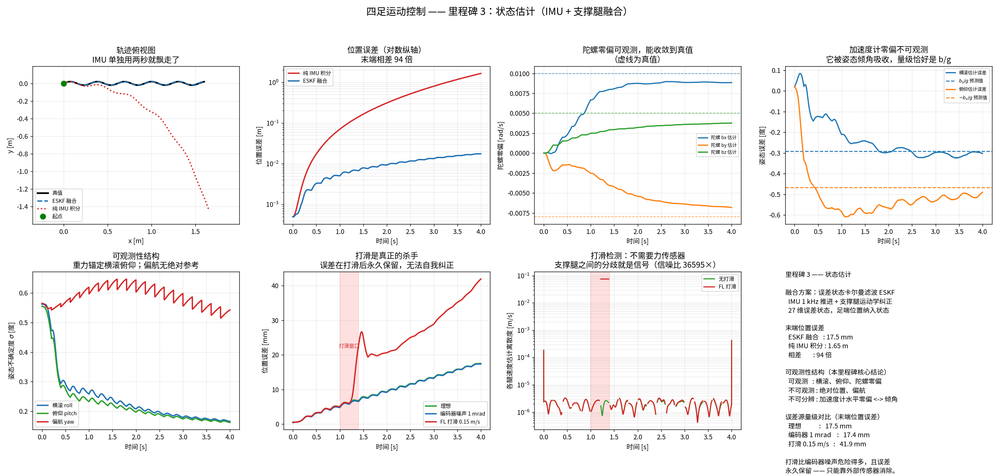

# 里程碑 3 —— 状态估计

> 模块：`state_estimator/` · 机器人：Unitree Go2 · 状态：已完成，32/32 测试通过



---

## 1. 这个模块为什么存在

前两个里程碑给了你**模型**：脚在哪（M1）、力怎么变成运动（M2）。但控制器还缺一样最基本的东西 —— **机器人自己在哪、朝哪、走多快**。

MPC 要知道质心状态才能规划接触力，WBC 要知道姿态才能算重力补偿，落脚点规划要知道速度才能用 Raibert 启发式。**没有状态估计，前面所有模型都无从使用。**

问题在于：**这些量一个都测不到。**

| 想知道的量 | 有没有直接传感器 |
|---|---|
| 躯干位置 | ❌ 无（室内无 GPS） |
| 躯干速度 | ❌ 无 |
| 躯干姿态 | ⚠️ 只有 IMU，会漂 |
| 关节角 | ✅ 编码器，很准 |
| 加速度、角速度 | ✅ IMU，但有噪声和零偏 |

所以必须**融合**：用能测的量，推断想知道的量。

### 与你 MHE / PX4 背景的对应

这一块你其实最熟。PX4 的 EKF2 做的是同一件事：IMU 高频推进 + GPS/气压计/光流低频纠正。四足的差别只有一个，但影响巨大：

| | 无人机（PX4 EKF2） | 四足 |
|---|---|---|
| 位置观测 | GPS / 光流 / UWB | **无** |
| 速度观测 | GPS / 光流 | **支撑腿运动学** |
| 姿态参考 | 加速度计（重力）+ 磁力计 | 加速度计（重力），通常不用磁力计 |
| 绝对位置是否可观测 | 是（有 GPS） | **否** |
| 偏航是否可观测 | 是（有磁力计/GPS 航向） | **否** |

**四足多了一个无人机没有的观测（支撑腿），但少了唯一的绝对参考（GPS）。** 这决定了本里程碑的全部结论。

---

## 2. 支撑腿里程计：四足独有的那个观测

四足虽然没有 GPS，但它有一件无人机做不到的事：**只要脚踩在地上不打滑，那只脚在世界系里的速度就是零**。这是一个免费的速度观测。

设躯干位姿为 $(p, R)$，某只支撑脚在躯干系下的位置为 $p^B_f$，则

$$p^W_f = p + R\, p^B_f$$

对时间求导，并令支撑脚速度为零：

$$0 = \dot p + R\,(\omega \times p^B_f) + R\, J(q)\,\dot q$$

$$\boxed{\dot p = -R\left(J(q)\,\dot q + \omega \times p^B_f\right)}$$

三项的物理含义很清楚：关节在动（$J\dot q$）、躯干在转（$\omega \times p^B_f$），二者合起来必须由躯干平动抵消，才能让脚在世界里保持静止。

**注意这直接用到了里程碑 1 的雅可比。** 测试 `test_leg_odometry_recovers_velocity_exactly` 验证理想条件下速度还原精度达 $2\times10^{-4}$ m/s —— 如果 $J$ 错了，这里立刻暴露。这就是分层构建的价值：每一层都在替下一层做体检。

### 免费的打滑检测

四条腿各自独立给出一个速度估计。不打滑时它们应当高度一致；某条腿一滑，它给出的估计立刻偏离其余几条。

**这个离散度就是打滑指标，不需要任何力传感器。** 实测信噪比 **36595×**（打滑时 $10^{-1}$ m/s，基线 $2\times10^{-6}$ m/s）。

> 工程细节：接触切换前后 15 ms 必须屏蔽。那里关节速度靠差分得到，跨越落地/离地的不连续点会产生虚假尖峰。真实控制器同样屏蔽这些时刻 —— 接触状态本身在那几毫秒里就不可靠。

---

## 3. 为什么是误差状态卡尔曼滤波（ESKF）

### 姿态不是向量

姿态活在 $SO(3)$ 上，不是向量空间。直接对四元数做卡尔曼更新会破坏单位模长，用欧拉角会遇到万向锁。

**误差状态**的做法：把估计拆成"大的名义值（在流形上）+ 小的误差（在切空间里）"，卡尔曼只处理后者。误差始终保持在零附近的小量，线性化因此始终有效，所有线性代数都合法。

> **这与里程碑 2 里"浮动基座求导必须用 `pin.integrate`"是同一个道理。** 一旦状态活在流形上，所有"加减"都必须换成流形上的对应操作。这个模式会在整个项目里反复出现。

### 状态设计（Bloesch 等 2013）

```
名义状态                     误差状态（27 维）
p       (3)   躯干位置        dp      (3)
v       (3)   躯干速度        dv      (3)
R       (3,3) 姿态            dtheta  (3)   <- 切空间
b_a     (3)   加速度计零偏    db_a    (3)
b_g     (3)   陀螺零偏        db_g    (3)
p_f     (4,3) 四只脚世界位置  dp_f    (12)
```

**把足端位置放进状态**是这个方案的关键设计。不把"脚不动"当成硬约束，而是给每只脚一个很小的过程噪声。轻微打滑于是被自然吸收成状态的缓慢漂移，而不是让滤波器发散。

`ESKFConfig.foot_noise_stance` 就是这个旋钮：调大则容忍打滑但精度下降，调小则精度高但一打滑就崩。测试 `test_larger_foot_process_noise_absorbs_slip_better` 量化了这个权衡。

### 姿态误差的扰动约定

本实现采用**世界系（左）扰动**：

$$R = \exp(\delta\theta^\wedge)\,\hat R$$

由此得到观测雅可比（对 $z = R^\top(p_f - p)$ 展开）：

$$\frac{\partial z}{\partial \delta p} = -\hat R^\top, \qquad
\frac{\partial z}{\partial \delta\theta} = \hat R^\top [p_f - p]_\times, \qquad
\frac{\partial z}{\partial \delta p_f} = \hat R^\top$$

**换成机体系（右）扰动，上面每一个雅可比都要改。** 这类约定必须写死在文档里并用测试钉住 —— 混用两种约定的 bug 表现为"滤波器大体能用但姿态更新总差一点"，极难定位。

---

## 4. 加速度计测的是比力，不是加速度

$$a_{\text{meas}} = R^\top (a_{\text{world}} - g_{\text{world}}) + b_a + n_a$$

**静止放在桌上时它读出的是 $+9.81\ \text{m/s}^2$ 向上，不是零。**

符号搞反的后果：滤波器把重力当成持续的向上加速度，位置在两秒内飞出去。由 `test_accelerometer_measures_specific_force_not_acceleration` 钉死。

这是 IMU 相关代码最经典的错误，而且**它在静止测试里看起来"差不多对"**（数值确实是 9.81），只有符号错了。

---

## 5. 可观测性：本里程碑最重要的结论

这一节的内容值得反复读 —— 它不是实现细节，而是**四足状态估计的根本结构**。

### 实测结果

| 量 | 可观测性 | 实测 |
|---|---|---|
| 横滚、俯仰 | ✅ 可观测 | $\sigma$ 从 0.562° 收敛到 **0.165°** |
| 陀螺零偏 | ✅ 可观测 | 估计值收敛到真值附近 |
| 偏航 | ❌ 不可观测 | $\sigma$ 从 0.565° 到 **0.543°**，不收敛 |
| 绝对位置 | ❌ 不可观测 | 只能保证**变化量**正确 |
| 加速度计水平零偏 | ⚠️ **与倾角不可分辨** | 完全没估出来 |

### 为什么横滚俯仰可观测，偏航不可观测

**重力是一个绝对参考。** 加速度计在长时间平均意义上指向重力反方向，这就锁定了横滚和俯仰。

但重力矢量是竖直的，**绕竖直轴旋转不改变它**。所以偏航没有任何绝对参考，只能靠陀螺积分，必然缓慢漂移。

> 无人机靠磁力计解决这个问题。四足通常不用磁力计 —— 电机的强磁场和室内钢结构会让它比不用还糟。所以工业界的答案是：**要么接受偏航漂移把估计当里程计用，要么上视觉/激光。**

### 加速度计零偏与倾角不可分辨 —— 一个漂亮的验证

这是我在实现过程中最满意的一个发现，也是从"数字异常"追到"物理原因"的完整过程。

**现象**：注入加速度计零偏 $b_a = [0.08, -0.05, 0.10]$，滤波器完全没估出来（估计值 $\approx 0$），但位置精度依然不错。

**假说**：水平方向的常值零偏 $b$，和一个大小为 $b/g$ 的倾角，对加速度计产生**完全相同的读数** —— 二者不可分辨。滤波器于是把零偏"吸收"成了姿态误差。

**定量验证**：

| | 由 $b/g$ 预测的倾角 | 实测姿态误差 |
|---|---|---|
| 横滚（来自 $b_y$） | $-0.292°$ | **$-0.302°$** |
| 俯仰（来自 $b_x$） | $-0.467°$ | $-0.490°$ |

吻合到小数点后两位。这个假说被写成了测试 `test_accelerometer_bias_is_absorbed_into_tilt`，容差 0.002 rad。

**工程含义**：不要指望在线估出加速度计零偏。它需要机器人做出**足够丰富的机动**（不同方向的持续加速）才能与倾角分开。实践中的做法是开机前静态标定，或者干脆接受这个 0.3° 的姿态偏差。

---

## 6. 什么会真正搞垮估计器

实测末端位置误差（4 秒 trot，含 IMU 噪声与零偏）：

| 场景 | 末端位置误差 |
|---|---:|
| 纯 IMU 开环积分 | **1.65 m** |
| ESKF 融合（理想运动学） | 17.5 mm |
| ESKF + 编码器噪声 1 mrad | 17.4 mm |
| ESKF + FL 打滑 0.15 m/s × 0.4 s | **41.9 mm** |

三个结论：

**1. 融合的价值是 94 倍。** 纯 IMU 积分两秒就飘走了 —— 零偏经过双重积分变成 $\frac{1}{2}bt^2$，增长极快。

**2. 编码器噪声几乎无害。** 1 mrad 的噪声对结果影响小于 1%。因为它是**零均值**的，会被滤波平均掉。

**3. 打滑是真正的杀手，而且误差永久保留。** 打滑是**有偏**的误差，直接积分进位置。更要命的是：打滑结束后，误差不会自己消失（测试 `test_slip_error_is_permanent`）。

**为什么无法自我纠正？** 因为没有任何绝对位置参考。滤波器无法区分"是脚动了"还是"是身体动了" —— 这两种解释对所有传感器读数完全一致。

> 这直接推出工业界的分层：**腿部里程计做局部高频估计，视觉/激光 SLAM 做低频全局纠正。** 宇树、波士顿动力、ANYmal 全是这个架构。本里程碑做的是第一层。

---

## 7. 你熟悉的 MHE 为什么在这里不常用

既然你有 MHE 背景，这个问题值得专门讲 —— **它也是很好的面试题**。

MHE 理论上确实更优：

- 能处理**约束**（比如 $f_z \ge 0$、零偏有界）；
- 对**野值**更鲁棒（可以用 Huber 损失）；
- 用一个**时间窗**的全部数据，而不只是当前时刻。

但腿式状态估计几乎全用 EKF，原因有四个：

**1. 硬实时。** 状态估计要跑在 1 kHz 线程里。EKF 每步是固定的矩阵运算，耗时**有确定上界**。MHE 每步要解一个优化问题，耗时取决于初值和收敛情况 —— **无上界**。这一条基本就判了死刑。

> 这和里程碑 1 里"解析 IK vs 数值 IK"是同一个论证。硬实时系统里，**平均速度不重要，最坏情况才重要**。

**2. 这里的非线性很温和。** MHE 的优势在强非线性、状态约束起作用的场合。四足状态估计的非线性主要来自姿态，而 ESKF 用误差状态已经把它处理得很好了。滑动窗口带来的额外精度很有限。

**3. 不可观测方向不会因为 MHE 而变得可观测。** 偏航和绝对位置的不可观测性是**结构性**的 —— 观测方程里根本没有它们的信息。用 MHE 也变不出来。

**4. 调参与工程复杂度。** EKF 只需调协方差矩阵，MHE 要调窗口长度、代价函数、求解器容差、warm start 策略。在一个必须 24 小时稳定运行的产品里，这是实打实的成本。

**那什么时候值得上 MHE？** 当你需要显式处理约束、或者要融合延迟很大的观测（比如视觉 SLAM 的回环，几百毫秒延迟）时。工业界的做法通常是**分层**：1 kHz 的 EKF 做本体估计，10 Hz 的因子图/滑窗优化做全局定位 —— 后者本质上就是 MHE。

---

## 8. 软件架构

```
                   state_estimator/simulation.py
                   （生成带真值的运动数据）
                   复用 M1 的 IK + M2 的姿态工具
                              │
              ┌───────────────┴───────────────┐
              │                               │
   leg_odometry.py                       eskf.py
   （纯腿部里程计，手推 NumPy）       （ESKF，IMU + 腿部融合）
   既是最简可用估计器                  工业标准做法
   也是衡量融合价值的对照组                  │
              │                               │
              └───────────────┬───────────────┘
                              │
                 tests/test_state_estimation.py
```

**验证策略的变化。** 前两个里程碑靠"两份独立实现互相对照"。状态估计不行 —— 真机上**没有真值**。所以先造一个运动学完全自洽的世界，再在其中检验估计器。

这本身就是工业界的标准做法：先在仿真里把估计器调对，再上真机。而**数据生成器自己也必须被验证** —— `test_generated_data_is_kinematically_consistent` 断言 FK(关节角) 严格等于足端位置，精度 $10^{-12}$。否则整个验证建立在沙子上。

---

## 9. API

```python
from state_estimator import (
    generate_trot, simulate_imu, TrajectoryConfig,
    ErrorStateKF, ESKFConfig, ESKFState,
    LegOdometry, base_velocity_from_legs,
)

# 造数据
gt = generate_trot(TrajectoryConfig(duration=4.0, forward_speed=0.4))
accel, gyro = simulate_imu(gt, accel_noise=0.02, gyro_noise=0.002,
                           accel_bias=[0.08, -0.05, 0.10])

# ESKF
init = ESKFState(position=..., velocity=..., rotation=...)
init.foot_position[:] = gt.foot_position_world[0]
kf = ErrorStateKF(dt=1e-3, config=ESKFConfig(), initial_state=init)

for k in range(len(gt)):
    kf.step(accel[k], gyro[k], gt.joint_position[k], gt.contact[k])

kf.state.position, kf.state.velocity, kf.state.rotation
kf.position_std, kf.velocity_std, kf.attitude_std   # 不确定度

# 纯腿部里程计（对照组）
v_world, per_leg = base_velocity_from_legs(joint_pos, joint_vel, R, omega_body, contact)
slip = LegOdometry.slip_indicator(per_leg)          # 打滑检测

# 退化场景注入
from state_estimator.simulation import inject_slip, add_encoder_noise
slipped = inject_slip(gt, "FL", 1.0, 1.4, [0.15, 0, 0])
jp, jv = add_encoder_noise(gt, position_noise=1e-3)
```

---

## 10. 本模块如何被验证

`pytest tests/test_state_estimation.py -v` → **32 passed**。

| 分组 | 钉死了什么 |
|---|---|
| 数据生成器 | FK(关节角) == 足端位置，$10^{-12}$；trot 恒有两条支撑腿；支撑脚不动；摆动脚真的抬起 |
| 数据生成器 | 解析速度/加速度与数值微分一致；$\dot R = R\omega^\wedge$ |
| IMU 模型 | 静止时读数为 $+g$（**比力**）；零偏按指定值进入；陀螺测机体系角速度 |
| SO(3) | `so3_exp` == `pin.exp3`；小角度不出现 0/0；输出是合法旋转 |
| 腿部里程计 | 理想条件下精确还原速度（同时验证 M1 的雅可比）；各腿一致；腾空抛异常 |
| 打滑检测 | 打滑时指标跳高 20 倍以上 |
| ESKF | 跟踪真值；协方差始终对称正定；旋转始终正交；比开环好 20 倍以上 |
| ESKF | 腾空相不崩；落地时足端状态重新锚定 |
| **可观测性** | **陀螺零偏收敛；加速度计零偏被吸收成 $b/g$ 的倾角；横滚收敛而偏航不收敛** |
| 退化场景 | 编码器噪声温和退化；**打滑破坏力大一个数量级且永久保留**；过程噪声可调节抗滑性 |

### 调试清单

状态估计出问题时，按这个顺序查：

1. **先查 IMU 符号。** 静止时加速度计必须读 $+g$。这一条能抓住一半的问题。
2. **关掉噪声和零偏跑一遍。** 理想条件下误差应该 < 1 mm。不是的话，问题在模型或雅可比，与调参无关。
3. **关掉更新，只做预测。** 看纯 IMU 积分是否符合预期的 $\frac{1}{2}bt^2$ 增长。
4. **检查协方差是否对称正定。** 不是的话，用 Joseph 形式，并每步强制 `P = (P + P.T)/2`。
5. **检查旋转矩阵是否还正交。** 浮点累积会让它慢慢失正交，必须定期 SVD 投影回 $SO(3)$。
6. **查观测残差（新息）的均值。** 应当接近零。不为零说明有系统偏差 —— 常见于坐标系搞错或髋部偏置漏掉。
7. **打滑指标是否异常。** 位置突然发散但姿态正常，八成是打滑。
8. **姿态一直偏 0.3° 左右？** 大概率是加速度计零偏，别指望滤波器估出来。

---

## 11. 面试问题

### 概念题

1. 四足没有 GPS，靠什么估计位置？这个估计的根本局限是什么？
2. 推导支撑腿里程计的速度公式。为什么会有 $\omega \times p^B_f$ 这一项？
3. 为什么要用误差状态卡尔曼，而不是直接对四元数做 EKF？
4. 加速度计测的是什么？静止水平放置时读数是多少？
5. 四足状态估计中，哪些量可观测，哪些不可观测？为什么？
6. 为什么加速度计零偏很难估出来？它会跑到哪里去？
7. 为什么把足端位置放进状态向量，而不是把"脚不动"当硬约束？
8. 打滑怎么检测？为什么打滑的误差无法自我纠正？
9. **你有 MHE 背景 —— 为什么腿式状态估计不用 MHE 而用 EKF？**
10. 不变卡尔曼滤波（InEKF）解决了 EKF 的什么问题？

### 一定会被追问的

- "机器人位置估计慢慢往一个方向飘。"（*打滑；或某条腿的接触检测有误*）
- "姿态一直有 0.3° 的偏差。"（*加速度计零偏被吸收成倾角*）
- "位置在两秒内飞出去。"（*加速度计比力符号搞反，重力没减掉*）
- "滤波器跑一会儿协方差就不是正定了。"（*没用 Joseph 形式；没强制对称*）
- "偏航为什么一直漂？加个磁力计行不行？"（*理论可以，但电机磁场和室内钢结构会让它更糟*）

### 编程题

- 手写一个一维位置-速度 KF，融合加速度计和位置观测。
- 给定 $R = \exp(\delta\theta^\wedge)\hat R$，推导 $z = R^\top(p_f - p)$ 对 $\delta\theta$ 的雅可比。
- 写一个测试，能抓住"加速度计符号搞反"这个 bug。

### 系统设计题

- 设计一个四足的完整定位方案，从 1 kHz 本体估计到全局定位。各层跑多快，怎么交互？
- 视觉 SLAM 有 200 ms 延迟，怎么和 1 kHz 的 EKF 融合？
- 机器人走到冰面上，你怎么让系统降级而不是摔倒？

---

## 12. 它和后面的模块怎么衔接

| 下游模块 | 需要本模块提供什么 |
|---|---|
| 步态调度（M4） | 接触状态；打滑指标可用于触发步态降级 |
| 摆动腿规划（M5） | 躯干位姿，把世界系落脚点转到躯干系 |
| 落脚点规划（M6） | **躯干速度** —— Raibert 启发式的核心输入 |
| 凸 MPC（M7） | 质心位置、速度、姿态、角速度，即 MPC 的初始状态 |
| WBC（M8） | 姿态（重力补偿）、接触状态（约束集合） |
| 强化学习（M9） | 策略的观测向量；sim-to-real 时要注入同样的估计误差 |

**M9 有一个容易被忽略的点**：在 Isaac Lab 里训练时用的是仿真的完美状态，真机上用的是本模块的估计值。二者的差距是 sim-to-real gap 的重要来源之一 —— 训练时就应该把估计误差（0.3° 姿态偏差、位置漂移）注入观测。

---

## 13. 参考文献

- Bloesch et al., *State Estimation for Legged Robots — Consistent Fusion of Leg Kinematics and IMU*, RSS 2012 —— 本模块的直接来源。
- Bloesch et al., *State Estimation for Legged Robots on Unstable and Slippery Terrain*, IROS 2013.
- Hartley et al., *Contact-Aided Invariant Extended Kalman Filtering for Robot State Estimation*, IJRR 2020 —— InEKF，解决 EKF 的一致性问题。
- Solà, *Quaternion kinematics for the error-state Kalman filter*, arXiv 2017 —— ESKF 推导的最佳参考。
- Barrau & Bonnabel, *The Invariant Extended Kalman Filter as a Stable Observer*, IEEE TAC 2017.

---

**下一步：** 里程碑 4 —— 步态调度器。相位、占空比、接触时序，以及为什么 trot / pace / bound / gallop 的选择本质上是一个能量与稳定性的权衡。这一块相对轻，但它是 MPC 与摆动规划共同的时间基准。
