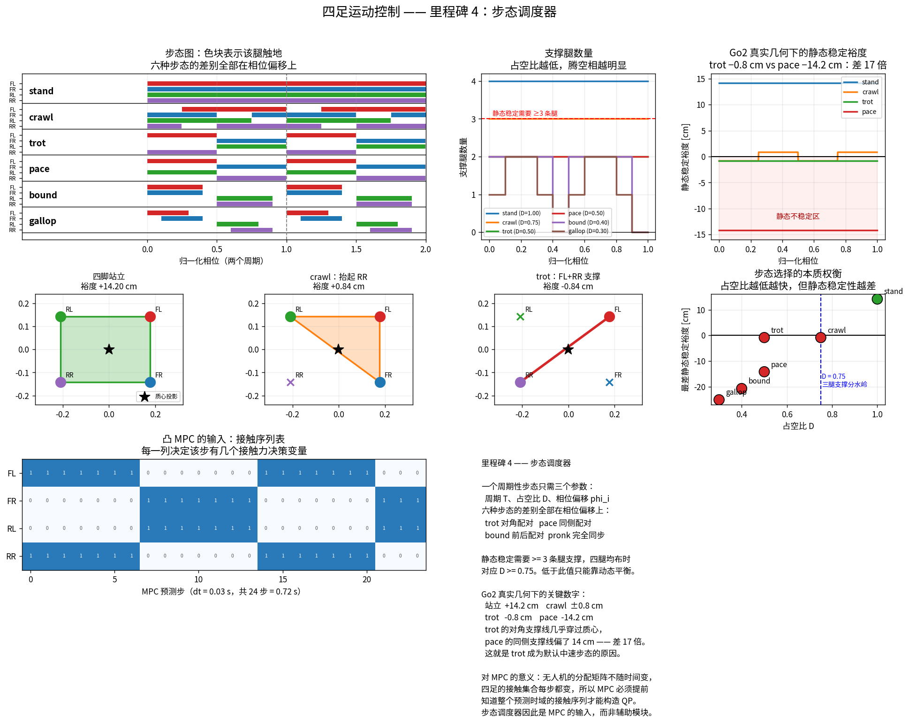

# 里程碑 4 —— 步态调度器

> 模块：`gait_scheduler/` · 机器人：Unitree Go2 · 状态：已完成，34/34 测试通过



---

## 1. 这个模块为什么存在

前三个里程碑给了**模型**（M1 运动学、M2 动力学）和**状态**（M3 估计）。现在要开始规划运动了，而规划的第一件事是决定**时间**：

> 在未来的每一个时刻，哪几只脚踩在地上？

这个问题的答案是整个控制栈的**共同时间基准**。四个下游模块都在问它，问法各不相同：

| 问题 | 谁在问 | 本模块的接口 |
|---|---|---|
| 现在哪几条腿踩着地？ | WBC（约束集合）、状态估计（观测集合） | `contact(t)` |
| 这条腿的摆动进行到百分之几？ | 摆动腿规划器（M5） | `swing_phase(t)` |
| 这条腿还有多久落地？ | 落脚点规划器（M6） | `time_to_touchdown(t)` |
| 未来 N 步的接触序列是什么？ | 凸 MPC（M7） | `contact_schedule(t0, dt, N)` |

### 为什么最后一条最重要

这是四足 MPC 与无人机 MPC 最本质的差别，也是 M2 那句"$S$ 的前 6 列全为零"的直接后果。

**无人机的控制分配矩阵不随时间变化。** MPC 每一个预测步的结构完全相同，你可以离线把 QP 的稀疏结构定死。

**四足的接触集合每走一步就变一次。** trot 时 FL+RR 支撑，半个周期后换成 FR+RL。MPC 只为**支撑腿**引入接触力决策变量，摆动腿的力被强制为零 —— 所以**整个 QP 的结构由接触序列决定**，必须提前知道。

> **所以步态调度器不是"辅助模块"，它是 MPC 的输入之一。** 这个认知上的调整挺重要 —— 很多人第一次看四足 MPC 会以为步态是控制器"算出来"的，其实是**预先指定**的。接触序列本身如果也要优化，问题就变成混合整数规划（MIQP），实时性立刻崩掉。这是接触隐式（contact-implicit）MPC 至今没有大规模落地的原因。

---

## 2. 三个参数描述一切步态

一个周期性步态只需要三样东西：

| 参数 | 含义 |
|---|---|
| 周期 $T$ | 走完一个完整循环需要多久 |
| 占空比 $D$ | 每条腿有多大比例的时间踩在地上 |
| 相位偏移 $\phi_i$ | 每条腿在循环里的哪个时刻**落地** |

$$s_i(t) = \left(\frac{t}{T} - \phi_i\right) \bmod 1, \qquad \text{接触} \iff s_i(t) < D$$

**约定要一次定死**：这里的 $\phi_i$ 是**落地**相位。有的文献定义成离地时刻，符号全反 —— 又是一个"混用两套约定就会悄悄出错"的地方。

### 六种步态，差别全部在相位偏移上

| 步态 | $T$ | $D$ | 配对方式 | 相位偏移 (FL, FR, RL, RR) |
|---|---|---|---|---|
| stand | 1.0 | 1.00 | — | (0, 0, 0, 0) |
| crawl | 1.0 | 0.75 | 一次只抬一条 | (0.25, 0.75, 0, 0.5) |
| **trot** | 0.4 | 0.50 | **对角** | (0, 0.5, 0.5, 0) |
| pace | 0.4 | 0.50 | **同侧** | (0, 0.5, 0, 0.5) |
| bound | 0.32 | 0.40 | **前后** | (0, 0, 0.5, 0.5) |
| gallop | 0.3 | 0.30 | 依次落地 | (0, 0.1, 0.5, 0.6) |

**trot 和 pace 的周期、占空比完全一样，只有配对方式不同。** 就这一个数字的差别，决定了机器人是稳还是晃 —— 下一节会把这个差别量化到 17 倍。

---

## 3. 静态稳定：为什么 $D = 0.75$ 是分水岭

**静态稳定**的定义：把质心竖直投影到地面，如果落在支撑多边形内部，机器人即使完全静止也不会翻倒。

由此立刻推出：**至少需要三条腿触地**。两条腿的"多边形"退化成一条线段，质心投影几乎不可能恰好落在线上。

四条腿均匀分布时，"任意时刻至少三条腿在地上"要求

$$D \ge 0.75$$

所以 **trot、pace、bound、gallop 全都是静态不稳定的**。它们靠运动本身维持平衡 —— 就像人跑步时，任何一个瞬间都处在要摔倒的状态，只是还没来得及摔。

### Go2 真实几何下的实测

用 M2 算出的真实质心和 M1 算出的真实足端位置：

| 步态 | 最差静态稳定裕度 |
|---|---:|
| stand | **+14.20 cm** |
| crawl | −0.84 cm（在 ±0.84 之间振荡） |
| **trot** | **−0.84 cm** |
| **pace** | **−14.20 cm** |
| bound | −20.76 cm（含腾空相 → −∞） |
| gallop | −25.15 cm（含腾空相 → −∞） |

### 本里程碑最有价值的一个数字：trot vs pace 差 17 倍

trot 和 pace 的占空比、周期完全相同，静态稳定裕度却差了 **17 倍**：

- **trot**：支撑的是**对角**两只脚（FL + RR）。它们的连线是矩形的**对角线**，几乎正好穿过质心 → 裕度 −0.84 cm，只是"勉强不稳"。
- **pace**：支撑的是**同侧**两只脚（FL + RL）。它们的连线在身体一侧，离质心 14.2 cm → 裕度 −14.20 cm，"严重不稳"。

**这就是 trot 成为四足默认中速步态的定量原因**，也是真实机器人跑 pace 时会明显左右摇晃的原因。骆驼和部分犬类用 pace，代价就是身体大幅侧向摆动 —— 它们靠很宽的身体和主动摆动来补偿。

### crawl 为什么要左右摇摆

crawl 的裕度在 $\pm 0.84$ cm 之间振荡 —— **有一半时间是负的**。

原因是个漂亮的几何事实：**矩形的对角线，就是去掉一个角之后所形成三角形的一条边**。质心位于矩形中心时，恰好落在这条边上，裕度为零。

所以真实的 crawl 步态**必须把质心朝支撑三角形那一侧挪**。这正是四足慢走时身体左右摇摆的原因 —— 不是为了好看，是为了把质心塞进支撑三角形里。测试 `test_shifting_com_into_the_triangle_restores_stability` 验证了朝形心挪动总能改善裕度。

> **静态稳定裕度只对慢速步态有意义。** trot 起来之后它恒为负，此时该看的是**动态**稳定性指标 —— 捕获点（capture point）、零力矩点（ZMP）、发散分量（DCM）。那些是里程碑 6 的内容。

---

## 4. 步态切换：为什么不能立即切换

`request_gait()` 请求的切换会**等到下一个周期边界**才生效。这不是偷懒，是必须的。

**相位偏移一变，某些腿的接触状态会瞬间跳变。** 正踩着地的脚突然被判定为摆动腿，WBC 立刻撤掉它的接触约束、把它的接触力设为零 —— 机器人在那一个控制周期里瞬间失去支撑。

真实系统的做法有两种：

1. **周期边界切换**（本模块的默认）—— 简单可靠；
2. **等到所有腿都触地时切换** —— 更安全，但要求步态里存在四脚同时着地的时刻（crawl、stand 有，trot 没有）。

`force_gait()` 提供了立即切换，但只应在机器人静止或四脚全部触地时使用。文档和 docstring 里都写清楚了这个前提。

---

## 5. 顺手还掉的一笔技术债

里程碑 3 为了生成验证数据，在 `state_estimator/simulation.py` 里手写了一个最小 trot 时序。本里程碑把它替换成了正式的 `GaitScheduler`。

**替换之后 M1–M3 的 102 项测试全部原样通过** —— 这本身就是新调度器行为正确性的强验证：如果相位约定、占空比语义、摆动进度定义有任何一处不一致，M3 的 32 项测试立刻会红。

更重要的是原则：**数据生成器和真实控制器必须共用同一个时间基准**。否则你在仿真里调对的东西，到了控制器里可能因为相位差半个周期而完全不工作 —— 这类 bug 极难定位。

---

## 6. API

```python
from gait_scheduler import GaitScheduler, get_gait, GAITS, static_stability_margin

sched = GaitScheduler("trot")

# 当前状态
sched.contact(t)            # (4,) bool  —— WBC 的约束集合
sched.n_stance(t)           # int
sched.leg_phase(t)          # (4,) [0,1)，0 表示刚落地
sched.swing_phase(t)        # (4,) 摆动进度，支撑腿为 NaN  —— M5 用
sched.stance_phase(t)       # (4,) 支撑进度，摆动腿为 NaN

# 事件倒计时
sched.time_to_touchdown(t)  # (4,) 秒  —— M6 的核心输入
sched.time_to_liftoff(t)
sched.next_touchdown_time(t)

# MPC 接口
sched.contact_schedule(t0=0.0, dt=0.03, horizon=24)   # (24, 4) bool

# 步态切换
sched.request_gait("crawl")     # 周期边界生效
sched.update(t)                 # 控制回路里每步调用，返回是否已切换
sched.force_gait("stand", t)    # 立即切换，仅限静止时

# 稳定性分析
static_stability_margin(com_xy, foot_positions, contact)   # 带符号距离，米
support_polygon(foot_positions, contact)                   # (m, 2) 凸包顶点
```

自定义步态：

```python
from gait_scheduler import GaitDefinition
my_gait = GaitDefinition(
    name="slow_trot", period=0.6, duty_factor=0.6,
    phase_offsets={"FL": 0.0, "RR": 0.0, "FR": 0.5, "RL": 0.5},
)
```

---

## 7. 本模块如何被验证

`pytest tests/test_gait.py -v` → **34 passed**。

步态调度器是纯逻辑模块，没有"第二份实现"可以对照。所以验证策略换成**用步态的定义性质去反查实现**：

| 分组 | 钉死了什么 |
|---|---|
| 定义合法性 | 参数校验；周期 = 支撑时长 + 摆动时长 |
| **步态的定义性质** | trot 对角腿接触状态**恒等**；pace 同侧腿恒等；bound 前后腿恒等 |
| | crawl 恒有 3 条支撑腿；stand 恒有 4 条；bound/gallop 存在腾空相 |
| | 占空比 == 实测支撑时间占比（10007 点采样，误差 < 2e-3） |
| **自洽性** | `contact` == `leg_phase < D`；摆动相与支撑相互斥（一个是 NaN 另一个必须不是） |
| | 摆动进度在同一次摆动内**严格递增**（否则 M5 的足端轨迹会来回抖） |
| | 落地倒计时结束的那一刻**必须真的已落地**，提前一点则还没落地 |
| MPC 接口 | 批量查询 == 逐点查询；跨周期时每条腿都既有支撑步也有摆动步 |
| 步态切换 | 请求切换必须等到周期边界，不得中途生效 |
| 凸包 | 正方形内点不入凸包；**退化输入（0/1/2 点、共线）不抛异常** |
| **稳定性** | 站立 +14.2 cm；两接触步态裕度**恒为非正**；**pace 比 trot 差一个数量级** |
| | 居中质心下 crawl 临界不稳；朝支撑三角形形心挪动**总能**改善裕度 |

### 调试清单

1. **先画步态图。** `scripts/viz_gait.py` 的第一张图能在三秒内看出相位偏移是否搞反。
2. **数支撑腿。** trot 恒为 2、crawl 恒为 3。不对就是占空比或偏移错了。
3. **检查摆动进度是否单调。** 不单调说明相位回绕的处理有问题，足端轨迹会抖。
4. **对照倒计时与实际接触。** `contact(t + time_to_touchdown(t))` 必须为真。
5. **机器人在步态切换瞬间跪下？** 八成是用了 `force_gait` 而不是 `request_gait`。
6. **慢走时明显要往一侧倒？** crawl 没有做质心侧移，裕度是负的。

---

## 8. 面试问题

### 概念题

1. 用哪三个参数可以完全描述一个周期性步态？
2. trot 和 pace 的区别是什么？为什么四足机器人默认用 trot？
3. 什么是占空比？为什么 $D = 0.75$ 是一条分界线？
4. 静态稳定和动态稳定的区别？trot 属于哪一种？
5. 四足慢走时为什么要左右摇摆身体？
6. 为什么凸 MPC 需要**提前**知道接触序列？如果接触序列也要优化会怎样？
7. 步态切换为什么不能立即生效？
8. 什么是腾空相？哪些步态有？它给控制带来什么挑战？

### 一定会被追问的

- "机器人在步态切换的瞬间跪了一下。"（*中途切换导致支撑脚被瞬间撤销约束*）
- "为什么不让 MPC 自己决定什么时候落脚？"（*接触序列是离散变量 → MIQP，实时性崩掉；这是 contact-implicit MPC 的核心难点*）
- "生物学上四足动物为什么会随速度切换步态？"（*能耗最优；Froude 数 $Fr = v^2/(gh)$ 可以预测切换点*）
- "怎么让机器人在打滑时自动降级步态？"（*用 M3 的打滑指标触发向 crawl 切换，提高占空比*）

### 编程题

- 实现 `contact_schedule(t0, dt, N)`，要求批量查询与逐点查询完全一致。
- 写一个凸包算法，要能处理少于 3 点和共线的退化输入。
- 给定支撑多边形和质心投影，计算带符号的稳定裕度。

### 系统设计题

- 设计一个能在 crawl / trot / bound 之间自动切换的调度器。切换条件是什么？在哪个时刻切？
- 机器人一条腿坏了，怎么改步态让它还能走？
- 步态调度器跑在哪个线程？它和 50 Hz 的 MPC、1 kHz 的 WBC 怎么同步？

---

## 9. 它和后面的模块怎么衔接

| 下游模块 | 需要本模块提供什么 |
|---|---|
| 摆动腿规划（M5） | `swing_phase(t)` —— 在足端轨迹上取点 |
| 落脚点规划（M6） | `time_to_touchdown(t)` —— Raibert 启发式的核心输入 |
| **凸 MPC（M7）** | **`contact_schedule(t0, dt, N)` —— 直接决定 QP 的结构** |
| WBC（M8） | `contact(t)` —— 等式约束的集合 |
| 强化学习（M9） | 相位可作为策略的周期性观测输入（相位驱动的 RL 步态） |

M5 和 M6 会立刻用上本模块。**M5 负责"脚怎么过去"，M6 负责"脚落在哪"，M4 负责"什么时候"** —— 三者严格分工，这个划分本身就是四足控制架构的标准做法。

---

## 10. 参考文献

- Alexander, *The Gaits of Bipedal and Quadrupedal Animals*, IJRR 1984 —— 步态分类与 Froude 数。
- Hoyt & Taylor, *Gait and the energetics of locomotion in horses*, Nature 1981 —— 步态切换的能耗解释。
- Di Carlo et al., *Dynamic Locomotion in the MIT Cheetah 3 via Convex MPC*, IROS 2018 —— 接触序列作为 MPC 输入。
- Bledt et al., *MIT Cheetah 3*, IROS 2018 —— 步态调度器的工程实现。
- McGhee & Frank, *On the stability properties of quadruped creeping gaits*, Mathematical Biosciences 1968 —— 静态稳定裕度的原始定义。

---

**下一步：** 里程碑 5 —— 摆动腿规划器。足端轨迹、抬腿高度、落地冲击，以及为什么摆动腿的轨迹形状直接影响机器人能不能过障碍。这一块会第一次把 M1 的 IK 用在真正的控制回路里。
