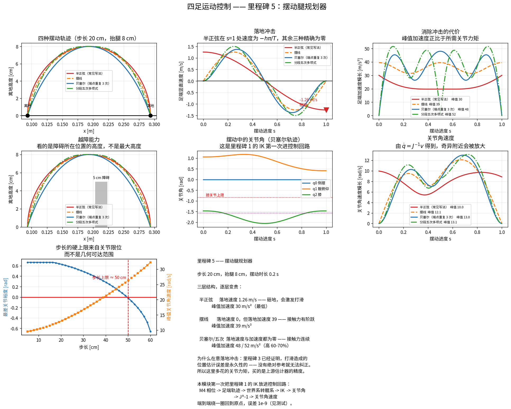

# 里程碑 5 —— 摆动腿规划器

> 模块：`swing_planner/` · 机器人：Unitree Go2 · 状态：已完成，32/32 测试通过



---

## 1. 这个模块为什么存在

里程碑 4 定下了**时间**：这条腿从 $t_1$ 到 $t_2$ 处于摆动相。现在要回答**空间**问题：

> 这只脚在空中应该走一条什么样的路径？

看起来只是"插值一下"，但这条曲线的形状直接决定三件事：

1. **落地冲击**。足端在落地瞬间如果还有竖直速度，就会砸在地上。
2. **越障能力**。抬腿不够高就绊倒；抬太高浪费能量、还可能超出工作空间。
3. **关节负担**。轨迹的二阶导决定关节加速度，进而决定所需力矩。

第一条最容易被忽略，也最致命 —— 下一节展开。

### 这是里程碑 1 的 IK 第一次进入控制回路

整条链路在这里第一次串起来：

```
步态调度器(M4)   ──摆动进度 s──┐
落脚点规划器(M6) ──落地目标────┤
状态估计器(M3)   ──躯干位姿────┤
                                v
                        足端轨迹（本模块）
                                │ 世界系足端位置
                                v
                        转换到髋系（需要躯干位姿）
                                │
                                v
                    逆运动学 IK (M1) ──> 关节角
                    雅可比逆 J⁻¹ (M1) ──> 关节角速度
```

测试 `test_joint_command_round_trips_through_kinematics` 验证：绕完整圈再用正运动学算回去，误差 $10^{-9}$。**任何一处符号错、髋部偏置漏掉、坐标系搞混，都会在这里暴露。**

---

## 2. 落地冲击：一个经典的坑

### 最常见的写法有问题

四足代码里最常见的摆动轨迹是"水平三次平滑插值 + 竖直半正弦"：

$$x(s) = x_0 + (3s^2 - 2s^3)\,\Delta x, \qquad z(s) = z_{\text{base}}(s) + h\sin(\pi s)$$

水平方向没问题：三次平滑插值在两端速度为零。**问题出在竖直方向**：

$$\left.\frac{dz}{ds}\right|_{s=1} = h\pi\cos(\pi) = -h\pi$$

换算成物理速度：

$$\boxed{v_{td} = -\frac{h\pi}{T_{\text{swing}}}}$$

取 $h = 8$ cm、$T_{\text{swing}} = 0.2$ s（trot 的典型值）：

$$v_{td} = -\frac{0.08 \times \pi}{0.2} = \mathbf{-1.26\ \text{m/s}}$$

**相当于从 8 cm 高自由落体砸下去。** 而且抬得越高、摆动越快，砸得越狠 —— **高速步态尤其危险**。

> 里程碑 3 里我为了造验证数据，手写的正是这条轨迹。当时只关心几何一致性，完全没考虑冲击。它现在作为对照基线留在 `SineHeightSwing` 里。

### 为什么必须在意

冲击本身会震坏减速器，但更麻烦的是它引发的**连锁反应**：

```
落地冲击 -> 足端打滑 -> 支撑腿里程计的前提失效 -> 位置估计出现偏差
```

而里程碑 3 已经用测试证明：**打滑造成的位置估计误差是永久性的**。四足没有任何绝对位置参考，估计器无法区分"是脚动了"还是"是身体动了"，误差只能一直累积下去。

**所以摆动轨迹上多花的关节力矩，买的是上游状态估计器的精度。** 这两个模块隔着两个里程碑，但它们是同一个问题的两端。

---

## 3. 四种轨迹与一个三层结构

| 轨迹 | 落地速度 | 落地**加速度** | 峰值加速度 | 峰值关节速度 |
|---|---:|---:|---:|---:|
| 半正弦 | **1.257 m/s** | 30.0 | **30.0**（最低） | 9.96 rad/s |
| 摆线 | 0 | **39.5** | 39.5 | 12.11 rad/s |
| 贝塞尔（端点重复 3 次） | 0 | **0** | 48.0 | 12.99 rad/s |
| 分段五次多项式 | 0 | **0** | 51.6 | 13.13 rad/s |

（步长 20 cm，抬腿 8 cm，摆动时长 0.2 s）

**这不是"有一种最好"，而是一个三层结构，逐层变贵：**

| 层次 | 特征 | 物理后果 |
|---|---|---|
| 半正弦 | 落地速度 ≠ 0 | 砸地，激发打滑 |
| 摆线 | 速度 = 0，加速度 ≠ 0 | 落地平滑，但**接触力有阶跃** |
| 贝塞尔 / 五次 | 速度 = 0，加速度 = 0 | 接触力连续，最平顺 |

### 代价的量化

消除落地冲击不是免费的：**峰值加速度上升 60–70%**（30 → 48/52 m/s²）。原因很直观 —— 零冲击轨迹必须在两端把速度压到零，中段就得加速得更猛。峰值加速度正比于所需关节力矩，所以这是实打实的电机成本。

**工程判断**：中低速用摆线（实现简单、落地已足够软）；高速或对接触力连续性敏感（比如力控 MPC）时用贝塞尔。MIT Cheetah 系列用的是贝塞尔。

---

## 4. 贝塞尔的两个技巧

### 端点重复次数控制导数阶数

贝塞尔曲线在端点的导数只取决于最靠近端点的几个控制点：

$$B'(0) = n(P_1 - P_0), \qquad B''(0) = n(n-1)(P_2 - 2P_1 + P_0)$$

所以**把端点控制点重复 $k$ 次，前 $k-1$ 阶导数在该端点自动为零**。不需要解方程，堆控制点即可。

- 重复 2 次 → 速度为零
- 重复 3 次 → 速度**和**加速度都为零

由 `test_bezier_endpoint_multiplicity_controls_derivative_order` 验证。

### 曲线不穿过中间控制点 —— 一个实现时踩到的坑

我第一版直接把顶点控制点设在目标抬腿高度上，结果**实际只抬起了三分之一**。

原因：贝塞尔曲线是控制点的加权平均，只有端点在曲线上。顶点控制点在 $s = 0.5$ 处的权重是

$$w = \frac{\binom{2k}{k}}{2^{2k}} \quad \xrightarrow{k=3} \quad \frac{20}{64} = 0.3125$$

所以控制点高度必须按 $h / w$ 反解。修正后由 `test_actual_clearance_equals_requested_height` 钉死：四种轨迹的**实际**抬腿高度都精确等于设定值。

---

## 5. 一个数值方法上的教训：端点导数不能用差分

第一版我给基类写了一个通用的中心差分求导，端点处把步长**截断**在 $[0,1]$ 内：

```python
s_plus = np.clip(s + eps, 0.0, 1.0)      # 错
s_minus = np.clip(s - eps, 0.0, 1.0)
```

截断会让中心差分退化成**不等间距**的三点公式，在端点给出错误结果。改成把整个模板**整体内移**后，摆线的落地速度算出来是 $7.9\times10^{-6}$ m/s —— 看起来"接近零"，其实是模板落在 $s = 1-\varepsilon$ 上的固有偏差。

**而落地速度恰恰是本模块的头号指标。** 一个"接近零"的头号指标是不可接受的：你无法区分它是真的零，还是有个小 bug。

最终的解法是给四种轨迹**全部写解析导数**。现在落地速度精确为零（$3\times10^{-16}$），并且解析导数与数值微分交叉验证到 $10^{-9}$（速度）/ $10^{-5}$（加速度）—— 又回到了里程碑 1、2 的老套路：**两条互不相干的路径必须一致**。

> 教训：**当某个量是模块的核心指标时，它值得被精确计算，而不是数值逼近。** 这和里程碑 1 里"IK 必须解析、不能迭代"是同一类判断。

---

## 6. 三个纯工程但缺一不可的环节

教科书讲轨迹生成时通常不提这些，但少一个机器人就走不了。

### 离地点必须在离地那一刻锁存

轨迹起点不是"当前足端位置"，而是**这条腿离开地面时**的位置。每周期实时读当前位置，会让轨迹自我追逐 —— 足端在原地打转。

由 `test_liftoff_point_is_latched_not_tracked` 验证：锁存之后再喂进去完全不同的"当前位置"，轨迹起点不应改变。

### 落地目标可以中途更新

落脚点规划器（M6）每个控制周期都在重算目标。轨迹必须能跟着变，否则机器人无法响应速度指令的变化。实现上就是每周期用最新的 `touchdown` 重建轨迹对象。

### 迟落地要继续下探

地面比预期低时，摆动进度已经到 1 却还没碰到地。此时必须以**受控速度继续向下探**，而不是停在空中 —— 否则机器人"踩空"，重心失去支撑。

`probe()` 以 `probe_velocity`（默认 0.15 m/s）下探，累计到 `max_probe_depth`（默认 6 cm）后停止。太慢会踩空，太快等于自己制造冲击；探过头则说明地面塌陷或标定错误，应当报故障。

### 另一个实现时踩到的坑：支撑腿的目标

支撑腿的"期望位置"必须是它**当前所在的位置**（保持不动）。我第一版把它初始化成零向量，结果开机瞬间还没摆动过的腿拿到 `[0,0,0]`，逆运动学随即解出一个荒唐的姿态。由 `test_stance_leg_target_is_its_current_position` 钉死。

---

## 7. 步长的硬上限来自关节限位

扫描步长可以得到一个明确的边界：

| 步长 | 可行性 | 最差关节裕度 | 峰值关节速度 |
|---|---|---:|---:|
| 10 cm | ✅ | +0.67 rad | 10.4 rad/s |
| 30 cm | ✅ | +0.49 rad | 16.7 rad/s |
| **50 cm** | ❌ | **−0.02 rad** | 26.3 rad/s |

**限制来自关节限位，不是几何可达范围。** 回顾里程碑 1：Go2 的几何最大伸展是 0.426 m，但膝限位 $-0.838$ rad 把它压到 **0.389 m**，只有 73% 的几何工作空间可用。再叠加 0.30 m 的站立高度，步长在 50 cm 附近就撞上限位了。

**落脚点规划器（M6）必须按这个数来**，而不是按几何可达范围。

---

## 8. API

```python
from swing_planner import SWING_TRAJECTORIES, SwingLegController, SwingLegConfig
from gait_scheduler import GaitScheduler

# 单独用轨迹
traj = SWING_TRAJECTORIES["bezier"](liftoff, touchdown, height=0.08)
traj.position(s)                        # (3,) 或 (n, 3)
traj.velocity(s, swing_duration)        # 解析导数
traj.acceleration(s, swing_duration)
traj.touchdown_velocity(swing_duration) # 头号指标
traj.peak_acceleration(swing_duration)
traj.clearance_profile()                # (s, 离地高度)

# 完整控制器
sched = GaitScheduler("trot")
ctl = SwingLegController(sched, SwingLegConfig(
    swing_height=0.08, trajectory="bezier",
    probe_velocity=0.15, max_probe_depth=0.06,
))

# 控制回路里每周期调用
ctl.update(t, foot_positions_world, touchdown_targets)   # 维护锁存与目标
q, dq = ctl.joint_command(t, "FR", base_position, base_rotation)
ctl.probe("FR", dt)          # 迟落地时下探

# 离线标定（无状态）
ctl.check_swing_feasibility("FR", liftoff, touchdown,
                            base_position, base_rotation, joint_limits)
# -> {feasible, worst_margin, max_condition_number,
#     max_joint_speed, touchdown_speed, peak_foot_acceleration}
```

---

## 9. 本模块如何被验证

`pytest tests/test_swing.py -v` → **32 passed**。

| 分组 | 钉死了什么 |
|---|---|
| 端点条件 | 四种轨迹都精确经过离地点与落地点 |
| 抬腿高度 | **实际**离地高度 == 设定值（贝塞尔的顶点权重反解） |
| 单调性 | 水平位移单调前进，不来回摆 |
| **落地冲击** | 半正弦落地速度 == $-h\pi/T$；其余三种**精确为零**（$10^{-15}$） |
| | 冲击速度正比于抬腿高度、反比于摆动时长 |
| | 摆线落地加速度 ≠ 0（力有阶跃）；贝塞尔/五次 == 0 |
| **权衡** | 零冲击轨迹的峰值加速度**必然**高于半正弦；贝塞尔/五次高 50% 以上 |
| 导数正确性 | 解析导数 == 数值微分；端点导数**精确**而非逼近 |
| 贝塞尔 | 端点重复 $k$ 次 → 前 $k-1$ 阶导数为零 |
| 控制器 | 支撑腿目标 == 当前位置；离地点**锁存**不追随；落地目标可中途更新 |
| 迟落地 | 下探累计到上限后饱和；回到支撑相后清零 |
| **端到端** | M4 相位 → 轨迹 → M1 逆运动学 → M1 正运动学，误差 $10^{-9}$ |
| | 躯干带姿态时依然自洽；$\dot q = J^{-1}v$ 乘回 $J$ 能还原足端速度 |
| 可行性 | 标称摆动可行；**50 cm 步长超限**；裕度随步长单调下降 |

### 调试清单

1. **先画轨迹。** `scripts/viz_swing.py` 的第一张图能立刻看出形状是否合理。
2. **查落地速度。** `traj.touchdown_velocity(T)` 的竖直分量应当是零（除非你**故意**用半正弦）。
3. **足端在原地打转？** 离地点没锁存，每周期都在读当前位置。
4. **开机瞬间某条腿姿态荒唐？** 支撑腿的目标位置没初始化。
5. **实际抬腿高度不对？** 用贝塞尔时顶点控制点没按权重反解。
6. **关节速度突然爆掉？** 检查雅可比条件数 —— 腿接近伸直时 $J^{-1}$ 会放大（里程碑 1 的条件数图）。
7. **机器人踩空？** 迟落地没有下探逻辑，或 `max_probe_depth` 太小。
8. **端到端对不上？** 检查世界系到髋系的变换有没有漏掉髋部安装偏置（差 0.19 m 就是这个）。

---

## 10. 面试问题

### 概念题

1. 摆动腿轨迹需要满足哪些边界条件？为什么落地速度必须为零？
2. 半正弦抬腿的落地速度是多少？推导一下。
3. 落地冲击会引发什么连锁反应？为什么它对状态估计特别有害？
4. 贝塞尔曲线怎么保证端点导数为零？为什么曲线不穿过中间控制点？
5. 消除落地冲击的代价是什么？为什么天下没有免费的午餐？
6. 摆线和贝塞尔的区别？什么时候必须用后者？
7. 摆动腿的步长上限由什么决定？几何可达范围还是关节限位？
8. 地面比预期低时应该怎么办？比预期高呢？

### 一定会被追问的

- "机器人足端在空中原地打转。"（*离地点没锁存，轨迹自我追逐*）
- "落地声音很响、减速器发热。"（*落地冲击；换零冲击轨迹或降低抬腿高度*）
- "为什么不干脆把抬腿高度调到很小来减小冲击？"（*会绊倒；正确做法是改轨迹形状而不是幅值*）
- "关节速度在摆动末期突然爆掉。"（*腿接近伸直，雅可比接近奇异，$J^{-1}$ 放大*）
- "落脚点规划器改了目标，但脚还是落到老地方。"（*轨迹没有随目标更新重建*）

### 编程题

- 实现一个满足"两端位置、速度、加速度均指定"的最低阶多项式插值。
- 给定贝塞尔控制点，写出其一阶、二阶导数曲线的控制点。
- 写一个测试，能抓住"贝塞尔顶点没按权重反解"这个 bug。

### 系统设计题

- 摆动腿规划跑在哪个频率？和 MPC、WBC 怎么分工？
- 摆动过程中发现前方有障碍，怎么在线修改轨迹？
- 一条腿在摆动中途被撞了，怎么恢复？

---

## 11. 它和后面的模块怎么衔接

| 上游/下游 | 关系 |
|---|---|
| 步态调度（M4） | 提供 `swing_phase(t)`，本模块据此在轨迹上取点 |
| 状态估计（M3） | 提供躯干位姿，用于世界系 ↔ 髋系变换 |
| **落脚点规划（M6）** | **提供 `touchdown` 目标 —— 下一个里程碑就做它** |
| 运动学（M1） | IK 与雅可比，本模块是它的第一个真实调用者 |
| WBC（M8） | 摆动腿的期望加速度进入 QP 的任务项；支撑腿则进接触约束 |

**M6 会填上最后一块拼图**：M4 说"什么时候"，M5 说"怎么过去"，M6 说"落在哪"。三者齐了，就可以接 MPC 了。

---

## 12. 参考文献

- Bledt et al., *MIT Cheetah 3: Design and Control of a Robust, Dynamic Quadruped Robot*, IROS 2018 —— 贝塞尔摆动轨迹的工程实现。
- Raibert, *Legged Robots That Balance*, MIT Press 1986 —— 摆动腿与落脚点的经典处理。
- Hutter et al., *ANYmal — a highly mobile and dynamic quadrupedal robot*, IROS 2016 —— 摆动腿的接触检测与迟落地处理。
- Focchi et al., *Slip Detection and Recovery for Quadruped Robots*, ISRR 2015 —— 冲击与打滑的关系。

---

**下一步：** 里程碑 6 —— 落脚点规划器。Raibert 启发式、捕获点（capture point）、以及为什么"脚该落在哪"本质上是一个**动态平衡**问题而不是几何问题。这一块会把里程碑 4 里那句"trot 静态稳定裕度恒为负"真正解决掉。
