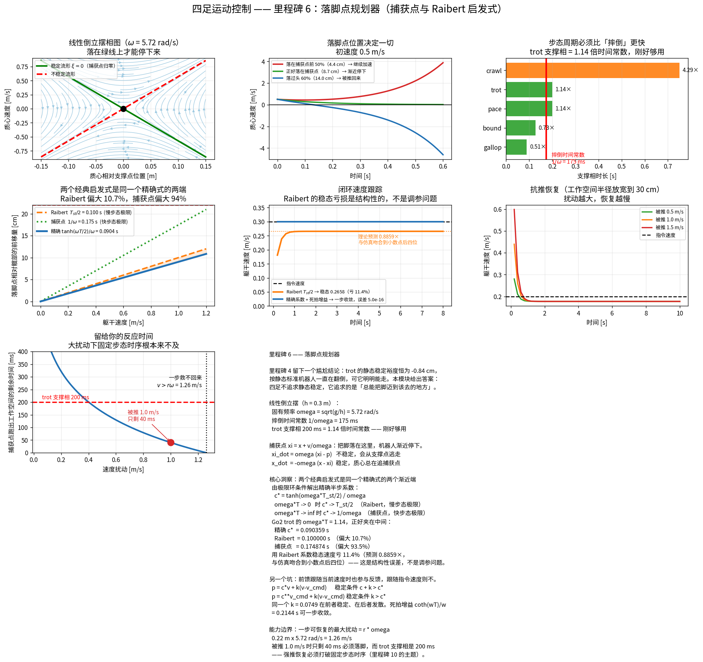

# 里程碑 6 —— 落脚点规划器

> 模块：`footstep_planner/` · 机器人：Unitree Go2 · 状态：已完成，44/44 测试通过



---

## 1. 先还上里程碑 4 欠的账

里程碑 4 算出一个尴尬的结论：

> **Go2 trot 的静态稳定裕度恒为 −0.84 cm。**

按静态标准，机器人一直在翻倒。可它明明能走。

答案是：**四足根本不追求静态稳定，它追求的是"总能把脚迈到该去的地方"。** 就像人跑步时任何一个瞬间都处在要摔倒的状态 —— 但只要下一步落对位置，就永远摔不下去。

本模块把这句话变成公式。

---

## 2. 线性倒立摆：摔倒有多快

把机器人简化成一个质心 + 一根无质量的腿撑在接触点 $p$ 上，假设质心高度 $h$ 恒定（这就是"线性"的来源）：

$$\ddot{x} = \omega^2 (x - p), \qquad \omega = \sqrt{g/h}$$

这是一个**不稳定**系统：质心离支撑点越远，加速度越大，离得更远。$\omega$ 就是这台机器"摔倒得多快"的固有频率。

**Go2 站立高度 0.30 m：**

$$\omega = \sqrt{9.81/0.30} = 5.72\ \text{rad/s}, \qquad \frac{1}{\omega} = 175\ \text{ms}$$

### 步态周期必须比"摔倒"更快

| 步态 | 支撑相 | / 时间常数 |
|---|---:|---:|
| crawl | 750 ms | 4.29× |
| **trot** | **200 ms** | **1.14×** |
| pace | 200 ms | 1.14× |
| bound | 128 ms | 0.73× |
| gallop | 90 ms | 0.51× |

**trot 的支撑相恰好是摔倒时间常数的 1.14 倍 —— 刚好够用。** 这不是巧合：步态周期如果远大于 $1/\omega$，一步还没迈完人已经倒了。crawl 的 4.29 倍之所以可行，是因为它靠静态稳定（三腿支撑），根本不依赖动态平衡。

> **无人机类比。** 这个 $\omega$ 相当于四旋翼的姿态发散速率。你在 PX4 里知道姿态环必须比机体自然发散快得多；四足的"落脚点环"和"摔倒"之间是同一种赛跑，只不过它的控制周期不是 1 kHz，而是**一步一次**（200 ms）。这就是腿式控制的根本难点：**执行器带宽很高，但控制输入的更新率被步态锁死了。**

---

## 3. 捕获点：脚该落在哪的理论答案

二阶不稳定系统可以解耦成两个一阶系统。定义**发散分量**（捕获点、DCM）：

$$\xi = x + \frac{\dot{x}}{\omega}$$

则

$$\dot{\xi} = \omega(\xi - p), \qquad \dot{x} = -\omega(x - \xi)$$

- 第二式**稳定**：质心总在追捕获点。
- 第一式**不稳定**：捕获点会从支撑点逃走。

于是全部控制问题被压缩成一句话：

> **把脚落在捕获点上，捕获点就不动了，机器人随之停下。**

三种结局（初速度 0.5 m/s，捕获点在前方 8.7 cm）：

| 落脚位置 | 结果 |
|---|---|
| 捕获点前 50%（4.4 cm） | 继续加速前冲 |
| **正好在捕获点（8.7 cm）** | **渐近停下** |
| 落过头 60%（14.0 cm） | 被推回来 |

---

## 4. 本里程碑最重要的发现：两个经典启发式是同一个式子的两端

### Raibert 启发式（1986）

$$p = p_{\text{hip}} + \frac{T_{st}}{2}\,v + k\,(v - v_{\text{cmd}})$$

四十年来的工业默认做法。中间那项是前馈：支撑相内躯干前进 $T_{st}v$，把脚放在前方半个身位，脚就会在支撑相中点恰好位于髋下。

### 精确解

设支撑相开始时质心在支撑点正上方、速度为 $v$，要求**一步之后速度不变**（极限环），由倒立摆解析解直接得到：

$$v(\cosh\omega T - 1) = p\,\omega\sinh\omega T \quad\Longrightarrow\quad \boxed{p = \frac{v}{\omega}\tanh\frac{\omega T_{st}}{2}}$$

**这个式子有两个漂亮的极限：**

$$\frac{\tanh(\omega T/2)}{\omega} \;\to\; \begin{cases} T_{st}/2, & \omega T \to 0 \quad\text{（Raibert，慢步态极限）}\\[4pt] 1/\omega, & \omega T \to \infty \quad\text{（捕获点，快步态极限）} \end{cases}$$

> **Raibert 启发式与捕获点不是两个互相竞争的方法，而是同一个精确表达式的两个渐近端。** Raibert 是慢步态展开的一阶项，捕获点是快步态的饱和值。

### Go2 trot 正好夹在中间

$\omega T_{st} = 1.14$，两个近似都不准：

| 系数 | 数值 (s) | 相对精确值 |
|---|---:|---:|
| **精确** $\tanh(\omega T/2)/\omega$ | **0.090359** | — |
| Raibert $T_{st}/2$ | 0.100000 | **+10.7%** |
| 捕获点 $1/\omega$ | 0.174874 | +93.5% |

### 后果可以精确预测

对 Raibert 形式 $p = c\,v + k(v-v_{cmd})$，令一步后速度不变，解得

$$\frac{v_{ss}}{v_{cmd}} = \frac{k}{c + k - c^*}, \qquad c^* = \frac{\tanh(\omega T_{st}/2)}{\omega}$$

代入 Go2 数值（$c=0.1$，$k=0.0749$）：**0.8859**。闭环仿真跑出来也是 **0.8859** —— 吻合到小数点后四位。

**这说明 Raibert 启发式的 11.4% 稳态速度亏损是结构性的，不是调参问题。** 换成精确系数则**精确跟踪**（比值 1.0000）。

---

## 5. 一个实现时踩到的坑：前馈项也在提供稳定性

我把系数换成"更精确"的 $c^*$ 之后，机器人反而**飞了**。

原因是两种写法虽然形式几乎一样，闭环性质却完全不同：

| 写法 | 闭环特征值 | 稳定条件 |
|---|---|---|
| $p = c\,v + k(v-v_{cmd})$（Raibert 原式） | $\cosh - \omega\sinh(c{+}k)$ | $c + k > c^*$ |
| $p = c^*v_{cmd} + k(v-v_{cmd})$ | $\cosh - \omega\sinh\,k$ | $k > c^*$ |

**第一种的前馈项跟随当前速度，因此也参与反馈；第二种跟随指令速度（常量），完全不贡献稳定裕度。**

后果很实在：$k = 1/\omega - T_{st}/2 = 0.0749 < c^* = 0.0904$，所以同一个增益在第一种写法下稳定（特征值 0.319），在第二种写法下**发散**（特征值 1.125）。

### 死拍增益

既然第二种写法的稳定裕度全压在 $k$ 上，干脆把特征值直接打到零：

$$k_{\text{deadbeat}} = \frac{\coth(\omega T_{st})}{\omega} = 0.2144\ \text{s}$$

实测**一步**就把速度从 0 拉到指令值，误差 $5\times10^{-16}$。

> 实机上不要直接用这个值：死拍对模型误差极其敏感，而 LIPM 忽略了腿的质量、接触柔性、执行器带宽。工程上取 0.5~0.7 倍，牺牲收敛速度换鲁棒性。

---

## 6. 能力边界：一步能救回多大的推

捕获点必须落在腿够得着的范围内。里程碑 5 实测步长上限约 50 cm，取半程再留余量得到落脚半径 $r = 0.22$ m。于是

$$\boxed{v_{\max} = r\,\omega = 0.22 \times 5.72 = 1.26\ \text{m/s}}$$

超过这个速度，**一步之内无论落在哪里都救不回来**，只能连迈几步。

### 更要命的是时间

捕获点按 $e^{\omega t}$ 发散，跑到工作空间边界的剩余时间：

| 速度扰动 | 捕获点位置 | 剩余时间 |
|---|---:|---:|
| 0.2 m/s | 3.5 cm | 322 ms |
| 0.5 m/s | 8.7 cm | 161 ms |
| **1.0 m/s** | 17.5 cm | **40 ms** |
| 1.26 m/s | 22.0 cm | 0 ms |

**trot 的支撑相是 200 ms。** 被推 1.0 m/s 时只剩 40 ms 必须落脚 —— 固定步态时序**根本来不及**。

> 这就是强推恢复难做的根本原因：它必须**打破固定步态时序**，提前中止支撑相、立即落脚。而 M4 已经说明，中途改步态会让正踩地的脚被瞬间撤销约束。这两个约束的冲突，是里程碑 10 的主题。

---

## 7. 三件真实机器人必须处理的事

### 转弯：必须用落地时刻的髋位置

躯干在摆动期间会转过 $\dot\psi \cdot \Delta t$。落脚点必须按**落地时刻**的髋位置算，而不是当前时刻的 —— 否则转弯时步宽越走越歪。由 `test_yaw_rate_uses_the_future_hip_position` 验证。

### 工作空间钳制发生在规划层

策略算出的点可能超出腿的可达范围。**钳制应该在规划层做，而不是丢给逆运动学。** 里程碑 1 的 `clamp` 是最后一道安全网；规划器一开始就不该提出够不到的目标 —— 钳制后至少方向还是对的，只是幅度受限（由 `test_clamping_preserves_direction` 验证）。

`is_clamped()` 提供了一个有用的信号：**持续被钳制说明机器人在试图走得比腿允许的更快**，上层应当降低速度指令或切到更高占空比的步态，而不是硬撑。

### 地形高度

落脚点的 $z$ 不一定是 0。这里留出接口由感知模块填。

---

## 8. API

```python
from footstep_planner import (
    FootstepPlanner, FootstepPlannerConfig, LIPMParams,
    capture_point, time_to_boundary,
    raibert_footstep, exact_footstep, exact_stride_coefficient,
    optimal_feedback_gain, deadbeat_feedback_gain, steady_state_velocity_ratio,
)

# 倒立摆分析
p = LIPMParams(height=0.30)
p.omega, p.time_constant                      # 5.72 rad/s, 175 ms
capture_point(com, velocity, p)               # 捕获点
time_to_boundary(com, velocity, 0.22, p)      # 还剩多久必须迈步

# 系数
exact_stride_coefficient(p, stance)           # 0.090359  精确
optimal_feedback_gain(p, stance)              # 0.0749    Raibert 用
deadbeat_feedback_gain(p, stance)             # 0.2144    exact 用，一步收敛
steady_state_velocity_ratio(c, k, p, stance)  # 预测稳态跟踪误差

# 规划器
planner = FootstepPlanner(scheduler, FootstepPlannerConfig(
    strategy="exact",          # raibert / capture_point / exact
    max_step_radius=0.22,
    nominal_height=0.30,
))
targets = planner.plan(t, base_position, velocity, velocity_command,
                       yaw=yaw, yaw_rate=yaw_rate)
# -> {腿: 落脚点(3,)}，直接喂给里程碑 5 的 SwingLegController

planner.capture_point_world(base_position, velocity)   # 在线诊断
```

---

## 9. 本模块如何被验证

`pytest tests/test_footstep.py -v` → **44 passed**。

多了一类前几个里程碑没有的测试：**闭环行为验证**。落脚点策略正确与否，最终要看"放进倒立摆里跑，机器人会不会真的收敛到指令速度"。

| 分组 | 钉死了什么 |
|---|---|
| 倒立摆 | $\omega = \sqrt{g/h}$；时间常数正比 $\sqrt{h}$；**解析解 == 精细数值积分** |
| 捕获点 | 定义式；$\dot\xi = \omega(\xi-p)$（中心差分）；$\dot x = -\omega(x-\xi)$ |
| | 落在捕获点上 → 停下；落不够 → 加速；落过头 → 倒退 |
| | 到达边界时间 == $\log(\text{比值})/\omega$，并用倒立摆推进验证 |
| **精确系数** | 由极限环条件直接解出；**一步后速度精确不变** |
| **渐近极限** | $\omega T\to 0$ 趋近 Raibert；$\omega T\to\infty$ 趋近捕获点；Go2 夹在中间 |
| **稳态误差** | 解析预测 0.8859 == 闭环仿真 0.8859（结构性误差，非调参问题） |
| | 精确系数使稳态比 == 1.0000，实测误差 $<2\times10^{-3}$ |
| **稳定性结构** | 前馈跟随当前速度时参与反馈；同一 $k$ 在两种写法下一稳一发散 |
| | 死拍增益使特征值 == 0；实测**一步**收敛 |
| 能力边界 | 最大可恢复扰动 == $r\omega$ = 1.26 m/s；1.0 m/s 时剩余时间 < 0.25 倍支撑相 |
| 规划器 | 髋投影随偏航旋转；**用落地时刻的偏航角**；工作空间钳制保方向 |
| | 只返回摆动腿；地形高度生效；默认增益按策略分别选取 |
| 闭环 | Raibert / 捕获点 / 精确 三种策略都收敛；抗推恢复误差降到 10% 以下 |
| | 去掉反馈项则完全跟不上（前馈无法从静止起步） |

### 调试清单

1. **机器人走不到指令速度，差一个固定比例？** 前馈系数用了 $T_{st}/2$，换成 $\tanh(\omega T/2)/\omega$。用 `steady_state_velocity_ratio` 可以先预测出这个比例。
2. **换了"更精确"的系数反而发散？** 检查前馈跟随的是当前速度还是指令速度 —— 两者稳定条件不同。
3. **转弯时步宽越走越歪？** 髋投影用了当前偏航角，应该用落地时刻的。
4. **落脚点老是被钳制？** 机器人在试图走得比腿允许的更快，降速或换步态。
5. **被推之后救不回来？** 查 `capture_point_world` 是否已跑出工作空间；再查 `time_to_boundary` 是否小于剩余支撑时间。
6. **仿真里倒立摆数值爆炸？** 别用欧拉法 —— 这个系统本身发散，局部误差会被指数放大。用 `lipm_step` 的解析解。

---

## 10. 面试问题

### 概念题

1. 线性倒立摆模型是什么？$\omega = \sqrt{g/h}$ 的物理含义？
2. 什么是捕获点？把脚落在捕获点上会发生什么？
3. 推导 $\dot\xi = \omega(\xi - p)$ 和 $\dot x = -\omega(x - \xi)$。为什么说控制问题被解耦了？
4. Raibert 启发式的三项各是什么作用？
5. **Raibert 启发式和捕获点是什么关系？**（*同一精确式的两个渐近极限*）
6. 四足静态稳定裕度恒为负，为什么还能走？
7. 一步能恢复的最大速度扰动是多少？由什么决定？
8. 为什么强推恢复必须打破固定步态时序？

### 一定会被追问的

- "机器人速度总是差指令 10%。"（*前馈系数用了 $T_{st}/2$，是慢步态极限*）
- "为什么换了更精确的系数反而不稳？"（*前馈跟随对象变了，稳定条件跟着变*）
- "死拍增益为什么实机不能直接用？"（*对模型误差极敏感；LIPM 忽略腿质量、接触柔性、执行器带宽*）
- "捕获点跑出工作空间了怎么办？"（*连迈几步；或降低质心高度增大 $\omega$；或用手臂/摆动腿产生角动量*）
- "LIPM 假设质心高度恒定，这个假设什么时候失效？"（*跳跃、上下楼梯、大幅蹲起*）

### 编程题

- 推导并实现倒立摆的解析步进（为什么不能用欧拉法？）。
- 给定 $c$、$k$，解出闭环稳态速度比。
- 写一个测试，能抓住"前馈系数用错极限"这个 bug。

### 系统设计题

- 落脚点规划跑在什么频率？和 MPC、WBC 怎么分工？
- 感知给出的地形高度有 100 ms 延迟，怎么处理？
- 机器人踩到一个比预期低 10 cm 的坑，整条链路各模块应该怎么反应？

---

## 11. 三块拼图齐了

| 模块 | 回答的问题 |
|---|---|
| 步态调度（M4） | **什么时候** |
| 摆动腿规划（M5） | **脚怎么过去** |
| **落脚点规划（M6）** | **落在哪** |

```python
targets = footstep_planner.plan(t, base_pos, vel, vel_cmd, yaw, yaw_rate)
swing_controller.update(t, foot_positions_world, targets)
q, dq = swing_controller.joint_command(t, leg, base_pos, base_rot)
```

**接下来就可以接 MPC 了。** M4 给出接触序列，M6 给出足端位置，M2 给出单刚体模型 —— 凸 MPC 的三个输入全部齐备。

---

## 12. 参考文献

- Raibert, *Legged Robots That Balance*, MIT Press 1986 —— 启发式的原始出处。
- Pratt et al., *Capture Point: A Step toward Humanoid Push Recovery*, Humanoids 2006 —— 捕获点的提出。
- Englsberger et al., *Three-Dimensional Bipedal Walking Control Based on Divergent Component of Motion*, T-RO 2015 —— DCM 的完整理论。
- Kajita et al., *The 3D Linear Inverted Pendulum Mode*, IROS 2001 —— LIPM。
- Bledt & Kim, *Implementing Regularized Predictive Control for Simultaneous Real-Time Footstep and Ground Reaction Force Optimization*, IROS 2019 —— 落脚点与接触力联合优化。

---

**下一步：** 里程碑 7 —— 凸 MPC。把里程碑 2 的单刚体模型、里程碑 4 的接触序列、里程碑 6 的落脚点塞进一个 QP，在预测时域上求解接触力。这是整个项目的核心，也是你 NMPC 背景最直接派上用场的地方 —— 区别在于四足的 MPC 是**凸**的，而你熟悉的 NMPC 不是。
