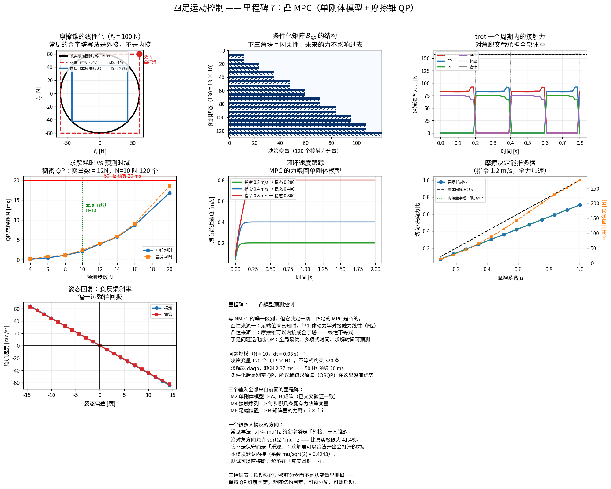

# 里程碑 7 —— 凸模型预测控制

> 模块：`mpc/` · 机器人：Unitree Go2 · 状态：已完成，26/26 测试通过



---

## 1. 与你 NMPC 背景的唯一区别

你已经写过 NMPC，所以这个里程碑对你来说不是"学一个新东西"，而是**理解一个结构上的差别**：

> **四足的 MPC 是凸的，你熟悉的 NMPC 不是。**

凸性有两个来源，两个都是前面里程碑已经铺好的：

| 来源 | 出处 |
|---|---|
| **足端位置已知时，单刚体动力学对接触力线性** | 里程碑 2 |
| **摩擦锥可以内接成金字塔 —— 线性不等式** | 本里程碑 §4 |

于是整个问题退化成一个**二次规划（QP）**。这带来三件 NMPC 给不了的东西：

- **全局最优** —— 没有局部极小值，不依赖初值；
- **多项式时间** —— 有理论复杂度保证；
- **求解时间可预测** —— 这是硬实时的前提。

> 第三条是最关键的。你在里程碑 1 见过"解析 IK vs 迭代 IK"，里程碑 3 见过"EKF vs MHE"，现在是第三次：**硬实时系统里，平均速度不重要，最坏情况才重要。** 凸性给的正是这个保证。

### 代价也已经量化过了

里程碑 2 实测：关节速度 8 rad/s 时，单刚体模型的躯干角加速度误差中位数达 **43%**。所以凸性不是免费的 —— MPC 用简化模型规划接触力，剩下的误差由里程碑 8 的 WBC 用完整模型补上。

---

## 2. 状态与模型

采用 MIT Cheetah 3 的 13 维状态：

$$x = [\Theta;\; p;\; \omega;\; \dot p;\; g] \in \mathbb{R}^{13}$$

**最后那个 $g = -9.81$ 是个很实用的小技巧。** 重力是一个**仿射**项，直接写成 $\dot x = Ax + Bu + c$ 的话，条件化时要单独处理常数项。把 $g$ 塞进状态当成一个恒为常数的分量，仿射项就变成了线性项 $A[11,12] = 1$，可以直接套标准公式。

连续时间模型：

$$\dot\Theta = R_z(\psi)^\top \omega, \qquad \dot p = \dot p$$
$$\dot\omega = I_w^{-1}\sum_i [r_i - p]_\times f_i, \qquad \ddot p = \frac{1}{m}\sum_i f_i + g$$

后两式就是里程碑 2 的 `srbd_acceleration_mpc`。测试 `test_B_matrix_matches_the_srbd_from_milestone_2` 做了一次**跨里程碑交叉验证**：同一份物理，两处实现，必须对上（误差 $10^{-9}$）。

### 三个输入全部来自前面的里程碑

| 输入 | 来源 | 在 MPC 里的位置 |
|---|---|---|
| 单刚体参数（质量、复合惯量） | M2 `srbd_params_from_model` | $A$、$B$ 矩阵 |
| 接触序列 | M4 `contact_schedule(t0, dt, N)` | 每步哪几条腿有力决策变量 |
| 足端位置 | M6 `plan()` | $B$ 矩阵里的力臂 $r_i \times f_i$ |

**前六个里程碑到这里全部汇合。**

---

## 3. 条件化：把状态消掉

把状态全部用控制量表示，只留 $U$ 作为决策变量：

$$X = A_{qp}\,x_0 + B_{qp}\,U$$

于是代价函数变成 $U$ 的二次型：

$$\min_U\ (A_{qp}x_0 + B_{qp}U - X_{ref})^\top Q (\cdots) + U^\top R U$$

$B_{qp}$ 是**下三角块结构**（见图中稀疏模式）—— 这就是因果性：未来的力不影响过去的状态。

**为什么用稠密而不是稀疏形式？** 稀疏形式把 $X$ 和 $U$ 都当决策变量，变量多但矩阵稀疏；稠密形式变量少但矩阵稠密。对四足这种**短时域（N=10）、小状态（13 维）**的问题，条件化后的稠密 QP 更快 —— 这与你在 acados 里遇到的 condensing vs. sparse 权衡是同一个。

实测也印证了这一点：装好的 OSQP（稀疏求解器）在这里没有优势，daqp（稠密活跃集）反而更合适。

---

## 4. 一个很多人搞反的方向：摩擦金字塔是外接的

摩擦约束 $\|f_{xy}\| \le \mu f_z$ 是一个**二次锥**。保留它问题就是 SOCP —— 仍然凸，但求解器慢一个量级。

工业界的做法是换成金字塔：

$$|f_x| \le \mu f_z, \qquad |f_y| \le \mu f_z$$

### 它包住了圆锥，不是被圆锥包住

正方形的半宽是 $\mu f_z$，而**内切**圆半径也是 $\mu f_z$ —— 所以正方形**包住**了圆。沿对角方向，这个金字塔允许的切向力可达

$$\sqrt{(\mu f_z)^2 + (\mu f_z)^2} = \sqrt{2}\,\mu f_z$$

**比真实摩擦极限大 41.4%。**

> 我第一版的文档把这个方向写反了，说"金字塔内接于圆锥，所以是保守的"。是测试 `test_pyramid_is_inscribed_in_the_cone` 直接失败把它抓了出来 —— 采样 500 个点，发现金字塔内的点会落在圆锥外。**这类方向性错误光看公式很难发现，但一个随机采样测试三秒钟就能定案。**

$\mu = 0.6$、$f_z = 100$ N 时：

| | 对角方向允许的切向力 |
|---|---:|
| 真实圆锥 | 60.0 N |
| 外接金字塔（常见写法） | **84.9 N** ← 会打滑 |
| 内接金字塔（系数 $\mu/\sqrt2$） | 60.0 N |

### 两种工程做法

| 做法 | 特点 |
|---|---|
| 外接版 + 打折的 $\mu$（实测 0.8 填 0.5） | 传统做法，靠参数偷偷补回来 |
| **内接版 + 实测 $\mu$**（本模块默认） | 约束写出来就是物理上成立的 |

选后者的理由是**可验证性**：测试里可以直接断言求解结果落在**真实圆锥**内，而不是"金字塔内"。前者做不到这一点 —— 你只能相信那个折扣系数够大。

---

## 5. 一个实时实现的关键技巧

**摆动腿的力被硬性钉为零（$0 \le f \le 0$），而不是从决策变量里删掉。**

看起来浪费：N=10 的 trot 里有一半变量恒为零。但好处是**QP 的维度在整个预测时域内保持不变**：

- 矩阵结构固定 → 可以预分配内存，实时线程里零动态分配；
- 稀疏模式固定 → 求解器的符号分解可以复用；
- 可以热启动 → 上一周期的解直接作为这一周期的初值。

这三条都是把 MPC 塞进硬实时循环的必要条件。

> **代价要知道**：这种退化的等式约束（`0 <= f <= 0`）对某些求解器不友好。实测 daqp 处理得很好，quadprog 直接失败并返回零力。所以 `MPCResult.success` 必须如实上报 —— **零力意味着机器人直接瘫下去，上层必须能区分"MPC 说不用力"和"MPC 没解出来"。**

---

## 6. 实测结果

### 问题规模与速度

| 项 | 数值 |
|---|---:|
| 预测步数 $N$ | 10 |
| 预测步长 | 0.03 s（时域 0.3 s） |
| 决策变量 | **120**（12 × N） |
| 不等式约束 | **320** |
| 求解器 | daqp（稠密活跃集） |
| **求解耗时** | **2.24 ms** |
| 50 Hz 预算 | 20 ms |

**留下 89% 的余量给 WBC 和其他任务。** 时域拉到 N=20 时耗时涨到 17 ms，逼近预算 —— 稠密 QP 的规模随 $N$ 增长得比线性快。

### 物理正确性

| 检查 | 结果 |
|---|---|
| 四脚站立时垂直力之和 | 157.8 N == 体重 ✓ |
| trot 两腿支撑时垂直力之和 | 157.8 N ✓（两条腿承担全部体重） |
| 摆动腿的力 | 精确为零 ✓ |
| 所有力落在**真实圆锥**内 | ✓ |
| 法向力在 $[f_{\min}, f_{\max}]$ 内 | ✓ |

### 闭环行为

把 MPC 的力喂回单刚体模型（这才是"解对了"的证据，而不只是"解出来了"）：

| 指令速度 | 稳态速度 | 误差 |
|---|---|---|
| 0.2 m/s | 0.2000 | **0.0 mm/s** |
| 0.4 m/s | 0.4000 | 0.0 mm/s |
| 0.8 m/s | 0.8000 | 0.0 mm/s |

姿态扰动下产生**负反馈斜率**的回复力矩（图中最后一张），前倾就往后扳。

### 摩擦决定能推多猛

$\mu$ 从 0.1 扫到 1.0，可用前向合力从 15 N 增长到 275 N，实际切向/法向力比始终守在真实圆锥 $\mu$ 以下。**这条曲线就是"冰面上为什么走不快"的定量答案。**

---

## 7. API

```python
from mpc import ConvexMPC, MPCConfig, FrictionConstraints, check_friction_cone
from dynamics import srbd_params_from_model, load_go2_dynamics, nominal_configuration
from gait_scheduler import GaitScheduler

rbd = load_go2_dynamics(floating_base=True)
params = srbd_params_from_model(rbd)          # M2

cfg = MPCConfig(
    horizon=10, dt=0.03,
    friction=FrictionConstraints(mu=0.6, f_min=5.0, f_max=250.0, inscribed=True),
    # solver=None 时自动挑可用的稠密求解器
)
mpc = ConvexMPC(params, cfg)

sched = GaitScheduler("trot")
x0 = ConvexMPC.make_state(rpy, com, omega, velocity)      # M3 的状态估计输出
ref = mpc.make_reference(x0, velocity_command, yaw_rate_command)
contact = sched.contact_schedule(t, cfg.dt, cfg.horizon)  # M4
foot_traj = ...                                            # M6

r = mpc.solve(x0, ref, contact, foot_traj, com_traj)
r.current_forces      # (4, 3) 只用第一步 —— 滚动时域
r.solve_time, r.success, r.n_variables, r.n_constraints
```

---

## 8. 本模块如何被验证

`pytest tests/test_mpc.py -v` → **26 passed**。

MPC 没有"第二份实现"可对照，所以验证策略是**用物理必须成立的性质去反查求解结果**。

| 分组 | 钉死了什么 |
|---|---|
| **摩擦方向** | 常见金字塔写法是**外接**（对角允许 $\sqrt2\mu f_z$，在圆锥外） |
| | 内接版：2000 次随机采样，金字塔内 ⟹ 圆锥内；对角顶点恰在圆锥边界 |
| 约束构造 | 摆动腿的力钉为零；支撑腿法向力下界为正（防接触抖动） |
| **跨里程碑** | **$B$ 矩阵 == 里程碑 2 的单刚体动力学**（误差 $10^{-9}$） |
| 模型 | $A$、$B$ 的结构；一阶欧拉离散；**条件化矩阵 == 逐步递推** |
| 物理 | 站立/trot 力和 == 体重；摆动腿零力；**全部落在真实圆锥内** |
| 控制行为 | 质心偏低 → 加大垂直力；前进指令 → 向前合力；前倾 → 回复力矩 |
| **闭环** | **喂回单刚体模型，速度收敛到指令（误差 < 0.08 m/s）** |
| 实时性 | 中位耗时 < 10 ms，最差 < 20 ms；耗时随时域单调增长 |
| 诚实性 | 求解失败必须如实上报，不能悄悄返回零力 |

### 调试清单

1. **力和不等于体重？** 先查 `success`。再查参考轨迹的高度是不是设错了。
2. **机器人打滑但 QP 说可行？** 用的是外接金字塔。改成内接，或把 $\mu$ 打折。
3. **求解器返回全零且 `success=False`？** 换求解器（daqp 对退化等式约束更稳），或检查约束是否本来就不可行（$f_{\min}$ 太大？）。
4. **耗时超预算？** 缩短时域，或换更快的求解器，或做热启动。
5. **姿态发散？** 检查惯量 —— 里程碑 2 已经证明用躯干连杆惯量会差 5–7 倍。
6. **速度跟踪有稳态误差？** 这是 MPC 参考轨迹的问题，不是 QP 的问题 —— 检查 `make_reference`。
7. **接触力在支撑相开始/结束时跳变？** 力权重太小；或接触序列和实际接触检测不同步。

---

## 9. 面试问题

### 概念题

1. 为什么四足 MPC 是凸的，而一般的 NMPC 不是？凸性的两个来源分别是什么？
2. 凸性带来什么？为什么它对硬实时特别重要？
3. 为什么状态里要塞一个常数 $g$？
4. 什么是条件化？稠密形式和稀疏形式怎么选？
5. 摩擦锥怎么线性化？常见的金字塔写法是内接还是外接？后果是什么？
6. 为什么摆动腿的力要钉为零而不是删掉变量？
7. 预测时域怎么选？太短、太长各有什么问题？
8. MPC 跑 50 Hz，WBC 跑 1 kHz，中间怎么衔接？
9. 如果接触序列也要优化，问题会变成什么？为什么不这么做？

### 一定会被追问的

- "机器人在 QP 说可行的情况下打滑了。"（*外接金字塔；或实际 $\mu$ 比模型里小*）
- "MPC 求解偶尔超时怎么办？"（*沿用上一周期的解；或降级到静态力分配；绝不能用零力*）
- "为什么不用完整动力学做 MPC？"（*非凸 + 维度爆炸；实时性没保证*）
- "SRBD 误差 43% 还能用？"（*MPC 只管规划接触力，WBC 用完整模型补差*）
- "MPC 和 WBC 的模型不一致，会不会打架？"（*会；解法是让 WBC 把 MPC 的力当**软**任务而非硬约束 —— M8 的主题*）

### 编程题

- 手写条件化：给定 $A_k$、$B_k$ 序列，构造 $A_{qp}$、$B_{qp}$。
- 写出摩擦金字塔的约束矩阵，并说明内接/外接的系数差别。
- 写一个测试，能抓住"金字塔方向搞反"这个 bug。

### 系统设计题

- MPC 求解失败时的降级策略怎么设计？
- 感知发现前方是冰面（$\mu$ 突降），整条链路各模块怎么反应？
- 怎么把落脚点也放进优化？代价是什么？

---

## 10. 它和后面的模块怎么衔接

| 下游 | 关系 |
|---|---|
| **WBC（M8）** | **MPC 的接触力是 WBC 的任务目标；WBC 用完整动力学把它落实成关节力矩** |
| 强化学习（M9） | MPC 可作为专家策略做模仿学习；或作为残差 RL 的基线控制器 |
| 抗推恢复（M10） | MPC 无法在一步内改变接触序列，强推时需要 M6 的捕获点触发提前落脚 |

**M8 是最后一块**：MPC 说"每只脚该用多大力"，WBC 说"那 12 个电机各该出多少力矩"。M2 那个方程终于要被完整地用上了：

$$M(q)a + C(q,v)v + g(q) = S^\top\tau + \sum_i J_i^\top f_i$$

---

## 11. 参考文献

- Di Carlo et al., *Dynamic Locomotion in the MIT Cheetah 3 via Convex Model Predictive Control*, IROS 2018 —— 本模块的直接来源。
- Bledt et al., *MIT Cheetah 3: Design and Control of a Robust, Dynamic Quadruped Robot*, IROS 2018.
- Kim et al., *Highly Dynamic Quadruped Locomotion via Whole-Body Impulse Control and Model Predictive Control*, arXiv 2019 —— MPC + WBC 的完整架构。
- Boyd & Vandenberghe, *Convex Optimization*, CUP 2004 —— 凸性与 QP/SOCP 的分类。
- Stellato et al., *OSQP: An Operator Splitting Solver for Quadratic Programs*, MPC 2020.

---

**下一步：** 里程碑 8 —— 全身控制（WBC）。用里程碑 2 的完整 18 自由度动力学，把 MPC 给出的接触力落实成 12 个关节力矩，同时兼顾摆动腿的跟踪任务。这是分层 QP 的主场，也是那句"$S$ 的前 6 列全为零"最终发挥作用的地方。
