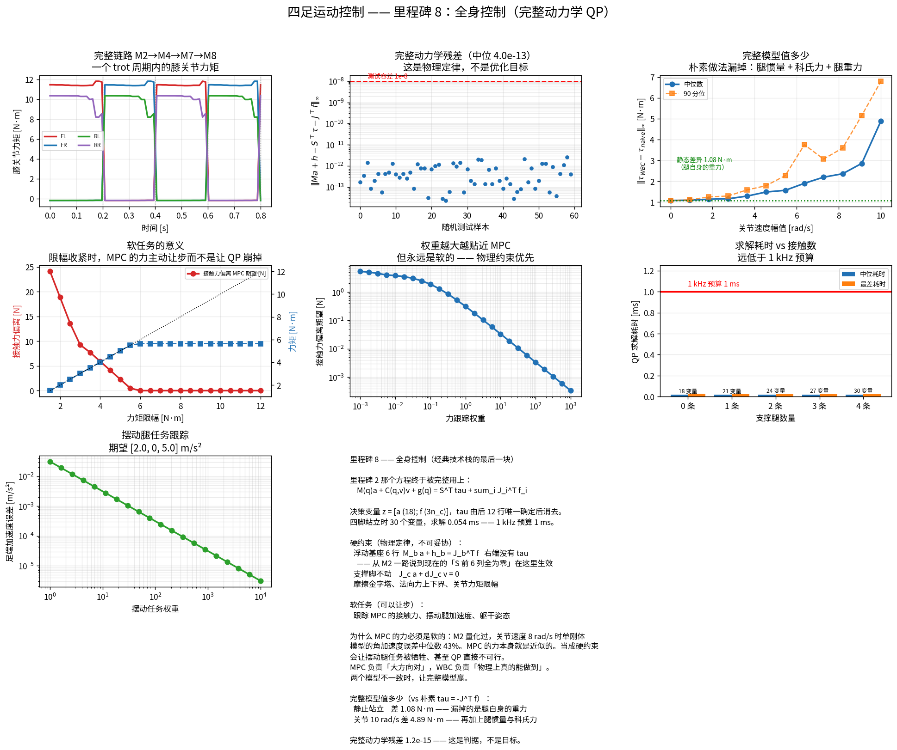

# 里程碑 8 —— 全身控制（WBC）

> 模块：`whole_body_controller/` · 机器人：Unitree Go2 · 状态：已完成，28/28 测试通过



---

## 1. 那句话终于兑现了

从里程碑 2 开始，有一句话被反复提起：

> **$S$ 的前 6 列全为零 —— 躯干的 6 个自由度上没有电机。**

M2 用它解释了欠驱动，M4 用它解释了为什么 MPC 需要接触序列，M7 用它解释了为什么要优化接触力。**现在它变成 QP 的等式约束**，第一次真正参与计算。

里程碑 2 那个方程也终于被完整用上：

$$M(q)\,a + C(q,v)\,v + g(q) = S^\top \tau + \sum_i J_i(q)^\top f_i$$

MPC 说"每只脚该用多大力"，WBC 说"12 个电机各该出多少力矩"。

---

## 2. 问题的构造

### 决策变量

$$z = [\,a \;(18)\;;\; f \;(3 n_c)\,]$$

**力矩 $\tau$ 不是决策变量** —— 它由动力学方程的后 12 行**唯一确定**：

$$\tau = M_{j}a + h_{j} - J_{c,j}^\top f$$

把它消掉，QP 少 12 维。代价是力矩限幅变成对 $(a, f)$ 的线性不等式而不是简单的箱式约束 —— 换来的规模缩减更划算。四脚站立时只有 **30 个变量**。

### 硬约束：物理定律，不可妥协

| 约束 | 含义 |
|---|---|
| $M_{b}a + h_{b} = J_{c,b}^\top f$（6 行） | **躯干上没有电机**，右端没有 $\tau$ |
| $J_c a + \dot J_c v = 0$ | 支撑脚不加速 |
| 摩擦金字塔、法向力上下界 | 与 M7 共用同一套定义 |
| $\|\tau\| \le \tau_{\max}$ | 电机能力 |

第一条不是"希望满足的目标"，而是物理定律。**违反它意味着算出来的力矩在真实机器人上根本产生不了那个运动。**

### 软任务：可以让步

| 任务 | 权重量级 |
|---|---|
| 跟踪 MPC 的接触力 | 高 |
| 摆动腿足端加速度 | 中高 |
| 躯干位姿加速度 | 中 |

所有任务的形式统一：

$$J_{\text{task}}\,a + \dot J_{\text{task}}\,v = a_{\text{des}}$$

**只要把非线性都塞进"已知量"，剩下的就是线性代数** —— 这与 M7 凸 MPC 的思路完全一致。

---

## 3. 为什么 MPC 的力必须是软的

这是本里程碑最重要的设计判断，而且它的依据是**里程碑 2 早就量化好的数字**：

> 关节速度 8 rad/s 时，单刚体模型的躯干角加速度误差中位数达 **43%**。

MPC 是基于那个模型算出来的力，**它本身就是近似的**。

如果当成**硬**约束，WBC 就必须精确复现一组基于错误模型算出的力。后果有两个，都很糟：

1. 摆动腿的跟踪任务被牺牲掉（所有自由度都拿去满足那组力了）；
2. 更糟的情况是 QP 直接**不可行** —— 那组力可能超出力矩限幅或摩擦锥。

所以正确做法是把它当**软**任务：权重高，但可以让步。

> **MPC 负责"大方向对"，WBC 负责"物理上真的能做到"。两个模型不一致时，让完整模型赢。**

实测验证（图中"软任务的意义"面板）：把力矩限幅从 12 N·m 收紧到 1.5 N·m，接触力对 MPC 期望的偏离从 0 平滑增长到 24 N，**QP 始终可解**。硬约束下这里早就崩了。

---

## 4. 不可讨价还价的判据

WBC 的正确性有一个判据，它不是"优化得好不好"，而是"物理成不成立"：

$$M(q)a + C(q,v)v + g(q) \;\overset{!}{=}\; S^\top\tau + \sum_i J_i^\top f_i$$

**实测残差：$1.2\times10^{-15}$**（机器精度）。60 组随机测试的中位残差 $4\times10^{-13}$。

里程碑 2 建好的整机动力学在这里成了验证的基准 —— 又一次"两条互不相干的路径必须一致"：一条是 QP 解出来的 $(a,\tau,f)$，一条是 Pinocchio 独立算出的 $M$、$h$、$J$。

---

## 5. 完整模型到底值多少

很多入门实现直接用 $\tau = -J^\top f$ 把接触力换算成力矩。它**漏掉了三样东西**：

1. 腿本身的**惯量** —— 摆动腿要加速就需要力矩；
2. **科氏力**与离心力；
3. 腿自身的**重力**。

实测差异（Go2）：

| 工况 | $\|\tau_{\text{WBC}} - \tau_{\text{naive}}\|_\infty$ | 主要来源 |
|---|---:|---|
| 静止站立 | **1.08 N·m** | 腿自身的重力 |
| 关节 5 rad/s | 1.6 N·m | + 腿惯量 |
| 关节 10 rad/s | **4.89 N·m** | + 科氏力 |

静态那 1.08 N·m 有个漂亮的验证：它应当**恰好等于**关节行的重力项 $g(q)_j$ —— 测试 `test_naive_torque_ignores_leg_gravity` 断言两者相差 < 0.05 N·m。

Go2 的膝关节力矩上限约 45 N·m，所以 4.89 N·m 是 **11% 的满量程误差**。在慢速站立时朴素做法勉强能用，一动起来就不行了。

---

## 6. 实时性

WBC 跑在 **1 kHz** 线程里，周期只有 1 ms。

| 支撑腿数 | 决策变量 | 中位耗时 |
|---|---:|---:|
| 0（腾空） | 18 | 0.017 ms |
| 2（trot） | 24 | 0.018 ms |
| 4（站立） | 30 | 0.020 ms |

**余量 50 倍以上。** 对比 M7 的凸 MPC（120 变量、2.24 ms、50 Hz），可以看出这个分层架构的逻辑：

| | 频率 | 模型 | 变量 | 耗时 |
|---|---|---|---|---|
| MPC | 50 Hz | 单刚体（近似） | 120 | 2.24 ms |
| **WBC** | **1 kHz** | **完整 18 自由度（精确）** | **30** | **0.02 ms** |

**MPC 看得远但看得糙，WBC 看得近但看得准。** 前者规划 0.3 s 的未来，后者只算当前这一个瞬间 —— 所以它可以用完整模型还比 MPC 快 100 倍。

---

## 7. 一个反复出现的模式：误差必须活在切空间

姿态任务的误差用 SO(3) 的 log：

$$e = \log\left(R_{\text{des}} R^\top\right)^\vee$$

**不能用欧拉角相减。**

这是本项目**第三次**遇到同一个模式：

| 里程碑 | 场景 | 解法 |
|---|---|---|
| M2 | 浮动基座求数值导数 | `pin.integrate` 沿切空间扰动 |
| M3 | 卡尔曼滤波的姿态状态 | 误差状态活在切空间 |
| **M8** | **姿态任务的误差** | **SO(3) 的 log** |

**一旦状态活在流形上，所有"加减"都必须换成流形上的对应操作。** 这个模式值得记住 —— 它在人形机器人里出现得更频繁。

---

## 8. API

```python
from whole_body_controller import WholeBodyController, WBCConfig, Task, pd_acceleration
from dynamics import load_go2_dynamics

rbd = load_go2_dynamics(floating_base=True)      # M2，必须浮动基座
wbc = WholeBodyController(rbd, WBCConfig(
    force_tracking_weight=1.0,     # MPC 力跟踪，软的
    torque_limit=45.0,
    friction=FrictionConstraints(mu=0.6, inscribed=True),   # 与 M7 共用
))

# 任务
swing = wbc.swing_foot_task(q, v, "FR", desired_acceleration, weight=500.0)
body = wbc.body_task(lin_acc_des, ang_acc_des, linear_weight=10.0, angular_weight=20.0)

# 求解
r = wbc.solve(q, v, stance_legs, mpc_forces, tasks=[swing, body])
r.torque              # (12,) 直接发给电机
r.acceleration        # (18,) 广义加速度
r.contact_force       # (n_c, 3) WBC 实际给出的力
r.task_costs          # 诊断：谁在让步
r.solve_time, r.success

# 对照：朴素做法
wbc.naive_torque(q, stance_legs, mpc_forces)
```

---

## 9. 本模块如何被验证

`pytest tests/test_wbc.py -v` → **28 passed**。

| 分组 | 钉死了什么 |
|---|---|
| **物理判据** | **完整动力学 $Ma+h = S^\top\tau + J^\top f$ 成立（$10^{-8}$）** |
| | 浮动基座 6 行右端没有 $\tau$；支撑脚加速度为零 |
| 约束 | 力矩限幅、摩擦锥（**真实圆锥**）、法向力上下界 |
| **软任务** | 喂一组做不到的力，**QP 仍可解**且力明显让步 |
| | 收紧力矩限幅 → 接触力主动偏离；权重越大越贴近 |
| 任务 | 摆动腿加速度被跟踪；躯干任务作用在前 6 个分量 |
| | 任务代价可诊断（谁在让步看得见） |
| **对照** | 静态下 $\tau_{\text{WBC}} - \tau_{\text{naive}}$ **恰好等于关节重力项** |
| | 误差随关节速度单调增长，10 rad/s 时放大 4.5 倍 |
| 姿态 | SO(3) log 与 `pin.exp3` 互逆；同姿态时误差为零 |
| 接触变化 | 0/1/2/4 条支撑腿都能解；QP 维度随之变化 |
| 实时性 | 中位 < 1 ms，最差 < 3 ms |
| 诚实性 | 求解失败如实上报（零力矩 = 机器人瘫下去） |
| **全栈** | **M2→M4→M7→M8 串起来跑一个 trot 周期，每步都验证完整动力学** |

### 调试清单

1. **机器人动作和期望不一样？** 先查完整动力学残差。不为零说明 QP 构造错了，不是调参问题。
2. **QP 不可行？** 八成是把 MPC 的力当硬约束了。改成软任务。
3. **摆动腿跟不上？** 力跟踪权重太大，把自由度都吃掉了。看 `task_costs` 谁在让步。
4. **力矩饱和？** 检查限幅是否合理；或 MPC 要的力本身就超出电机能力。
5. **基座加速度不对？** 检查那 6 行等式约束有没有写错 —— 右端**不能**有 $\tau$。
6. **支撑脚滑动？** $\dot J_c v$ 漏项或符号错（M2 踩过这个坑）。
7. **姿态任务在大角度下发散？** 用了欧拉角相减，改用 SO(3) 的 log。

---

## 10. 面试问题

### 概念题

1. WBC 的决策变量是什么？为什么 $\tau$ 不在里面？
2. 哪些是硬约束，哪些是软任务？划分依据是什么？
3. **为什么 MPC 的接触力必须是软任务？**
4. 浮动基座那 6 行等式约束的物理含义是什么？
5. WBC 和 MPC 的模型不一致，会不会打架？怎么处理？
6. 为什么 WBC 用完整模型还比 MPC 快 100 倍？
7. 加权 QP 和分层 QP（零空间投影）的区别？各自的优缺点？
8. 姿态误差为什么不能用欧拉角相减？
9. $\tau = -J^\top f$ 漏掉了什么？在什么工况下误差最大？

### 一定会被追问的

- "QP 偶尔不可行怎么办？"（*降级：放松软任务权重 / 沿用上一周期的力矩 / 切到重力补偿；绝不能发零力矩*）
- "为什么不用分层 QP？"（*加权 QP 更简单更鲁棒；分层的严格优先级在实际中往往不是必需的，还更慢*）
- "MPC 50 Hz、WBC 1 kHz，中间 20 个周期 MPC 的力不变，会有问题吗？"（*会有轻微的力阶跃；工程上做插值或让 WBC 的软权重吸收*）
- "力矩算出来了，怎么发给电机？"（*一般是 $\tau + K_p(q_d - q) + K_d(\dot q_d - \dot q)$ 的混合控制，纯力矩对模型误差太敏感*）

### 编程题

- 写出 WBC 的等式约束矩阵（浮动基座行 + 接触约束）。
- 把力矩限幅写成对 $(a, f)$ 的线性不等式。
- 实现 SO(3) 的 log 映射，处理小角度和 $\pi$ 附近。

### 系统设计题

- 设计 MPC + WBC 的完整线程架构：各跑什么频率，数据怎么传，失败怎么降级？
- 机器人某个关节的编码器坏了，控制器应该怎么反应？
- 怎么在 WBC 里加入自碰撞避免？

---

## 11. 经典技术栈到此完整

```
M3 状态估计 ──┐
              ├─> M4 步态调度 ─┬─> M6 落脚点 ─> M5 摆动轨迹 ─┐
M1 运动学 ────┤                │                              ├─> M8 WBC ─> 力矩
              │                └─> M7 凸 MPC ─> 接触力 ───────┘
M2 动力学 ────┘
```

八个里程碑，**每一个的输出都是下一个的输入**，没有一块是孤立的：

| 里程碑 | 给了下游什么 |
|---|---|
| M1 运动学 | 雅可比 —— 被 M3、M5、M7、M8 全部用到 |
| M2 动力学 | 完整模型给 M8，单刚体模型给 M7 |
| M3 状态估计 | 躯干位姿与速度，是 M6、M7 的输入 |
| M4 步态 | 接触序列 —— M7 的 QP 结构由它决定 |
| M5 摆动 | 足端轨迹 → M8 的摆动任务 |
| M6 落脚点 | 足端位置 → M7 的力臂 |
| M7 MPC | 接触力 → M8 的软任务目标 |
| M8 WBC | 关节力矩 → 电机 |

**接下来是里程碑 9：强化学习。** 它会用完全不同的路线解决同一个问题 —— 不建模，直接从数据里学。而本项目前八个里程碑建好的东西不会浪费：它们是 RL 的**对照基线**、**奖励设计的依据**，以及残差 RL 的**基础控制器**。

---

## 12. 参考文献

- Kim et al., *Highly Dynamic Quadruped Locomotion via Whole-Body Impulse Control and Model Predictive Control*, arXiv 2019 —— MIT 的 WBIC，本模块的主要参考。
- Bellicoso et al., *Perception-less Terrain Adaptation through Whole Body Control and Hierarchical Optimization*, Humanoids 2016 —— ANYmal 的分层 QP。
- Herzog et al., *Balancing Experiments on a Torque-Controlled Humanoid with Hierarchical Inverse Dynamics*, IROS 2014 —— 分层 vs 加权的经典讨论。
- Wensing et al., *Optimization-Based Control for Dynamic Legged Robots*, T-RO 2024 —— 综述，把 MPC + WBC 的架构讲得最清楚。
- Escande et al., *Hierarchical Quadratic Programming*, IJRR 2014.

---

**下一步：** 里程碑 9 —— Isaac Lab 中的 PPO 运动学习。换一条完全不同的路线：不建模，从数据里学。前八个里程碑会以三种身份继续参与 —— 性能基线、奖励设计依据、残差 RL 的基础控制器。
