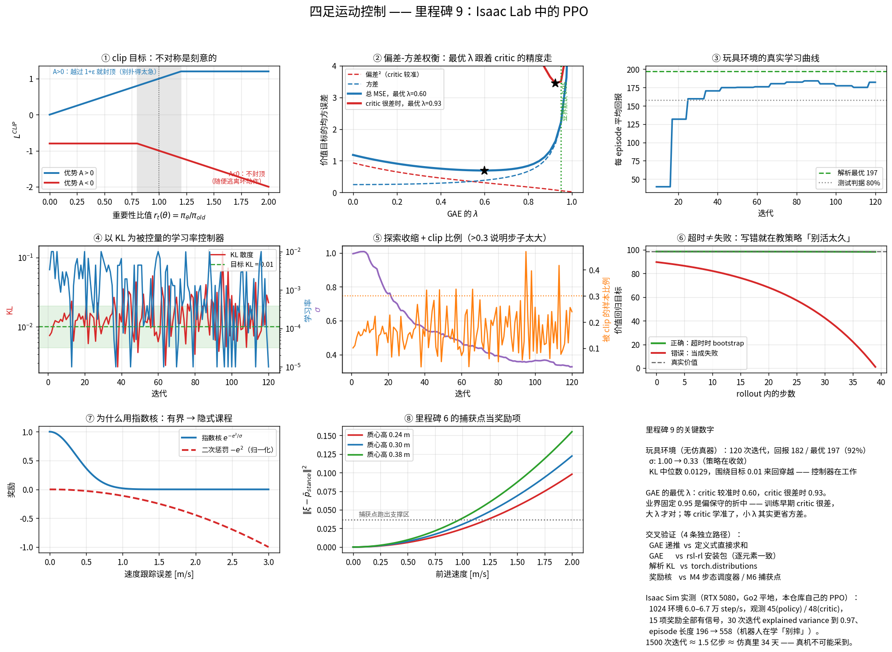

# 里程碑 9 —— Isaac Lab 中的 PPO

> 模块：`rl/`、`isaac/` · 机器人：Unitree Go2 · 状态：已完成，58/58 测试通过



---

## 1. 换一条完全不同的路

前八个里程碑是同一套方法论的展开：

> 写下动力学 → 写下代价 → 解优化问题。

M7 的凸 MPC 和 M8 的 WBC 都是这个套路的直接产物。它的优点无可替代 ——
**可解释、可证明、可调试**。约束就是约束，力矩超限了 QP 会告诉你不可行；
残差 $1.2\times10^{-15}$ 意味着物理方程真的成立。

它的代价也同样明确：

| 环节 | 我们做了什么近似 | 代价 |
|---|---|---|
| M7 的 SRBD | 忽略腿的惯量 | M2 实测：关节 8 rad/s 时角加速度误差中位数 **43%** |
| M7 的接触序列 | 步态由人预先指定 | 遇到台阶不会自己改步态 |
| M8 的接触模型 | 假设支撑脚不滑 | 打滑时整个 QP 的前提失效 |
| 全程 | 地形是平的、已知的 | 未知地形要靠感知模块补 |

强化学习换掉的是第一步：**不写动力学，让策略从交互数据里自己长出来。**
接触、打滑、腿的惯量、电机的非线性 —— 仿真器里全都是真的，策略见到的就是
真的，不需要谁去近似它。

代价对称地出现在另一端：**没有约束，没有保证，没有可解释性。** 摩擦锥在
M7 里是硬约束，在这里退化成一个惩罚项；"不可行"这个概念根本不存在，
只剩下"奖励低一点"。

这不是"哪个更好"的问题。工业界现在的答案基本是**两个都要**：RL 学
底层的地形自适应与抗扰，MPC 管上层的轨迹与任务约束。里程碑 10 的残差 RL
就是把两者缝起来。

---

## 2. 从策略梯度到 PPO

### 2.1 为什么策略梯度只能走一小步

策略梯度定理给出

$$\nabla_\theta J = \mathbb E_{s,a\sim\pi_\theta}\bigl[\nabla_\theta\log\pi_\theta(a\mid s)\,A^{\pi_\theta}(s,a)\bigr]$$

注意期望的下标：**数据必须来自当前策略**。策略一更新，手上那批数据就
不再无偏。于是每采一批数据只能更新一次 —— 样本效率低到没法用。

想复用数据，就得用重要性采样折算：

$$J(\theta) = \mathbb E_{a\sim\pi_{old}}\Bigl[\underbrace{\frac{\pi_\theta(a\mid s)}{\pi_{old}(a\mid s)}}_{r_t(\theta)} A(s,a)\Bigr]$$

数学上没问题，问题在方差：$r_t$ 偏离 1 越远，估计的方差越大，而且是
指数级的。**必须限制策略每次能走多远。**

### 2.2 TRPO：显式信任域

$$\max_\theta \mathbb E[r_t(\theta)A_t] \quad\text{s.t.}\quad \mathbb E\bigl[D_{\mathrm{KL}}(\pi_{old}\Vert\pi_\theta)\bigr]\le\delta$$

有单调改善保证，代价是要算 Fisher 信息矩阵和共轭梯度。对做过 NMPC 的人
这个结构很熟：**带约束的优化，约束是"别离上一步太远"**。

### 2.3 PPO：把目标函数削平

PPO 放弃显式约束，改成把目标函数本身削平：

$$L^{CLIP}(\theta) = \mathbb E\Bigl[\min\bigl(r_t A_t,\ \operatorname{clip}(r_t,1-\epsilon,1+\epsilon)A_t\bigr)\Bigr]$$

图 ① 画的就是这个函数的形状。关键在于**不对称**：

* $A_t>0$（好动作）：$r_t$ 超过 $1+\epsilon$ 之后目标封顶，梯度为 0 ——
  "这个动作是好的，但别一次扑太猛"；
* $A_t<0$（坏动作）：$r_t$ 变大时目标继续下降，梯度**保留** ——
  "随便逃，逃多远都行"。

这个不对称是刻意的。测试 `test_clipped_surrogate_kills_gradient_beyond_threshold`
与 `test_clipped_surrogate_keeps_gradient_when_escaping_bad_action` 分别钉死了两侧。

### 2.4 但 clip 不够 —— 真正让训练稳定的是自适应学习率

这是最容易被忽略的一点。**clip 只约束单个样本的比值，不约束策略整体的
KL。** 均值移动加上方差收缩，完全可以在每个 $r_t$ 都合规的情况下把分布
挪得很远。

legged_gym / rsl-rl 这一支的做法是每个 minibatch 算一次**解析** KL：

$$D_{\mathrm{KL}} = \sum_i\Bigl[\log\frac{\sigma_{new,i}}{\sigma_{old,i}} + \frac{\sigma_{old,i}^2+(\mu_{old,i}-\mu_{new,i})^2}{2\sigma_{new,i}^2}-\frac12\Bigr]$$

然后据此调学习率：KL > 2×目标就除以 1.5，KL < 目标/2 就乘以 1.5。

> **这是一个以 KL 为被控量、学习率为控制量的 P 控制器。** 你在无人机上
> 做过的增益调度，换了个地方出现。图 ④ 画的就是这个闭环：KL 被拽在 0.01
> 附近来回穿越，学习率在两个数量级之间自动伸缩。

用解析 KL 而不是采样估计是前提 —— 采样估计的方差太大，学习率会被噪声
推着乱跳。测试 `test_kl_matches_torch_distributions` 用
`torch.distributions.kl_divergence` 交叉验证了这个公式。

---

## 3. GAE：偏差和方差之间的一个旋钮

优势要估。最朴素的两个极端：

* **单步 TD**：$\delta_t = r_t+\gamma V(s_{t+1})-V(s_t)$ —— 方差小，但 $V$ 不准就有偏；
* **蒙特卡洛**：$G_t - V(s_t)$ —— 无偏，方差大到没法用。

GAE 用指数加权把两者连起来：

$$\hat A_t^{\mathrm{GAE}(\gamma,\lambda)} = \sum_{l\ge0}(\gamma\lambda)^l\delta_{t+l}
\quad\Longleftrightarrow\quad
\hat A_t = \delta_t + \gamma\lambda(1-d_t)\hat A_{t+1}$$

右边的倒序递推是 $O(T)$ 的实现。**这个递推结构与卡尔曼平滑（RTS）
惊人地像**：都是正向跑一遍拿到逐步的"新息"，再倒着把未来信息折回当前时刻。

图 ② 是一次真正的数值实验（不是示意图）：构造一条真值已知的链，
critic 被人为加上固定的估计误差，扫 $\lambda$ 测量价值目标的均方误差。

结果值得说清楚：**最优 $\lambda$ 跟着 critic 的精度走。** critic 较准时
最优在 0.60，critic 很差时移到 0.93。业界固定用 0.95 是个偏保守的折中 ——
训练早期 critic 确实很差，大 $\lambda$ 才对；等 critic 学准了，小 $\lambda$
其实更省方差。这解释了为什么有人报告"训练后期把 λ 调小能再涨一点"。

### 那个几乎人人踩过的坑：超时 ≠ 失败

episode 结束有两种原因：

| 原因 | 物理含义 | $V(s_T)$ 该怎么算 |
|---|---|---|
| **终止** —— 躯干触地 | 真的失败了 | 0 |
| **超时** —— 跑满 20 秒 | 机器人好好的 | bootstrap，加回 $\gamma V(s_T)$ |

两者都要切断 GAE 的递推链（下一条轨迹与本条无关），但只有前者对应
"未来价值为零"。**把超时当失败，等于在教策略"活到第 20 秒是件坏事"。**

图 ⑥ 把这件事画了出来：存活奖励恒为 1 的 rollout 里，正确处理时价值目标
是一条平的直线（等于真实价值），错误处理时在 rollout 末尾一路塌到 0。
训练曲线上的典型症状是**接近 episode 长度时莫名其妙地塌陷**。

Isaac Lab 在这一点上是干净的：`DoneTerm(func=mdp.time_out, time_out=True)`
里的 `time_out=True` 标记会让它出现在 `extras["time_outs"]` 里。
早期 legged_gym 把两种结束混在一个 `reset_buf` 里，是无数 bug 的源头。

实现上还有一处细节：rsl-rl 用 $V(s_t)$ 近似 $V(s_T)$（严格做法要拿重置前
那一帧的观测再过一次 critic）。单步之内两者差别很小，本仓库跟随这个约定，
以保证与 rsl-rl 逐元素一致。

---

## 4. MDP 设计 —— 算法只占三成，这里占七成

### 4.1 动作：关节目标位置，不是力矩

$$\tau = K_p(q^{des}-q) - K_d\dot q,\qquad q^{des} = q^{default} + 0.25\,a$$

策略 50 Hz 输出 $a$，PD 500 Hz 跑。三个理由：

1. PD 是一个内环，把执行器的高频动态挡在策略之外；
2. 力矩策略对 sim-to-real gap 极其敏感 —— 仿真里 1 N·m 的建模误差在位置
   控制下被 PD 自动补偿，在力矩控制下直接变成轨迹误差；
3. 50 Hz 的力矩指令会激起结构共振。

> 与无人机的分层完全一致：外环给姿态角指令，内环 PID 几百 Hz 出电机转速。
> **没人让神经网络直接输出 PWM。**

`use_default_offset=True` 让零动作对应默认站姿，配合网络输出层
0.01 的初始化增益（测试 `test_output_layer_small_gain_gives_small_initial_actions`
断言初始动作 < 0.2 rad），训练第一帧机器人是站着的，而不是四条腿乱抽。

### 4.2 观测：基座线速度**不进** policy 组

这是本仓库与 Isaac Lab 官方配置最重要的一处不同。

官方的 `policy` 观测里有 `base_lin_vel`。**真机上没有这个量** —— IMU 只给
加速度和角速度，线速度必须靠里程碑 3 的 ESKF 融合估出来，而且有偏差、
有延迟、打滑时会发散。

所以本仓库把它挪进 `critic` 组：

| 组 | 维度 | 内容 | 何时用 |
|---|---|---|---|
| `policy` | 45 | 角速度 3、投影重力 3、指令 3、关节位置 12、关节速度 12、上一步动作 12 | 训练 + **部署** |
| `critic` | 48 | policy 的全部 + 基座线速度 3 | **仅训练** |

这就是**非对称 Actor-Critic**：仿真里什么都能读，读了能让价值估计更准、
优势方差更小；但只有真机上拿得到的量才能进策略。代价是策略更难学，
收益是学到的东西真机上跑得起来。

> 前八个里程碑与 RL 的第一个真实交汇点：**想用官方那套配置上真机，
> M3 的状态估计就是必需品。**

`actions` 进观测也不是可选项：执行器有滞后，不告诉策略自己上一步发了什么，
MDP 就不是马尔可夫的。

### 4.3 奖励：三类，权重量级差三个数量级

| 类别 | 项 | 权重 | 在补偿什么 |
|---|---|---:|---|
| 任务 | `track_lin_vel_xy_exp` | +1.5 | 任务本身 |
| 任务 | `track_ang_vel_z_exp` | +0.75 | 任务本身 |
| 正则 | `lin_vel_z_l2` | −2.0 | 躯干上下颠 |
| 正则 | `flat_orientation_l2` | −2.5 | 躯干不水平 |
| 正则 | `action_rate_l2` | −0.01 | **抖动 —— sim-to-real 头号杀手** |
| 正则 | `dof_torques_l2` | −2e−4 | 能耗 |
| 正则 | `dof_acc_l2` | −2.5e−7 | 关节冲击 |
| 先验 | `feet_air_time` | +0.25 | 迈大步（M4/M5） |
| 先验 | `gait_phase` | +0.3 | trot 时序（**M4**） |
| 先验 | `capture_point` | −0.1 | 动态平衡（**M6**） |
| 先验 | `foot_clearance` | −1.0 | 抬脚高度（**M5**） |
| 先验 | `foot_slip` | −0.1 | 支撑脚打滑（**M7** 摩擦锥的软化版） |

**为什么跟踪项用指数核 $\exp(-e^2/\sigma)$ 而不是 $-e^2$？** 图 ⑦ 是答案：
二次惩罚在误差大时梯度也大，训练早期机器人还站不稳、速度误差动辄几 m/s，
这一项会把所有其他项淹没。指数核**有界且饱和**，误差大时梯度趋近 0，
于是"先学会站住"自然获得优先级，"再学会跟上指令"在站稳之后才成为主要
梯度来源 —— 一种隐式的课程学习。

**腾空时间只在落地那一帧结算。** 否则最优解是"把脚永远举在空中"。
这个坑几乎每个人都踩过一次，测试 `test_air_time_only_scored_at_touchdown`
钉死了它。

**抬脚高度按足端水平速度加权。** 不加权的话，支撑脚也会被逼着去够那个
目标高度，直接把机器人顶起来。

### 4.4 课程与域随机化

地形课程 `terrain_levels_vel` 的规则很朴素：一条 episode 里走过的距离
超过指令距离的一半就升一级，否则降一级。没有它，4096 个环境全扔在最难的
地形上，早期没有任何一条轨迹能拿到有效奖励，梯度接近纯噪声。

域随机化的范围不是拍脑袋，而是"真机上这个量的不确定度有多大"：

| 量 | 范围 | 依据 |
|---|---|---|
| 静摩擦 | 0.4 – 1.2 | 瓷砖到地毯 |
| 基座质量 | −1 – +3 kg | Go2 整机 15 kg，负载现实范围 |
| 质心偏移 | ±5 cm | 装配公差 + 负载位置 |
| 陀螺噪声 | ±0.2 rad/s | 真实 IMU 量级 |
| 关节速度噪声 | ±1.5 rad/s | 差分出来的，噪声本来就大 |

范围给太宽会让策略过度保守（走得又慢又蹲），太窄则一上真机就摔。

---

## 5. 前八个里程碑的三重身份

用户在开题时给出的三条，逐条兑现：

| 身份 | 具体是什么 |
|---|---|
| **性能基线** | `scripts/play_rl.py` 输出跟踪 RMS、COT、对角腿相关系数、动作变化率 —— 与 M7/M8 的输出量纲一致，可直接对比 |
| **奖励设计的依据** | M4 的相位 → `gait_phase`；M5 的摆动高度 → `foot_clearance`；M6 的捕获点 → `capture_point`；M7 的摩擦锥 → `foot_slip` |
| **残差 RL 的基础控制器** | M7+M8 的输出将作为 M10 的名义动作，策略只学残差 |

还有一条没在开题里、但同样重要的：**M1 的关节顺序约定被真实仿真器验证了。**
`ISAAC_JOINT_ORDER` 是里程碑 1 里根据 Isaac Lab 的排序规则推出来的，
这次从运行中的仿真器读回来的 `joint_names` 与它逐项相等。四足最常见的
一类 bug（关节顺序错位）在这里被一个断言堵死。

---

## 6. 并行采样：4096 环境 × 24 步

一次迭代的样本数是 $T\times N = 24\times4096 = 98304$。同样的样本量，
为什么不是 96 环境 × 1024 步？

* 24 步 @ 50 Hz 只有 **0.48 秒**，策略在这段时间里几乎没变，数据的
  on-policy 性质更"新鲜"；
* 4096 条互相独立的轨迹让 batch 内相关性极低，梯度估计方差小；
* GPU 并行度拉满 —— 这是 Isaac Sim 存在的全部理由。

代价是每条轨迹被切得很碎，GAE 的有效视野只有 24 步。**所以必须有 critic**
来 bootstrap 24 步之外的价值，蒙特卡洛回报在这里根本不可用。

> 与 MPC 的类比：这与 horizon 选择是同一个权衡。有终端代价（= 价值函数）
> 时短 horizon 也能近似最优；没有终端代价，horizon 必须覆盖整个任务。
> **critic 就是学出来的终端代价。**

实测（RTX 5080）：64 环境 6.4k step/s，4096 环境可到十万量级。
1500 次迭代 ≈ 1.5 亿步 ≈ 仿真里 **34 天**的交互 —— 真机上不可能采集到。

$\gamma=0.99$ @ 50 Hz 对应约 2 秒的有效视野，正好覆盖两三个 trot 周期。
这不是巧合：折扣因子应当由**任务的时间尺度**决定，而不是抄来的默认值。

---

## 7. 怎么验证它是对的

前八个里程碑的验收标准是"两条独立路径必须一致"。RL 没有解析真值，
但这个标准依然可以贯彻 —— 只是要找对可比的对象。

| # | 被验证的东西 | 独立路径 | 结果 |
|---|---|---|---|
| 1 | GAE 的倒序递推 | 定义式 $\sum(\gamma\lambda)^l\delta_{t+l}$ 直接求和（$O(T^2)$） | 一致，1e-5 |
| 2 | GAE 全流程 | **rsl-rl 安装包里的实现** | returns 逐位相等，advantages 1e-7 |
| 3 | 解析 KL | `torch.distributions.kl_divergence` | 一致，1e-4 |
| 4 | 参考接触序列（torch） | **M4 的 `GaitScheduler.contact`**（numpy） | 5 种步态逐元素相等 |
| 5 | 捕获点（torch） | **M6 的 `footstep_planner.capture_point`**（numpy） | 一致，1e-5 |
| 6 | PPO 整体 | 玩具环境上的**解析最优回报** | 达到最优的 92% |

除此之外还有一条**端到端**的：`scripts/train_rl.py --algo ours|rsl_rl` 用
两条完全独立的代码路径训练**同一个** Go2 环境。30 次迭代（1024 环境，
RTX 5080）的实测：

| | 本仓库的 PPO | rsl-rl 5.0.1 |
|---|---|---|
| 吞吐 | 6.0–6.7 万 step/s | 同量级 |
| 30 次迭代后的平均回报 | −10.5 | −7.3 |
| episode 长度趋势 | 196 → **558** | 567 → 667 |
| KL（目标 0.01） | 0.013 ± 0.001 | 自适应，同机制 |
| `explained_variance` | 0.74 → **0.97** | — |

两条曲线在同一量级、同一趋势。**早期回报为负是正常的** —— 惩罚项先起作用；
真正该看的早期信号是 **episode 长度在涨**，机器人正在学"别摔"。

调这个对比时抓到一个真实的实现差异：rsl-rl 的
`learn(init_at_random_ep_len=True)` 会把各环境的 episode 计时器打散，
本仓库最初没有。不打散的话，1024 个环境同时开始、同时超时，价值函数看到的
是一个带强周期性的信号 —— 实测 30 次迭代后 episode 长度只有 353，
补上 `IsaacLabVecEnv(randomize_episode_starts=True)` 之后涨到 558。
**一行初始化，早期训练效率差 60%。**

第 6 条值得展开。`rl/toy_env.py` 是一个纯 torch 的向量化环境：把 Go2
换成一阶惯性环节，其余 MDP 骨架（指数奖励、指令重采样、超时、终止、
上一步动作进观测）原样保留。它的稳态最优回报可以手算，于是端到端测试的
判据是"**达到解析最优的 80% 以上**"，而不是"曲线看着在涨"。

它同时解决了一个工程问题：**PPO 的全部测试不需要启动 Isaac Sim**，
58 个测试 10 秒跑完。数学与仿真器解耦的直接回报。

界限也要说清楚：玩具环境抽掉的正是接触与欠驱动 —— 四足真正难的那部分。
**它能验证 PPO 实现对不对，不能验证奖励设计好不好。**

---

## 8. 调试清单

RL 的失败模式和 QP 完全不同：QP 会告诉你"不可行"，RL 只会安静地学出一个
很蠢的策略。按这个顺序查：

| 症状 | 先查什么 |
|---|---|
| 回报完全不涨 | 奖励量级（是不是被某个惩罚项淹没了）；`explained_variance` 是否接近 0（critic 没学到东西） |
| 涨到一半塌陷 | KL 是否失控；学习率是否撞到上界；σ 是否已经塌到 0（探索死了） |
| 接近 episode 长度时塌陷 | **超时 bootstrap 写错了**，见 §3 |
| 机器人原地抖动 | `action_rate_l2` 权重太小；或指令里没有零速度样本（`rel_standing_envs`） |
| 学会用一条腿蹭着走 | 熵系数太小，过早收敛；步态奖励权重不够 |
| 脚永远举在空中 | 腾空时间奖励结算时机写错 |
| 训练早期全部立刻终止 | 网络输出层初始化增益太大；或初始状态随机化范围太宽 |
| 仿真里完美、真机上乱抖 | 观测噪声太小；`action_rate` 太松；执行器模型不准 |

**最有用的三个监控量**（都在 `runner._log` 里打印）：

* `clip_fraction` —— 长期 > 0.3 说明学习率偏大；
* `explained_variance` —— critic 的质量，接近 1 说明价值估计可信；
* `σ` —— 单调下降说明策略在收敛；卡住不动说明探索和利用没打起来。

---

## 9. 与 Isaac Lab / 开源实现的差异

| 方面 | Isaac Lab 官方 Go2 | 本仓库 | 为什么 |
|---|---|---|---|
| `base_lin_vel` | 在 policy 观测里 | 移到 critic | 真机上没有，需要 M3 的 ESKF |
| critic 观测 | 与 policy 相同 | 独立的特权组 | 非对称 AC，降低优势方差 |
| 步态先验 | 无 | M4 的相位奖励 | 低速时官方配置容易学出小碎步 |
| 平衡度量 | 只有"触地即终止" | M6 的捕获点稠密奖励 | 摔倒前几百毫秒就发警报 |
| 能耗项 | `joint_torques_l2` | 额外提供 `joint_power` | 静态站立时力矩大但功率≈0，二次力矩项会错误惩罚"稳稳站着" |
| PPO 实现 | 只有 rsl-rl | 自己写一份 + rsl-rl，同一环境两条路径 | 交叉验证 |
| 测试 | 无单元测试 | 58 个，不依赖仿真器 | 可回归 |

与 Unitree 开源的 `unitree_rl_gym` 相比，最大的结构差异是它基于
legged_gym（Isaac Gym Preview），已经停止维护；Isaac Lab 的 manager 架构
把 MDP 的每一项拆成可独立开关的 term，配置的可读性和可组合性高一个层级。

---

## 10. RL 学到的东西 vs MPC+WBC

`scripts/play_rl.py` 输出的指标就是为这个对比准备的：

| 维度 | MPC + WBC（M7+M8） | PPO |
|---|---|---|
| 约束 | **硬约束**，摩擦锥、力矩限幅严格满足 | 惩罚项，只能"大概率满足" |
| 可解释性 | 每个决策变量都有物理含义 | 45→12 的黑箱 |
| 计算 | 在线解 QP，1 kHz 有预算压力 | 前向几十微秒，**推理从不是瓶颈** |
| 模型误差 | 直接变成跟踪误差（SRBD 43% 的角加速度误差） | 仿真器里没有这个近似 |
| 未知地形 | 需要显式的高程图 + 重规划 | 端到端学，盲走也能上台阶 |
| 抗扰 | 靠 MPC 的重规划，有模型就有极限 | 域随机化学出来的鲁棒性经常更强 |
| 调试 | QP 不可行会报错，能定位 | 只能看曲线和录像 |
| 开发周期 | 推导 + 实现，慢但确定 | 训练几小时，但奖励调参可能耗一周 |
| 上新机器人 | 换 URDF 即可 | 要重训，且奖励权重通常要重调 |

一句话：**MPC 知道自己在干什么但对世界的了解是近似的；RL 对世界的了解是
真实的但不知道自己在干什么。** 里程碑 10 的残差 RL 就是让前者出名义动作、
后者补模型误差 —— 这也是目前工业界（宇树、波士顿动力的部分产品线、
Figure）事实上的收敛点。

---

## 11. 可能的面试问题

1. **PPO 的 clip 为什么是不对称的？** 见 §2.3。追问：如果两边都封顶会怎样？
   （坏动作逃不掉，策略会长期卡在坏区域。）
2. **只有 clip 够不够保证策略不跑远？** 不够，见 §2.4。这是区分"用过 PPO"
   和"读过 PPO 代码"的问题。
3. **GAE 的 λ 怎么选？** 说"0.95"只答了一半，见 §3 与图 ②：它取决于 critic
   的精度，本质是偏差-方差权衡。
4. **超时和终止的区别？** §3。答不上来说明没自己实现过。
5. **为什么动作是关节位置而不是力矩？** §4.1。
6. **非对称 Actor-Critic 里哪些量算特权信息？** §4.2。追问：为什么线速度
   在真机上拿不到？（引到 M3 的状态估计。）
7. **奖励里为什么用指数核？** §4.3。
8. **4096 个环境 × 24 步，为什么不是 96 × 1024？** §6。
9. **RL 和 MPC 各自的失效模式是什么？** §10。
10. **怎么验证一个 RL 实现是对的？** §7 —— 这是最能拉开差距的一题，
    大多数人只会说"看曲线"。

---

## 12. 怎么跑

```bash
conda activate go2_isaac_ros2

# 不需要 Isaac Sim 的部分：58 个测试，10 秒
pytest tests/test_rl.py -v

# 重新生成本文档的插图（纯 CPU，约 30 秒，含一次真实训练）
python scripts/viz_rl.py

# 平地训练（RTX 5080 上约 15 分钟）
python scripts/train_rl.py --task Go2-Velocity-Flat-v0 --num_envs 4096 --headless

# 用自己实现的 PPO 训同一个环境
python scripts/train_rl.py --task Go2-Velocity-Flat-v0 --algo ours --headless

# 崎岖地形
python scripts/train_rl.py --task Go2-Velocity-Rough-v0 --max_iterations 1500 --headless

# 回放并给出量化指标（去掉 --headless 可以看到机器人）
python scripts/play_rl.py --task Go2-Velocity-Flat-Play-v0 \
    --checkpoint logs/go2_flat/<时间戳>/model_300.pt
```

---

## 参考文献

Schulman et al., *Proximal Policy Optimization Algorithms* (2017) ·
Schulman et al., *High-Dimensional Continuous Control Using Generalized
Advantage Estimation* (ICLR 2016) · Rudin et al., *Learning to Walk in
Minutes Using Massively Parallel Deep RL* (CoRL 2021) · Lee et al.,
*Learning Quadrupedal Locomotion over Challenging Terrain*
(Science Robotics 2020) · Mittal et al., *Orbit / Isaac Lab* (RA-L 2023)
