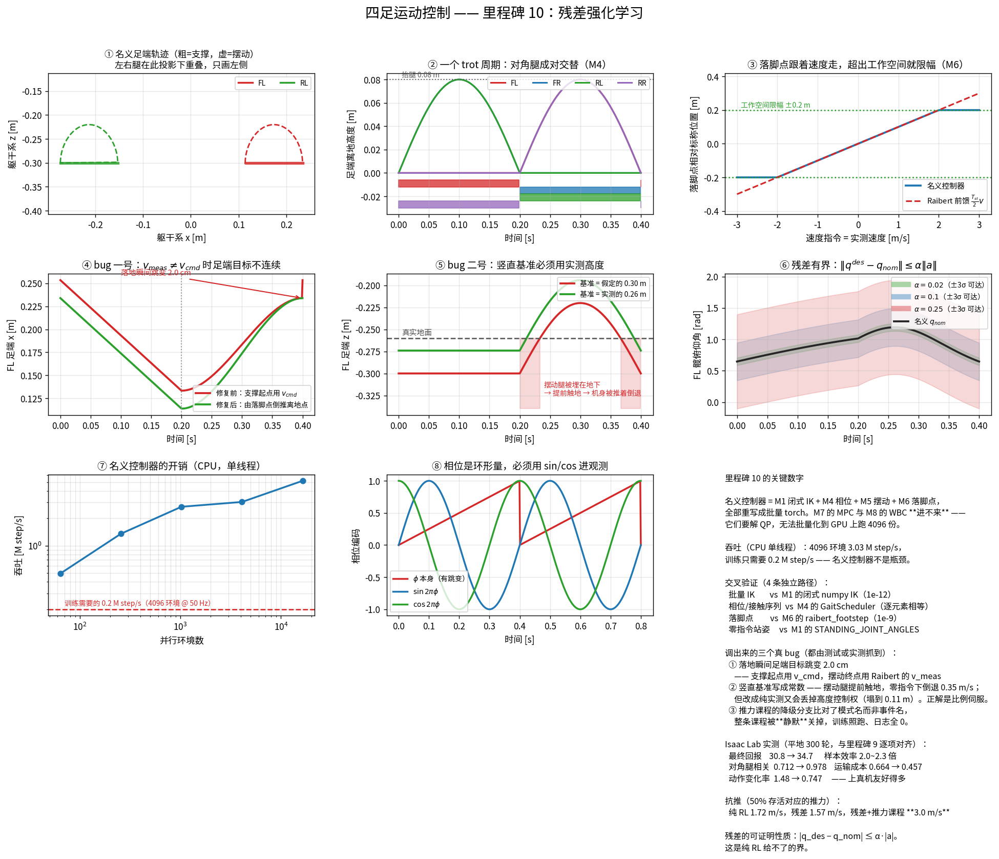

# 里程碑 10 —— 残差强化学习

> 模块：`rl/nominal_controller.py`、`isaac/mdp/actions.py` · 机器人：Unitree Go2 · 状态：已完成，29/29 测试通过



---

## 1. 一行公式

$$q^{des} = \underbrace{q_{\text{nom}}(s)}_{\text{M1/4/5/6 的解析步态}} + \underbrace{\alpha\,a_\theta(s)}_{\text{策略学的残差}}$$

对比里程碑 9 的纯 RL：

$$q^{des} = q^{\text{default}} + 0.25\,a_\theta(s)$$

**差别只有一项：基线从"固定站姿"换成了"一个会迈步的控制器"。** 其余的
观测、奖励、终止、域随机化、超参数**一字未改** —— 只有这样，"残差 RL 到底
值不值"这个问题才被问干净了。

> 与无人机的类比这次几乎是同构的：你做过的 **NMPC + 学习残差动力学**，
> 名义模型给前馈、网络补未建模的气动效应。这里一模一样，只是残差补在
> **动作**上而不是**动力学**上。

---

## 2. 结论先放前面

平地，4096 环境，300 次迭代，RTX 5080，**环境与里程碑 9 逐项对齐**：

| | 纯 RL（M9） | 残差 RL（M10） | 变化 |
|---|---:|---:|---|
| 最终平均回报 | 30.8 | **34.7** | +13% |
| 首达回报 20 | 169 轮 | **83 轮** | **2.0× 快** |
| 首达回报 30 | 287 轮 | **125 轮** | **2.3× 快** |
| 对角腿接触相关 | 0.712 | **0.978** | 步态近乎标准 trot |
| 运输成本 COT | 0.664 | **0.457** | −31% |
| 动作变化率 RMS | 1.48 | **0.747** | −50%，**上真机友好得多** |
| 线速度跟踪 RMS | 0.189 | **0.162** m/s | −14% |
| 终止次数 | 0 | 0 | 都不摔 |

**最值得说的一点：这个加速是在名义控制器本身走得很差的前提下拿到的。**
下一节会给出数据 —— 那个解析步态几乎没有速度跟踪能力。这说明残差 RL 的
主要收益来自"**步态时序这件事不用再学一遍**"，而不是来自名义控制器走得多好。

---

## 3. 谁能当名义控制器：一条被计算量画出来的分界线

残差 RL 要求 $q_{\text{nom}}$ **每个仿真步、每个环境都算一次** ——
4096 环境 × 50 Hz = 每秒 20 万次。这一条硬性要求把里程碑 1–8 劈成了两半：

| 里程碑 | 能不能进 | 为什么 |
|---|---|---|
| M1 单腿闭式 IK | ✅ | 只有 atan2/acos/sqrt |
| M4 步态相位 | ✅ | 纯取模运算 |
| M5 摆动轨迹 | ✅ | 正弦 + smoothstep，闭式 |
| M6 Raibert 落脚点 | ✅ | 闭式代数 |
| **M7 凸 MPC** | ❌ | **要解 QP** |
| **M8 全身控制** | ❌ | **要解 QP** |

QP 求解器是串行的、迭代次数依数据而变的、跑在 CPU 上的。**没有任何办法把它
批量化成 4096 份跑在 GPU 上。** 这不是工程懒惰，是算法结构决定的。

于是本里程碑的名义控制器是 **M1+M4+M5+M6 的批量 torch 重写**。实测吞吐
（CPU 单线程）：4096 环境 **3.0 M step/s**，而训练只需要 0.2 M step/s ——
名义控制器不是瓶颈，富余 15 倍。

### 那 M7 和 M8 怎么办

工业界的做法是**蒸馏**：让 MPC+WBC 在 CPU 上离线跑出大量 $(s, a)$ 数据，
监督学习训一个网络去拟合它，再把网络当名义策略。网络前向是可批量化的，
于是绕开了 QP。

代价是蒸馏出来的网络只是 MPC 的**近似**，而且丢掉了 MPC 最值钱的东西 ——
**约束保证**。这条路本仓库没走，因为它需要的工程量（离线数据管线 + 蒸馏
训练 + 蒸馏质量评估）远超一个里程碑，而教学价值主要在"知道有这条路、
知道它的代价"。

---

## 4. 名义控制器有多差：三个 bug 与一个结构性限制

这是本里程碑花时间最多的地方，也是最值得写下来的地方。

### bug 一号：标称足端横向位置漏了侧摆偏置

标称落脚点该是**髋偏置 + 侧摆偏置**（M6 的 `nominal_hip_projection` 就是这么
写的）。只用髋偏置，足端就被放在侧摆轴正下方，逼出一个非零的侧摆角 ——
实测 **±0.32 rad**，整条腿一直斜着站，膝角也随之偏 0.18 rad。

抓到它的是测试 `test_zero_command_gives_standing_pose`：零指令下的输出必须
等于 M1 的 `STANDING_JOINT_ANGLES`。**这个测试之所以能存在，是因为里程碑 1
把标称站姿写成了一个常量。** 前面的里程碑给后面的里程碑当判据，这是第十次。

### bug 二号：落地瞬间足端目标不连续（图 ④）

第一版把支撑相起点写成 $p_{\text{nom}} + \tfrac{T_{st}}{2}v_{cmd}$，
而摆动相终点是 Raibert 落脚点
$p_{\text{nom}} + \tfrac{T_{st}}{2}v_{meas} + k(v_{meas}-v_{cmd})$。

两者只在 $v_{meas} = v_{cmd}$ 时相等 —— **而那恰恰是永远不成立的那个假设**：
起步、转向、被推的瞬间都不成立。图 ④ 的工况（$v_{cmd}=0.6$、$v_{meas}=0.45$）下
跳变 **2.0 cm**，足端在触地那一帧被瞬移；速度误差越大跳得越狠。

正解是**由落脚点倒推离地点**：$p_{\text{lift}} = p_{\text{td}} - T_{st}v_{cmd}$，
支撑相从 $p_{\text{td}}$ 线性扫到 $p_{\text{lift}}$。两个边界都是构造上连续的。

抓到它的是 `test_swing_horizontal_velocity_vanishes_at_endpoints` —— 它本来
是写来验证 M5 关于落地冲击的结论的，结果撞出了一个 32500 m/s 的"速度"。

### bug 三号：竖直基准写成常数，改成实测又走向另一个极端

这个改了三版才对，三版都在仿真里实测过（零速度指令）：

| 足端深度取法 | 实际速度 | 躯干高度 |
|---|---:|---:|
| 期望站高（常数 0.30） | **−0.35 m/s** | 0.26 m |
| 实测高度 | +0.01 m/s | **0.11 m** |
| 支撑用期望、摆动用实测 | **−0.49 m/s** | 0.22 m |
| 实测 + $k\,$(期望 − 实测) | −0.02 m/s | 0.10 m |

两端的失效机理是对称的：

* **取常数**：纯位置控制下 Go2 的 PD 刚度扛不住自重，躯干比目标下沉约 5 cm。
  足端目标于是落在真实地面**以下**，摆动腿在轨迹还没走完时就撞地 ——
  而它那一刻正在向前运动，摩擦力把机身往后推，**零指令下匀速倒退 0.35 m/s**。
* **取实测**：足端目标永远等于足端现在的位置，高度误差恒为零，
  **高度控制权整个消失**。身体下沉 → 目标跟着下沉 → 下沉更多。正反馈。

所以正确的写法是二者之间的一个比例控制器
$d = h_{meas} + k(h^* - h_{meas})$。**这本来就该是一个反馈问题，
写成常数才是那个 bug。**

### 结构性限制：位置控制没有速度权威

把上面三个都修好之后，名义控制器**仍然几乎不跟踪速度**：指令 0.5 m/s 时
实际速度在 0.06 m/s 以下，且姿态偏低。增益扫描（$k \in \{0, 0.2, 0.35,
0.5, 0.8, 1.0\}$）与站高扫描都改变不了这个结论。

这不是实现问题，是**位置控制的固有限制**：足端目标位置决定不了地面反力，
而速度是由地面反力积分出来的。想要速度权威就必须控制力 ——
**这正是 M7 的 MPC 与 M8 的 WBC 选择力矩控制的原因**，也是它们进不了
GPU 批量的那个原因的另一面。

> 一个漂亮的对偶：能批量化的（运动学）没有速度权威，有速度权威的（动力学）
> 不能批量化。残差 RL 恰好是把这个矛盾外包给策略去解决。

---

## 5. 残差 RL 为什么还是赢了

名义控制器这么差，残差 RL 却快 2.3 倍、回报高 13%、步态质量从 0.712 涨到
0.978。原因值得拆开：

1. **步态时序是免费送的。** 纯 RL 要用几十轮迭代才摸索出"对角腿成对交替"
   这件事；残差 RL 第一帧就在按 trot 迈步。图 ② 的接触时序是名义控制器
   直接给的，不需要学。
2. **探索的起点在流形上。** 纯 RL 早期的随机动作大多是"物理上没意义"的
   姿态；残差的随机动作是"一个合理步态附近的扰动"，每一条轨迹都携带信息。
3. **速度权威由策略补。** 名义控制器负责节奏，策略负责"真的走起来"。
   $\alpha=0.25$ 给了策略与纯 RL **完全相同的动作权限**，所以它能力上不吃亏。

第 3 点是 $\alpha$ 取值的关键。取小（0.05~0.1）会把策略**铐在先验上**：
先验好时这是优点（搜索空间小、行为有界），先验差时就是灾难 ——
策略连抵消先验的权限都没有。**$\alpha$ 本质上是"你有多信任那个名义控制器"。**

---

## 6. 抗推恢复

`scripts/eval_push.py`：走稳 2 秒后施加一次速度突变，观察 3 秒内是否摔倒，
每个幅值 64 次。三种控制器在**完全相同的协议**下：

| 策略 | 50% 存活对应的推力 | 恢复后速度误差 |
|---|---:|---:|
| 名义控制器（$\alpha=0$） | 3.00 m/s | **0.56 m/s** |
| 纯 RL（M9） | 1.72 m/s | 0.05–0.09 |
| 残差 RL（与 M9 同扰动） | 1.57 m/s | **0.035** |
| **残差 RL + 推力课程** | **3.00 m/s**（@81%） | 0.063 |

三条要读出来：

**名义控制器的 3.0 m/s 是假的。** 它恢复后的速度误差 0.56 ≈ 指令幅值本身，
说明它根本没在跟踪 —— 蹲得低、走得慢，当然不容易被推倒。**存活率必须和
任务指标一起看**，否则"站着不动"永远是最抗推的策略。

**同扰动下残差略输给纯 RL（1.57 vs 1.72）。** 这是一个真实的代价：被推狠了
以后正确的反应往往是**打破步态**、抢一步救回来，而残差被绑在一个时间驱动的
trot 节奏上，只能在 $\pm\alpha$ 的范围里偏离。**先验在分布内是帮助，
在分布外是束缚。**

**加上推力课程后残差冲到 3.0 m/s 且仍然跟踪（误差 0.063）。** 说明抗扰能力
主要由**训练时见过多大的扰动**决定，动作参数化的影响是次要的。课程比架构重要。

---

## 7. 又一个"静默失败"的 bug，值得单独一节

推力课程第一次跑的时候，日志里 `Curriculum/push_velocity` **全程为 0**，
而训练照跑、回报照涨、没有任何报错。

原因是我写的降级分支：

```python
if event_name not in env.event_manager.active_terms:   # 错
    return 0.0
```

Isaac Lab 的 `EventManager.active_terms` 是 `{模式: [名字, ...]}` ——
`in` 在比对**模式名**（`startup`/`reset`/`interval`），永远不匹配，
于是**整条推力课程被静默关掉**。

后果不只是"少了个功能"：我差点拿这份数据去和里程碑 9 做对比，得出
"残差 RL 抗推更差"的结论 —— 而真实原因只是它训练时只见过 ±0.3 的推力，
M9 见过 ±0.8。

> **防御性代码写错，比不写更糟：它把一个会报错的 bug 变成了一个不报错的 bug。**
> 现在 `tests/test_residual.py` 里有两个测试专门撞这个分支。

修好之后还带出一个方法论问题：开了推力课程之后，环境比 M9 难得多
（推力升到上限 2.0 m/s、每 3~6 秒一次），回报从 34.7 掉到 19.5 ——
**这个差别完全来自环境变难，与算法无关**。所以任务被拆成两个：

* `Go2-Residual-Flat-v0` —— 与 M9 逐项对齐，用来做干净的 A/B；
* `Go2-Residual-Flat-Push-v0` —— 开推力课程，用来做抗推研究。

**对照实验里只允许有一个自变量。** 这条规矩比任何算法细节都重要。

---

## 8. 实现要点

### 观测必须多两项

| 项 | 维度 | 为什么是必需的 |
|---|---:|---|
| 名义动作 $q_{\text{nom}}$ | 12 | 要修正一个东西，就得知道它是什么 |
| 步态相位 $(\sin,\cos)$ | 8 | 名义控制器是**时间驱动**的；不给相位，MDP 对策略而言不是马尔可夫的 |

相位用 $(\sin 2\pi\phi, \cos 2\pi\phi)$ 而不是 $\phi$：相位是**环形量**，
0.99 与 0.01 只差 0.02 个周期，数值上却差 0.98。把锯齿波喂给 MLP，
网络得浪费容量去学那个跳变（图 ⑧）。与"四元数不能用欧拉角替代"同一个道理。

观测维度：policy 45 → **65**，critic 48 → **68**。

### `action_l2` 在残差设定下有了新含义

$$-w\lVert a\rVert^2 \propto -\lVert q^{des} - q_{\text{nom}}\rVert^2$$

**即"偏离名义步态的代价"**。纯 RL 里这一项含义模糊（M9 里权重给 0），
残差 RL 里它是一个物理含义明确的正则：策略只在偏离能换来更高回报的地方
才偏离。权重越大越贴着先验走，给 0 则名义控制器退化成"只是一个初始化"。

### 一个必须说清楚的部署代价

名义控制器的 Raibert 项需要**实测躯干水平速度**，高度伺服需要**实测高度**。
里程碑 9 的纯 RL 策略可以完全不依赖它们（线速度只进 critic），残差 RL 不行 ——
名义控制器在真机上也要跑。

**残差 RL 把里程碑 3 的 ESKF 从"可选"变成了"必需"。** 换来的是 2.3 倍的
样本效率和有界的行为。这个交换划不划算，取决于你的状态估计有多可信。

---

## 9. 怎么验证它是对的

延续前九个里程碑的规矩，四条独立路径：

| # | 被验证的东西 | 独立路径 | 结果 |
|---|---|---|---|
| 1 | 批量 torch IK | **M1 的闭式 numpy IK** | 1e-12 |
| 2 | 相位与接触序列 | **M4 的 `GaitScheduler`** | 3 种步态逐元素相等 |
| 3 | 落脚点 | **M6 的 `raibert_footstep`** | 1e-9 |
| 4 | 零指令站姿 | **M1 的 `STANDING_JOINT_ANGLES`** | < 0.06 rad |

第 1 条尤其值钱：**它同时证明了新实现是对的、旧实现没有被悄悄改坏。**

另外三个结构性判据：

* `test_stride_clamped_to_workspace` —— 两端点各自限幅，中间是插值，
  于是整条轨迹都在圆内（圆是凸的）。
* `test_batch_independence` —— 4096 个环境互不串扰，批量实现最容易写错的地方。
* `test_residual_is_bounded` —— $\lVert q^{des}-q_{\text{nom}}\rVert_\infty
  \le \alpha\lVert a\rVert_\infty$，可以写进安全论证的界。

还有一条**过程性**的教训：`tests/test_residual.py` 曾经在模块层面调
`torch.set_default_dtype(torch.float64)`，泄漏到同一次 pytest 会话的其他模块，
把里程碑 9 的两个测试搞挂了。**全局状态必须成对地开关** —— 现在它是一个
带清理的 autouse fixture。

---

## 10. 调试清单

| 症状 | 先查什么 |
|---|---|
| 残差策略还不如纯 RL | 名义控制器是不是**有害**（不是"不够好"）；$\alpha$ 是不是太小，策略没权限抵消先验 |
| 训练早期就大面积摔倒 | $\alpha$ 起始值太大，随机噪声直接破坏名义步态；上 $\alpha$ 课程 |
| 学出来贴着名义不动 | `action_l2` 权重太大 |
| 机器人原地倒退/侧移 | 名义控制器的足端目标在相位边界不连续；画出 $x(t)$ 看有没有跳变 |
| 躯干越走越低 | 竖直基准的反馈增益取 0；高度控制权丢了 |
| 课程日志恒为 0 | 课程项的降级分支命中了；**先确认它该不该命中** |
| 抗推不如预期 | 训练时见过的推力有多大；这比动作参数化重要 |

---

## 11. 与开源实现的差异

| 方面 | 常见做法 | 本仓库 |
|---|---|---|
| 名义控制器来源 | 手写的固定步态表 / 蒸馏的 MPC | **复用 M1/4/5/6 的实现**，逐元素交叉验证 |
| 残差幅值 | 固定小值 | 与纯 RL 的 `action_scale` 对齐 + 课程 |
| 相位进观测 | 常见 | 同，但强调是**马尔可夫性**要求而不是技巧 |
| 抗推评估 | 看录像 | 幅值扫描 + 存活率 + **恢复后跟踪误差** |
| 对照实验 | 常常混着改多个变量 | 拆成两个任务，保证只有一个自变量 |

---

## 12. 可能的面试问题

1. **为什么 MPC 不能直接当名义控制器？** §3。追问：那工业界怎么做？（蒸馏，
   以及蒸馏丢掉了什么。）
2. **残差 RL 什么时候反而更慢？** §5 —— 先验有害且 $\alpha$ 太小的时候。
3. **$\alpha$ 怎么选？** 它是"你有多信任先验"，且必须和先验质量一起考虑。
4. **残差 RL 有什么纯 RL 没有的保证？** $\lVert q^{des}-q_{\text{nom}}\rVert
   \le \alpha\lVert a\rVert$，行为有界。
5. **为什么相位要用 sin/cos？** 环形量，§8。
6. **名义控制器为什么跟不上速度指令？** §4 结构性限制 —— 位置控制没有
   速度权威。这题能问出对方有没有真正理解位置控制与力控的区别。
7. **抗推能力主要由什么决定？** §6 —— 训练时见过的扰动幅度，而不是架构。
8. **"存活率 100%"是不是好结果？** 不一定，见 §6 名义控制器那一行。
9. **残差 RL 对状态估计有什么额外要求？** §8。
10. **怎么保证 A/B 对比是干净的？** §7 —— 只允许一个自变量，这也是本里程碑
    踩过的坑。

---

## 13. 怎么跑

```bash
conda activate go2_isaac_ros2

# 不需要 Isaac Sim：29 个测试，1 秒
pytest tests/test_residual.py -v

# 重新生成插图（纯 CPU，约 20 秒）
python scripts/viz_residual.py

# 残差 RL 训练（与里程碑 9 逐项对齐，2 分半）
python scripts/train_rl.py --task Go2-Residual-Flat-v0 --num_envs 4096 --headless

# 抗推研究版（开推力课程）
python scripts/train_rl.py --task Go2-Residual-Flat-Push-v0 --num_envs 4096 --headless

# 单独评估名义控制器能扛多大推力（残差恒为 0）
python scripts/eval_push.py --task Go2-Residual-Flat-Play-v0 --policy nominal --headless

# 评估训练好的策略
python scripts/eval_push.py --task Go2-Residual-Flat-Play-v0 \
    --checkpoint logs/go2_residual_flat/<时间戳>/model_299.pt --headless
python scripts/play_rl.py --task Go2-Residual-Flat-Play-v0 \
    --checkpoint logs/go2_residual_flat/<时间戳>/model_299.pt
```

---

## 参考文献

Johannink et al., *Residual Reinforcement Learning for Robot Control*
(ICRA 2019) · Silver et al., *Residual Policy Learning* (2018) ·
Raibert, *Legged Robots That Balance* (MIT Press 1986) ·
Bellegarda & Byl, *Combining Benefits from Trajectory Optimization and Deep
Reinforcement Learning* (2019) · Rudin et al., *Learning to Walk in Minutes
Using Massively Parallel Deep RL* (CoRL 2021)
